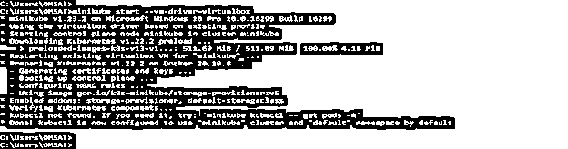
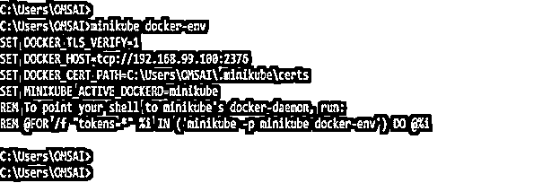
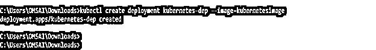
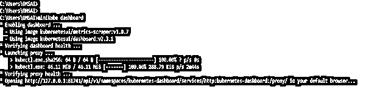
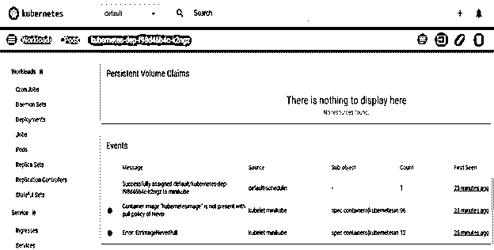
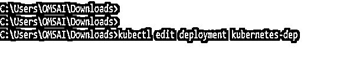
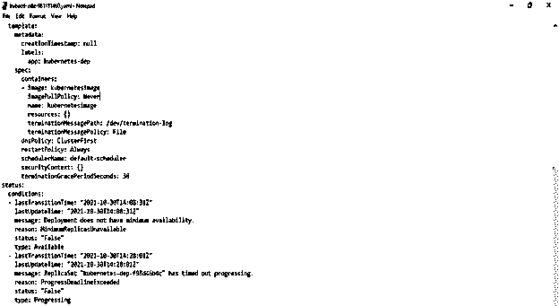
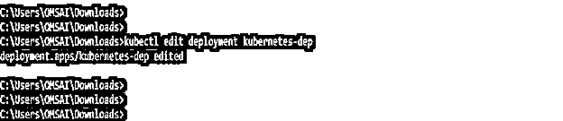
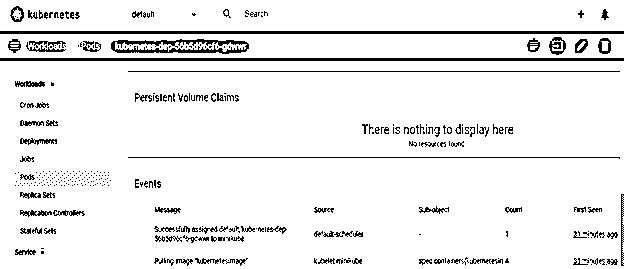

# kuble use local docker image(库比特使用本地坞站图像)

> 原文：<https://www.educba.com/kubernetes-use-local-docker-image/>

## 使用本地 docker 图像 Kubernetes 简介

Kubernetes 使用本地 docker 映像只不过是在本地创建 Kubernetes 映像，并在本地的 Kubernetes 集群上部署相同的映像；第一步是在 Kubernetes 上部署我们的应用程序来构建 docker 映像。接下来，我们需要使用 minikube 在本地环境中运行 Kubernetes。Minikube 只不过是 Kubernetes 的轻量级实现，用于在我们的系统上本地创建一个虚拟机，并在包含单个节点的集群上部署我们的应用程序。正如我们可以说的，默认情况下，minikube 将从 docker 的存储库中提取 docker 映像。

### 什么是 Kubernetes 本地码头形象？

*   我们可以使用 minikube 测试本地创建的 docker 映像。为了用 minikube 测试本地创建的 docker 映像，我们需要告诉 minikube 从我们的系统中引用它。
*   默认情况下，minikube 将从注册表中获取 docker 图像。因此，要在 Kubernetes 上运行本地创建的 docker 映像，我们需要在系统中安装 kubectl 和 minikube。Kubectl 是用于控制 Kubernetes 集群的命令行工具。
*   docker 映像表示由应用程序封装并使用软件依赖项的二进制数据。
*   Docker image 正在执行运行服务器的软件包，并使其成为运行时环境的明确假设。
*   我们还可以为我们的应用程序创建一个 docker 映像，它可以在引用 pod 中的同一个映像之前推入到注册表中。正如我们所知，在 Kubernetes 集群上部署我们的应用程序的第一步是构建 docker 映像。
*   为了在 Kubernetes 集群上部署 Docker 映像，我们使用 kubectl。我们还可以使用 kubectl edit 命令来编辑现有的部署。
*   为了编辑 docker 映像，我们只需要更新容器的属性来保存部署。
*   我们不需要创建新的 pod 新部署将使用我们指定的新 pod 自动创建新映像。同样，它将自动终止我们用于旧映像的旧 pod。
*   我们的 Kubernetes 集群可以访问存储库。因此，如果我们在 AWS 环境中运行 Kubernetes 集群，我们可以使用 AWS IAM 角色来访问节点，并从存储库中读取相同的内容。然而，AWS 没有提供从外部环境访问集群的简单方法。

### 如何使用本地 docker 图像？

*   有多种方法可以使用本地 docker 映像并将其部署在 Kubernetes 集群上。

1.  为本地 docker 映像创建一个本地存储库。
2.  为 docker 的 minikube 环境复制 docker 映像。
3.  在 minikube 中构建 docker 映像。

*   我们需要在本地环境中安装 minikube 和 virtual box，以便使用本地 docker 映像。
*   在我们的机器上运行的 Docker 映像不同于 minikube 的 docker 守护进程。
*   此外，我们需要使用 minikube 从存储库中提取 docker 映像。有不同类型的已配置存储库可用。
*   要首先使用本地 docker 映像，我们需要将映像放入存储库中。如果不将图像放入存储库，我们就不能在 Kubernetes 中使用相同的图像。

### 如何使用本地 docker 映像运行 Kubernetes？

以下步骤显示了如何在 Kubernetes 中运行本地 docker 映像。

<small>网页开发、编程语言、软件测试&其他</small>

*   **启动迷你库和虚拟盒-**

要在本地环境中使用 docker 映像，我们需要启动 minikube 和虚拟盒子。

我们可以使用下面的命令启动迷你库和虚拟盒子。

**代码—**

`> minikube start --vm-driver = virtualbox`

*   **使用 minikube 启动 docker 环境—**

一旦启动了 virtualbox 和 minikube，下一步就是使用 minikube 创建 docker 环境。

正如我们在下面的 snap minikube 中看到的，docker-env 命令创建全局变量，这是启动 docker 的守护进程所必需的。

**代码—**

`minikube docker-env`

*   **使用 kubectl 创建部署—**

在安装了 virtual box 和 minikube 之后，下一步是使用 docker.build 命令进行构建。构建映像后，下一步是使用 kubectl 命令创建部署。

**代码—**

`Kubectl create deployment kubernetes-dep –image = kubernetesimage`

在上面的例子中，我们提供了 Kubernetes image 作为映像名，并提供了 Kubernetes-dep 作为部署名。

*   **启动仪表板—**

部署就绪后，使用如下命令启动仪表板。

执行下面的命令后，我们可以看到仪表板已经创建并在浏览器中打开。在浏览器中打开仪表板后，我们可以看到部署已经创建，但是它显示一个错误。

该错误表明 minikube 将试图从本地存储库访问图像。要删除此错误，我们需要将标志名称编辑为 image-pull-policy，如 IfNotPresent 或 Never。

**代码—**

`minikube dashboard`

*   **编辑部署—**

在下面的步骤中，我们已经编辑了部署。我们正在将“图像拉取策略”的标志名称从“始终”更改为“从不”。

**代码—**

`kubectl edit deployment kubernetes-dep`

*   **检查 pod 状态—**

在 Kubernetes 集群上部署更改后，我们需要检查所有的 pods 是否运行正常，没有任何错误。

]

**在哪里存储 Docker 图像**

docker 的容器由卷、图像和网络设置组成。docker 映像的存储位置取决于我们正在使用的操作系统。

下面是 docker 图像的默认位置，用于存储图像。

*   **Windows—**

在 Windows 操作系统上，docker 映像存储在默认位置 C:\ProgramData\DockerDesktop。

*   **苹果电脑–**

在 MacOS 操作系统上，docker 映像以~/Library/Containers/com . docker . docker/Data/VMs/0/

*   **Fedora—**

在 Fedora 操作系统上，docker 映像存储在缺省位置/var/lib/docker/

*   **Ubuntu—**

在 ubuntu 操作系统上，docker 映像存储在默认位置为/var/lib/docker/

*   **Debian—**

在 Debian 操作系统上，docker 映像存储在默认位置/var/lib/docker/

### 结论

docker 映像表示由应用程序封装并使用软件依赖项的二进制数据。我们可以使用 minikube 测试本地创建的 docker 映像。为了用 minikube 测试本地创建的 docker 映像，我们需要告诉 minikube 从我们的系统中引用它。

### 推荐文章

这是 Kubernetes 使用本地 docker 图像的指南。在这里，我们讨论使用本地 docker 映像并将其部署到 Kubernetes 集群的各种方法。您也可以看看以下文章，了解更多信息–

1.  [立方注释](https://www.educba.com/kubernetes-annotations/)
2.  密密秘
3.  [Kubernetes 部署](https://www.educba.com/kubernetes-deployment/)
4.  [立方〔t1〕](https://www.educba.com/kubernetes-kubectl/)

