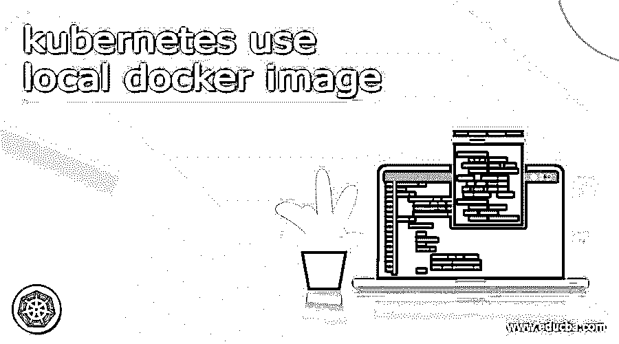

# kuble YAML 验证器

> 原文：<https://www.educba.com/kubernetes-yaml-validator/>

## Kubernetes yaml 验证器简介

Kubernetes YAML 验证器被定义为 YAML 验证器是 Kubernetes 提供的用于验证 YAML 文件的工具，它允许我们复制、粘贴和验证文件的数据，并且它使用简单，也被称为 YAML lint 工具。因此，它有助于验证我们的数据，并作为 YAML 检查器，或者我们可以说是 YAML 语法检查器，通过使用该工具，我们可以加载 YAML 文件的 URL 进行验证，我们也可以验证我们的 YAML REST URL 进行验证。

### kuble YAML 验证器 overviews

一般来说，库伯内特人的组织是在 YAML 档案中定义的，它表达了库伯内特人的资源之间的限制和关系。例如，在 Kubernetes 中，YAML 验证器作为人类可读的格式工作；即使是现在，也很难识别和创建有效的大规模排序。因此，Kubernetes 推出了使验证变得容易和自动化的工具；在这些工具的帮助下，Kubernetes 可以交叉检查明显的资源，以简单地将它们集成到管道中，Kubernetes 提供的工具用于验证，简单地执行安全性和最佳实践，并且他们还试图满足要求。

<small>网页开发、编程语言、软件测试&其他</small>

### 忽必烈 YAML 档案

YAML 是人类可读的基于文本的格式，称为数据序列化，它允许我们借助于名称-值对的映射和项目列表及其嵌套版本的联合来简单地描述配置类型数据，我们可以通过请求 Kubernetes 来表达它们来获得关于运行对象的更多数据，Kubernetes 的文档站点允许我们在源代码控制中保留我们的 YAML 文件的配置，在其中我们可以容易地跟踪它的版本；我们还可以回滚、部署和部署它们。

YAML 文件可以用于配置文件，也可以用于存储信息的应用程序；我们可以在任何文本编辑器中打开 YAML 文件，如果我们想编辑 YAML 文件，那么我们应该使用记事本++这样的源代码编辑器打开它，YAML 文件是用户友好的，可读性很好。

### 最佳工具实践 Kubernetes yaml 验证器:

有六种不同的工具，让我们看看它们，

#### 1\. Kubeval

kubeval 是使用该工具的顶级解决方案之一，它可以帮助检查和验证 Kubernetes 的资源，它可以执行 OpenAPI 规范，这可以允许在 REST API 中保留所有验证要求，用于检查 YAML 提供的输入，以便与 API 的模式进行比较，它可以支持 Kubernetes 的不同版本，其中有一个版本列表用于验证， 并且它可以以 JSON 的形式呈现在 GitHub 上，kubeval 可以与 YAML 及其配置一起工作，而不需要接近集群来编译验证。

#### 2\. Kube-score

这是一个 YAML 验证工具，可以检查 Kubernetes 资源配置的不同最佳实践，如使用非根权限运行容器，准确识别资源的限制，以及健康检查；如果我们运行分析，那么它可以提供输出并在运行的集群中丢失其限制，它的缺点是它不能随着 Kubernetes 的新版本而改变，而且它是不可定制的，并且它可以添加定制策略。

#### 3\. Config-lint

这是 Stelligent 提供的一个开源工具，它主要提供易于使用的验证特性；它可以检查需求的唯一性，它有一个验证规则列表，以确保在我们尝试安装 config-lint 时可以轻松地交叉检查配置对象，然后它没有任何内置的 Kubernetes 清单检查。我们需要编写自定义规则来执行验证，config-lint 的每个规则都有一些强制分配，用于检查用例。

#### 4.铜

它是另一个用 JavaScript 编写的 Kubernetes 验证工具，可以用来通过自定义检查来检查配置文件；它易于定制，并且没有任何限制。如果开发人员想要在 YAML 文件中进行更改，他们可以使用帮助器函数。通过使用帮助器函数，我们可以编写复杂的检查来验证 pod 的权限、部署和域清单，它提供了可用于提取 Kubernetes 对象的基本数据的库。

#### 5.Conftest

它是一个验证工具，为开发人员提供测试框架，帮助开发人员检查和验证 Kubernetes 的资源，它不仅允许验证配置，还允许编写无服务器的测试，对于其他著名的框架，confest 的检查可以通过使用减压阀来编写，其中它是 Kubernetes 的查询语言，它具有企业范围的支持，因为它有简单的自定义策略。

#### 6.北极星

它是 Kubernetes 提供的另一个用于验证的工具，可以安装在集群内部，或者作为一个命令行工具，可以静态地分析 Kubernetes 清单，当它作为一个命令工具运行时，它涉及一些内置的检查，这些检查具有与 Kube-score 类似的安全性和最佳实践，如果我们可以使用它来编写自定义检查，这些检查在某种程度上类似于 config-lint、copper 和 conftest。

### 结论

在本文中，我们得出结论，YAML 验证器可以用于验证目的；我们可以使用 yamlvalidator.com 在线验证我们的 YAML 文件，它也可以离线工作，我们可以将我们的 YAML 文件复制或粘贴到编辑器中，我们可以立即看到错误和 JSON 表示。

### 推荐文章

这是 Kubernetes yaml 验证器的指南。这里我们讨论可以用于验证目的的 YAML 验证器；我们可以在线验证我们的 YAML 文件。您也可以看看以下文章，了解更多信息–

1.  [Kubernetes 主机路径](https://www.educba.com/kubernetes-hostpath/)
2.  [Kubernetes 自动缩放](https://www.educba.com/kubernetes-autoscaling/)
3.  [立方注释](https://www.educba.com/kubernetes-annotations/)
4.  [立方入口](https://www.educba.com/kubernetes-ingress/)

