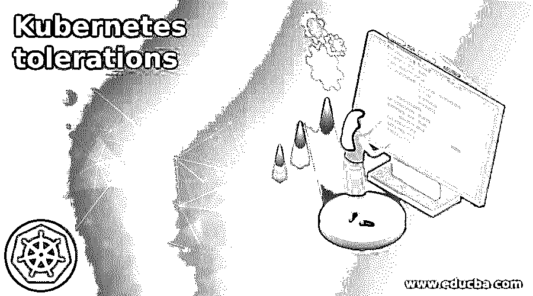

# 永恒的宽容

> 原文：<https://www.educba.com/kubernetes-tolerations/>

## Kubernetes 耐受性介绍

库伯内特人的耐受性被定义为:Kubernetes 提供的属性允许用户追踪一个节点，这个节点被称为人工保留的节点的污点；因此没有任何 pod 被安排给它；否则，一个豆荚显然能忍受这种污染。因此，Kubernetes 的容忍特性允许我们生成提交给特定 pod 的节点；我们可以说，一个 pod 需要更多的节点资产，这些资产可用于利用为它们指定的节点的时间表。

### 什么是 Kubernetes 容忍？

Kubernetes 容忍是 Kubernetes 提供的允许用户跟踪节点的特性，其中容忍是忽略污点的过程。相比之下，调度、容差不适用于 pod。不过，我们可以把它们应用到豆荚上；如果我们尝试容忍 pod 的规范，那么我们可以在正在使用的节点上慢慢容忍磁盘；容忍的特性可以用来发现一个节点，这样我们就不能申请调度它，而不是 pod 可以被明确地容忍，我们可以称之为污点。

<small>网页开发、编程语言、软件测试&其他</small>

可以将容差应用于一个 pod，这并不意味着需要该 pod，但是它允许该 pod 在具有相同污点的节点上进行调度。

### 如何使用 Kubernetes 宽容？

让我们看看 Kubernetes 如何允许我们使用宽容；如果我们希望使用提交的节点，那么我们可以使用污点和容差，因为通过使用提交的节点，我们可以通过使用特定的参数来生成节点池，并且我们还可以将它们用于特定的应用程序，因此我们还可以将分配的 pods 与我们的辅助应用程序区分开。

污染和容忍可以一起工作，以确保不能为不合适的节点调度 pods 我们可以将一个或多个污点放入一个节点，其中 pod 不会批准这种类型的节点，它们不会容忍这些污点。

我们可以这样使用污点，

`key = value : Effect,`

其中我们可以为效果分配三个不同的值，如 NoSchedule、PreferNoSchedule 和 NoExecute。

对于操作符，它有默认值“equal”，它也可以将它用作“exist”，如果我们想将操作符更改为“exist”，那么我们不需要给它赋值。如果污点在节点上不可用，那么效果可以应用于 pod。

例如，如果我们的 Kubernetes 集群有两个节点，一个节点会受到 pod 的影响，而另一个节点不会受到影响，并且没有污点可用，那么我们可以在该节点上添加一个污点，

taint = test: NoSchedule，这里我们可以说 pod 不会匹配 taint；因此，不能为此节点安排它。

### 创造 Kubernetes 宽容

为了首先创建 Kubernetes 容错和污点，我们需要检查集群中的可用节点，

*   我们必须执行命令来检查集群中的可用节点

`“kubectl get nodes #Get current pods in the cluster ”`

*   对于多个节点，我们可以使用命令“describe”来检查第一个节点中的污点

`“kubectl describe node node1 #Describe node01 node to extract more details”`

*   我们可以使用命令将“app = frontend:no schedule”tain 添加到第一个节点，

`“kubectl taint nodes node01 app = frontend:NoSchedule #Add taint to the node01 node details of the node01 node”`

`“kubectl describe node node01 #Extract”`

*   我们可以生成文件并将其添加到定义中的 pod 中，

`“vim my-pod.yml #create a pod definition”`

*   之后，为了生成没有容差的 pod，我们需要执行命令，

`“kubectl create –f my-pod.yml #Create a pod”`

`“kubectl get pods #Get details of the pod”`

*   我们还可以使用“describe”命令来获取关于 pod 的更多详细信息，

`“kubectl get pods #Get details of the pod”`

`“kubectl describe pod frontend #Extract more details of the Pod.”`

### 应用 Kubernetes 容忍

通过使用 kubectl，可以将容差应用于节点，我们可以将 kubectl 应用于所描述的节点的验证，这也可以应用于污点，所描述的节点也可以是多个，让我们看一个在节点上运行或应用节点的例子，

规格:

宽容:

*   关键:机器学习
*   运算符:“等于”

价值:“计算机视觉”

效果:“没有时间表”

在这个例子中，可以通过使用污染节点来匹配容忍度，并且可以在机器学习的节点中开发任何 pods 如果我们想删除节点上的容差，那么 kubectl 使用命令来删除它们。

### Kubernetes 宽容的例子

让我们看看宽容的例子，

`apiVersion: v2
kind: Pod
metadata:
name: mhjoy
labels:
env: test1
spec:
containers:
- name: mhjoy
image: mhjoy
imagePullPolicy: IfNotPresent
tolerations:
- key: "taint"
operator: "Exists"
effect: "NoSchedule"`

上面是一个使用容差的 pod 示例，其中它有运算符“exists ”,因此情况编号。将指定值和具有相等值的“equal”运算符，并且应该给出“NoSchedule”效果，其中我们的系统应该尝试发现一个 pod，以便它不会容忍不必要的节点污染。

### 结论

在本文中，我们得出的结论是，污点和容差可以共同确保 pod 不会被调度到适当的节点上；我们也讨论了一些与使用和创造它有关的问题，所以这篇文章将有助于理解库伯内特人的宽容。

### 推荐文章

这是一个 Kubernetes 宽容指南。在这里，我们讨论污染和容忍两者可以一起工作，以确保 pod 不会被调度到适当的节点上。您也可以看看以下文章，了解更多信息–

1.  [Kubernetes Daemonset](https://www.educba.com/kubernetes-daemonset/)
2.  [Kubernetes 主机路径](https://www.educba.com/kubernetes-hostpath/)
3.  [Kubernetes 自动缩放](https://www.educba.com/kubernetes-autoscaling/)
4.  [立方〔t1〕](https://www.educba.com/kubernetes-kubectl/)

