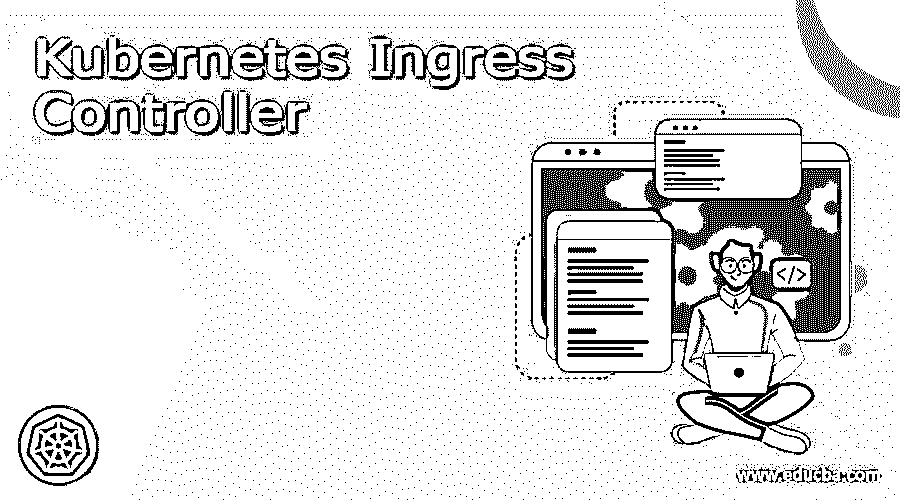

# Kubernetes 入口控制器

> 原文：<https://www.educba.com/kubernetes-ingress-controller/>

## Kubernetes 入口控制器简介

Ingress 是 Kubernetes 的一个负载平衡器，它的主要目的是向集群内部的服务公开集群外部的 HTTPS 和 HTTP 路由。通过使用入口控制器，我们还可以定义控制流量路由的规则。入口控制器负责实现入口，该计数也不会暴露任意协议或端口。基本上，入口控制器接受来自 Kubernetes 平台外部的流量，并帮助我们对其进行负载平衡。入口控制器还通过提供外部节点和 Kubernetes 服务之间的桥梁，帮助我们优化管理 Kubernetes 流量路由的复杂性。在教程的下一部分，我们将看到它的内部工作，实现细节，以便初学者更好地理解和清楚。

### 什么是 Kubernetes 入口控制器？

因为我们已经讨论了它的简短定义，所以让我们更仔细地了解一下它的作用，

<small>网页开发、编程语言、软件测试&其他</small>

1)入口控制器帮助我们管理进入 Kubernetes 平台的外部流量。2)它提供了 Kubernetes 服务和外部节点之间的桥梁。
3)在 I 控制器的帮助下，我们可以在 Kubernetes 集群内路由 HTTP 和 HTTPS 流量
4)它还有助于我们优化管理流量路由时可能出现的复杂性。
5)可以使用 Kubernetes API 配置入口控制器，然后我们可以部署名为“入口资源”的对象。
6)主要目的之一是，它帮助我们监控处于运行状态的 Kubernetes pods，基于此，它自动更新服务中添加和删除 pod 的负载平衡规则。在教程的下一部分，我们将讨论更多的内部工作，它的设置，以及我们拥有的最佳入口。

### 如何设置 Kubernetes 入口控制器？

在本节中，我们将看到入口控制器的设置步骤，让我们开始吧；

**先决条件:**

1)首先我们应该有一个能满足入口的入口控制器。如果我们只确定入口资源，则不会有任何影响。

2)要创建入口控制器，应遵循参考规范。

下面是入口控制器参考文件，我们可以用它来创建；

**例如:**

`apiVersion: networking.k8s.io/v1
kind: Ingress
metadata:
name: minimal-ingress
annotations:
nginx.ingress.kubernetes.io/rewrite-target: /
spec:
rules:
- http:
paths:
- path: /testpath
pathType: Prefix
backend:
service:
name: test
port:
number: 80`

正如我们在上面的文件中看到的，它包含了种类、元数据、注释、规范和。yml 文件。在 Kubernetes 中设置入口控制器时，我们需要记住以下几点:

1)入口控制器的名称应该是有效的 DNS 子域名称。

2)因为我们有不同类型的入口控制器，所以它们将支持不同类型的注释。

3)入口控制器也使用注释来配置一些选项。

4)最近我们在 yml 文件中有了一个规范，它指定了配置代理服务器或负载平衡器所需的所有信息。

5)规范包含的重要参数是规则，它根据我们在 yml 文件中定义的规则跟踪所有传入的请求。

6)在这里，入口控制器规则仅支持 HTTP(S)流量。

### 最佳 Kubernetes 入口控制器和示例

让我们通过示例详细讨论各种类型的 Kubernetes 入口控制器，让我们开始吧；

1) GCP 入口控制器:这是谷歌提供的顶级入口控制器之一，这里 GCP 代表谷歌云平台，该入口控制器创建谷歌云负载平衡器，并根据我们提供的规则和信息帮助我们配置它。要使用这个入口控制器，我们必须启用 HTTP 负载平衡插件。

2) Istio 入口:该入口控制器利用特使代理来管理到服务网格的所有流量。Istio 入口控制器提供了与现有服务和 Istio 结构的最佳集成，具有可用性、路由、部署模型和安全性。但它不是轻量级的，它有很大的学习曲线。

3)大使:这个入口控制器是一个负载平衡器和 API 网关，自带入口支持。它具有高可用性、安全性、无服务器集成等全功能。但是这个入口控制器是基于 Envoy 的，它也很容易与服务网格连接。

4) F5 容器入口:该入口控制器使用 OpenShift 或 Kubernetes，它是一个云原生连接器，使用其中任何一个作为 BIG-IP 编排。该 BIG-IP 控制器监控 Kubernetes API 以更新 BIG-IP 和格式化资源，并相应地配置系统。

5) Traefik:该入口控制器为我们提供 Kubernetes 入口控制器，该控制器帮助我们访问集群服务，支持入口规范。

### 基于羟基的

它是入口控制器的类型之一，这有助于我们对同样的事情，让我们详细讨论这一点，以便更好地理解和清楚，见下文；

它是最受欢迎的入口控制器之一，是在 Kubernetes 之前就存在的 TCP/HTTP 代理解决方案，它还有助于我们实现高性能，因此当我们以此为目标时，它是我们已经看到的不同入口控制器中的最佳选择之一。此外，如果我们需要负载平衡，这是我们的首要因素，那么我们可以再次选择 HAProxy 入口控制器，因为这是一个很好的选择。这个控制器还为我们提供了动态配置更新，可以通过 API 来完成。

### 结论

要理解入口控制器，请通读整篇文章，并按照逐步说明来更好地理解它。此外，我们已经简要概述了入口控制器的用途；本教程结束时，您将对入口控制器的使用和工作细节有更好的理解。

### 推荐文章

这是 Kubernetes 入口控制器指南。这里我们讨论定义，什么是 Kubernetes 入口控制器，如何设置一个 Kubernetes 入口控制器？.您也可以看看以下文章，了解更多信息–

1.  [立方注释](https://www.educba.com/kubernetes-annotations/)
2.  [Kubernetes 自动缩放](https://www.educba.com/kubernetes-autoscaling/)
3.  [立方控制平面](https://www.educba.com/kubernetes-control-plane/)
4.  [Kubernetes 工具](https://www.educba.com/kubernetes-tools/)

