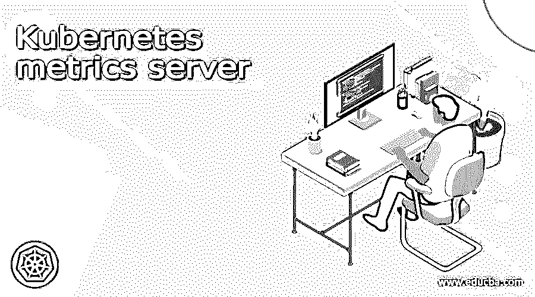

# Kubernetes 度量服务器

> 原文：<https://www.educba.com/kubernetes-metrics-server/>

## Kubernetes metrics 服务器简介

在 Kubernetes 中 metrics server 的帮助下，我们可以通过使用 metrics API 轻松跟踪资源使用情况，包括内存使用情况、Kubernetes 中可用的 CPU。我们可以通过两种方式直接访问这些指标，例如由用户或管理员访问。用户可以通过使用命令来访问它，对于集群中存在的控制器，例如可用于决策的水平 Pod 自动缩放器。简而言之，在 Kubernetes 中 Metrics API 的帮助下，我们可以很容易地确定给定 pods 或节点开始消耗的资源量。但是这个值不是由这个 API 存储的。在教程的下一节，我们将详细讨论它的内部工作和实现，以便初学者更好地理解和清楚。

### 什么是度量服务器？

正如我们已经看到的，metrics server 用于跟踪每个节点或给定 pod 上的资源使用情况。此外，我们可以通过使用任何命令或控制器的用户来跟踪这一点，这将为我们提供应用程序中资源使用的度量。因此，我们可以看到一些要点，这些要点可以让我们对 Kubernetes 中的度量服务器有更多的了解，详见下文；

<small>网页开发、编程语言、软件测试&其他</small>

1)它是一个集群范围的聚合器，包含资源使用数据。

2)默认情况下，它部署在我们可以通过名为 Kube-up.script 的脚本创建的群集中，并表示为部署对象。

3)如果我们要设置不同的 Kubernetes 设置，那么在这种情况下，可以使用包含配置的 components.yml 文件进行部署。

4)通过使用 Metrics server，我们可以从 API 中收集资源使用情况数据，这些数据由每个节点上的 K4 公开，并且通过使用 Kubernetes 聚合器向主 API 注册。

现在我们对 Kubernetes 中的度量服务器有了一个基本的概念，在下一节中，我们可以详细讨论它的用例以及实现，以便更好地理解和清楚。

### 用例 Kubernetes 度量服务器

在本节中，我们将讨论我们可以选择 Metrics Server 的场景，我们还将看到几个要点，这些要点将告诉我们何时不要选择 Metrics Server，所以让我们开始吧；

1)当我们希望实现基于 CPU/内存的水平自动扩展时，在这种 aces 中，我们应该选择 Metrics Server。水平自动扩展帮助我们自动扩展 pod、副本集和控制器的数量。

2)当我们想要执行垂直自动缩放时，也可以使用它，这意味着我们应该自动建议或调整容器所需的资源。

我们也有一些不应该考虑度量服务器的场景，让我们开始吧；

1)假设我们想要水平自动缩放，但它不是基于 CPU/内存，而是基于一些其他资源。

2)当我们有非 Kubernetes 集群时。

3)当我们需要准确的资源使用指标时。

### Kubernetes 度量服务器安装

正如我们所见，Kubernetes Metrics Server 是一个集群聚合器，它包含资源使用数据，这将有助于我们确定集群中每个节点或单元的资源使用情况。这个度量服务器基本上由 Kubernetes 附加组件使用，如 Kubernetes Dashboard 和 Horizontal Pod Amazon，默认情况下，它不部署在亚马逊 EKS 集群上，我们必须执行一些步骤才能实现这一点。

在本节中，我们将讨论 Kubernetes 中 metrics 服务器的安装部分，因为这也需要做一些配置。我们有两种安装方式，如下所述:

a)通过使用 YAML 货单

b)或利用官方舵轮图。

但是，我们有几个命令可以轻松地安装这个度量服务器，这可以通过主要使用 components.yml 清单文件来完成，按照下面的命令集来安装它，并验证它是否工作正常见下文；

a)使用以下命令安装 components.yml 清单文件 un；

例如:

`kubectl apply -f https://github.com/kubernetes-sigs/metrics-server/releases/latest/download/components.yaml`

b)现在我们将要求验证或检验我们的安装，为此，我们可以使用以下命令；
例如:

`kubectl get deployment metrics-server -n kube-system`

这样，我们可以为集群中的 pods 或 nods 安装 Metrics server，但是我们需要准备好 components.yaml 文件，以便正确执行上面的命令，因此您可以从这里下载最新的文件供您参考(见下文);
网址:

`https://github.com/kubernetes-sigs/metrics-server/releases`

Kubernetes 度量服务器 api 示例

我们可以通过下面提到的路径
发现 API，例如:
1)/API/metrics . k8s . io/
2)k8s.io/api/core/v1
Kubernetes metrics 服务器配置

让我们来看一下根据我们现有的群集类型需要完成的配置，我们需要更改一些需要在度量服务器中更改的标志，让我们开始吧
1)–kube let-preferred-address-types:这将有助于确定我们要连接的节点的地址。2)-kube let-unsecure-TLS:这仅用于测试目的；它不会验证 Kubelets 提供的证书的 CA。
3)–request header-client-ca-file:该配置将帮助我们指定根证书，这将有助于验证传入请求中的客户端证书。
使用以下命令获取填充指标服务器列表，
docker 运行–RM k8s.gcr.io/metrics-server/metrics-server:v0.5.0–帮助

### 结论

所以通读整篇文章，详细理解用例及其需求。一旦遵循了教程中给出的所有步骤，您将对在 Kubernetes 应用程序中安装和使用 Metrics Server 有很好的了解。

### 推荐文章

这是一个 Kubernetes 度量服务器的指南。这里我们讨论定义，什么是度量服务器，以及例子。您也可以看看以下文章，了解更多信息–

1.  [Kubernetes Daemonset](https://www.educba.com/kubernetes-daemonset/)
2.  [Kubernetes 主机路径](https://www.educba.com/kubernetes-hostpath/)
3.  [Kubernetes 环境变量](https://www.educba.com/kubernetes-environment-variables/)
4.  [Kubernetes 复制控制器](https://www.educba.com/kubernetes-replication-controller/)

