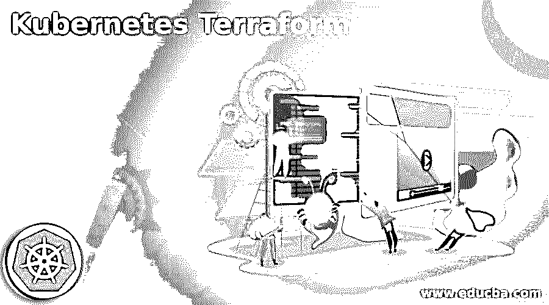

# 不可思议的土地改革

> 原文：<https://www.educba.com/kubernetes-terraform/>

## 库柏土地改革概论

Kubernetes terraform 的定义是，terraform 是一个开源工具，当 terraform 可以控制公共和私有云服务的基本结构时，它允许我们提供具有一致功能的基本结构，这有助于在 Kubernetes 的不同资源之间进行互连。 它还可以控制与 Kubernetes pods 相关的外部服务，因此我们可以说，Kubernetes terraform 允许用户通过使用指示性结构作为代码来控制 Kubernetes 资源的生命周期，我们可以使用 terraform 通过使用容器来生成 pod。

### 什么是不可思议的土地改革？

*   terraform 是一个开源的基础结构工具，可以作为代码工具工作，主要用于控制公共云，如 AWS、GCP 和 Azure，terraform 分散作为 CLI，用于将定义的基础结构编写为代码。 我们可以说，terraform 是一种工具，它可以通过将基本结构用作代码来选择控制该结构的整个生命周期，这意味着可以在配置文件中定义基础设施的组件，terraforming 可以使用这些组件来进行安排。
*   它还可以管理和调整多个云提供商的拆卸基础架构，terraform 可以构建资产图，还可以并行生成非依赖性资产，当涉及到基础架构上的协作时，its 的计划可以为其团队成员生成输出，以审查他们的工作。

### Kubernetes Terraform 工程

*   使用 terraform 控制基础架构的工作方式首先，我们必须编写或修改基础架构中的配置文件，其中配置文件可以具有我们基础架构的已定义状态，我们可以修改幸存的配置文件来定义如何更改现有的基础架构代码。
*   如果我们对定义的配置感到满意，那么我们可以要求 terraform 创建执行目标，该目标的命令用于根据配置创建执行计划，在该配置中，计划告诉我们我们希望在基础架构中进行什么转换来定义状态，我们可以说这是 terraform 的典型工作流，因为我们需要手动执行一些任务。 现在，terraform 还支持自动化工作流，我们可以在其中自动生成用于部署新分支机构的新基础架构，我们还可以自动获取计划，以便用其新版本更新计划，而无需任何易于理解的手动帮助。

### 为什么 Terraform 是一个工具？

*   Terraform 是一种工具，因为它承认资产之间的联系，其中它对生成、更新和删除资产的订单操作和不成功条件有内置的理解，例如，如果 PVC 需要与 PV 隔开，那么它可以自发地知道如何在 PV 之前生成 PV，并且如果 PV 无法生成，那么 terraform 将不会尝试生成 PVC，直到 terraform 理解生成失败为止。
*   Terraform 有利于维护 Kubernetes 的资产，它可以结合到 terraform 计划中，因此我们可以在尝试之前检查这些变化，它还可以用于各种客户的路由，并作为代码继续基本结构，它还有助于路由系统和优化上市时间。

### kubernetes terra form 的使用案例

terraform 有三个主要的使用案例:

<small>网页开发、编程语言、软件测试&其他</small>

#### 1.公共云资源调配

公共云供应是 terraform 的主要任务，因为它可以提供一个主要的云提供商，terraform 允许我们通过所谓的提供商使用公共云，terraform 中的提供商可以像插件一样封装现有公司，以生成定义的 terraform 语法，提供商可以克服主要的公共云，所有这些都可以开源，并由 terraform 背后的组织密切控制，从而使提供商能够接受来自提供商的更新。

#### 2.多云部署

这是 terraform 的另一个使用案例，其中它可以执行多种云部署，terraform 的主要吸引力之一是同时工作，它具有多种云部署功能，因为我们可以说它可以同时工作于多种云部署，但它主要与每一个云提供商合作。It 部门能够将资源开发到各种云提供商中，这是非常有益的，因为开发人员能够使用相同的代码并遵循 chain，并且不需要熟悉各种工具和技术，此外，它还可以帮助组织支持可能仅在一个提供商中可用的独特服务，从而克服所有云资产仅依赖于一个组织的风险。

#### **3。基础设施代码**

正如我们在上面看到的，terraform 有一种提供者的方式，它可以封装现有的 API 并将其转换为定义的语法，生成提供者的过程不仅适用于开放资源，而且可以为内部公司编写，公司可以允许我们转换现有的工具，API 可以管理执行 CRUD(创建、读取、更新和删除)操作，从而为管理各种基础架构提供灵活性。

### 结论

在本文中，我们得出结论，terraform 是一个非常动态的工具，可用于编写代码形式的基础设施，我们也看到了它的用例以及 terraform 的工作方式，因此本文将有助于理解 Terraform 的相关内容以及如何使用它。

### 推荐文章

这是 Kubernetes Terraform 的指南。在这里，我们讨论介绍，工作，为什么 terraform 是一个工具？和用例。您也可以看看以下文章，了解更多信息–

1.  [Kubernetes 主机路径](https://www.educba.com/kubernetes-hostpath/)
2.  [Kubernetes 环境变量](https://www.educba.com/kubernetes-environment-variables/)
3.  [Kubernetes 复制控制器](https://www.educba.com/kubernetes-replication-controller/)
4.  [Kubernetes 选择器](https://www.educba.com/kubernetes-selector/)

