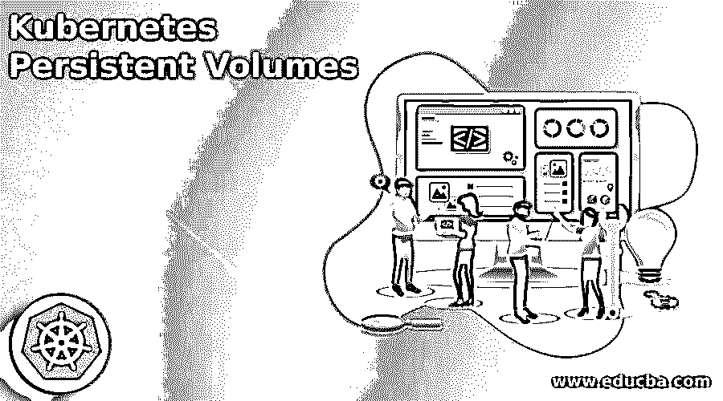

# 立方结构永久磁碟区

> 原文：<https://www.educba.com/kubernetes-persistent-volumes/>

## Kubernetes 持久性卷简介

Kubernetes 持久卷的定义是，它是群集中存储库的一部分，由管理员使用存储库类进行配置，它是群集中的资产，如节点，也是群集中的资产，它们是卷插件，类似于卷，但它们有一个生命周期，可以从任何单个 pod 中解放出来，并可以使用持久卷。 它通常用于 Kubernetes 中的数据库，因为数据库希望通过支持持久卷来随时访问其数据，该持久卷可以附加到 pod。

### 什么是 Kubernetes 持久卷？

在 Kubernetes 中，PersistentVolume 一词指的是可帮助我们控制应用程序存储的资产存储，持久存储元素的资产属于群集，它独立于 pod，持久卷是网络存储的一部分，已由管理员扩展，它在群集中拥有独立于任何可使用持久卷的单独 pod 的资源。

<small>网页开发、编程语言、软件测试&其他</small>

### Kubernetes 持久性卷生命周期

持久性卷的生命周期从供应开始，传递到绑定，接着是使用，然后可以转移到回收、保留，最后是删除。它在其生命周期中有一些步骤，让我们讨论如下:

**预配置**:有静态预配置和动态预配置。

**绑定**:确保永久卷能够满足用户需求而不浪费卷资产的过程。

**使用**:可以满足集群只能为一个 pod 扩展一个绑定卷的需求。

**回收**:集群可以利用回收策略，该策略可以在释放其请求后增加卷的处理量。

**Kubernetes 卷的类型**:Kubernetes 卷就像一个目录，可以被 pod 中的容器访问，它有各种类型，如下所示。

*   空目录:

当一个单元被分配给一个节点时，就生成了一个空目录卷，如果该单元在该节点上运行，那么它可能会工作很长时间，在这种情况下，首先该卷是空的，并且容器将读写该文件，当取出该单元时，数据也已经从空目录中删除。

*   **hostPath** :这个卷能够从节点的文件系统扩展一个文件或目录。
*   **gcepersistindisk**:这种类型的卷可以将 Google Compute Engine 的持久磁盘扩展到我们的 pod 中，当一个 pod 从节点中删除时，可以携带该卷中的全部数据。
*   **awsElasticBlockStore** :该卷已经将 amazon Wb Services 弹性块存储组织到我们的 pod 中，就像 GCE 持久性磁盘一样，当 pod 从节点中删除时，该卷中的完整数据保持不变。
*   **NFS**:NFS 代表网络文件系统，它可以组织到我们的 pod 中，当 pod 从节点中取出时，其中的数据已经被删除，卷只剩下 down。
*   **ISCSI**:ISCSI 卷允许将现有卷 SCSI over IP 卷设置到我们的 pod 中。
*   **flocker** :这个卷已经被用来控制数据卷，它是开源的，允许它的一个数据集组织在我们的 pod 中，如果这个数据集没有保存在 flocker 中，那么我们需要使用 flocker 的 API 来生成它。
*   glusterfs :开源网络文件系统允许将 glusterfs 放入我们的 pod 中。
*   **rbd**:Rados Block Device，表示 Rados Block Device，允许被发射到我们的 pod 中，并且在 pod 从节点中被删除后，数据被保留。
*   **cephfs** :允许将现有的 It 卷加载到我们的 pod 中，从节点中删除 pod 后，数据已经被携带上来。
*   gitRepo :它启动一个空目录，并在其中创建一个复制的 git 存储库，供我们的 pod 使用。
*   **秘密**:这种类型的卷被用来将密码等敏感数据传递给 pod。
*   **azureDiskVolume** :用于将一个微软 Azure 数据盘扩展成一个 pod。

### Kubernetes 持久类型的卷

Kubernetes 持久类型是作为插件执行的，其中一些插件如下所示:

*   AWS 弹性块存储
*   蓝色磁盘
*   Azure 文件
*   CephFS 卷
*   集装箱存储接口
*   光纤通道存储
*   弹性体积
*   GCE 永久磁盘
*   Glusterfs volume
*   主机路径卷
*   iSCSI
*   局部存储器
*   网络文件系统存储
*   波特沃克斯卷
*   雷达闭塞设备
*   Vsphere VMDK 卷
*   煤渣
*   Flocker 存储
*   字节容量
*   存储容量

### Kubernetes 持久卷—使用保护

在数据库服务等需要访问最高可用数据存储的生产环境中，Kubernetes 在持久性数据存储方面提供了很大的灵活性，其中每个化合物都可以使用特定的数据存储机制。

### Kubernetes 持久——保留、回收和删除

*   **Retained**:“retain”是一种回收策略，允许手动回收资产，当永久卷链已被删除时，PV 完全存在。
*   **Recycled** :这是一种回收策略，它在卷上执行基本清理，如果管理员可以使用控制器管理器命令行参数构建自定义回收器 pod 模板，则可以再次访问该卷以进行新的申请。
*   **Deleted** :这是一个回收策略，它支持的插件可以从 Kubernetes 中删除对象。

### 结论

在本文中，我们得出结论，Kubernetes 持久性卷是由管理员配备的网络存储的一部分，我们还讨论了卷的类型、Kubernetes 持久性卷的生命周期，因此本文将有助于理解 Kubernetes 中持久性卷的概念。

### 推荐文章

这是 Kubernetes 持久性卷的指南。在这里，我们讨论 Kubernetes 持久卷是由管理员配备的网络存储的一部分。您也可以看看以下文章，了解更多信息–

1.  [Kubernetes 主机路径](https://www.educba.com/kubernetes-hostpath/)
2.  [立方注释](https://www.educba.com/kubernetes-annotations/)
3.  [立方〔t1〕](https://www.educba.com/kubernetes-kubectl/)
4.  密密秘

