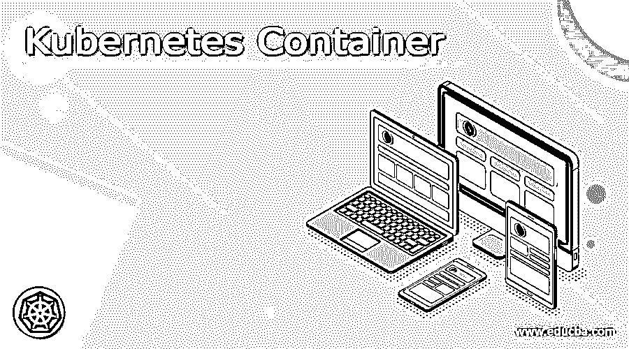

# 不可计量的容器；不可计量的容器；不可计量的容器；不可计量的容器；不可计量的容器；不可计量的容器；不可计量的容器；不可计量的容器；不可计量的容器

> 原文：<https://www.educba.com/kubernetes-container/>

## Kubernetes 容器介绍

Kubernetes 容器的定义是，它是一个随时可以运行的软件包，可以携带在 Kubernetes 中运行应用程序所需的信息，在 Kubernetes 中，它需要有负责运行容器的代码和容器运行时，并且它不能更改容器的代码。容器图像也作为软件包工作。容器是软件的一个公共部分，它可以包含一组代码及其所有的东西，这样应用程序就可以快速有效地从一个计算环境转移到另一个计算环境。

### 什么是 Kubernetes 容器？

Kubernetes 中的容器是软件包，它具有运行软件所需的所有信息，如在运行时很重要的代码、系统库，并且它还具有所需设置的默认值，其中它需要具有较少的系统资产和在容器中运行的应用程序，这些应用程序可以简单地为各种操作系统及其硬件平台实现， 每个正在运行的容器都是可重复的，这意味着它遵循标准化，这意味着我们可以在可以运行它的地方获得成对的轴承，容器映像是一个随时可以运行的软件包，包含运行软件所需的所有信息，包括代码、库，还需要设置默认值。

<small>网页开发、编程语言、软件测试&其他</small>

### Kubernetes 容器是如何工作的？

容器是 Kubernetes 的应用层中的一个分离部分，它包含代码及其依赖项；为了共享操作系统，不同的容器可以在相同的机器上运行，并且每台机器都可以在空间中以不同的方式工作，Kubernetes 的集群可以帮助主要的云提供商环境，以便我们可以通过使用一些命令来调整集群和实施应用程序。当 Kubernetes 可以控制一堆信息时，容器具有一个平台，这是一个客户端-服务器软件，可以通过其工作元素使容器的实施更加容易。

一个容器可以从底层映像开始编译，一个试用应用程序已经被打包到一个容器映像中，并且已经通过该容器的平台实现；在计算环境中，从底层开始有许多层，底层意味着底层将是第 1 层，其中它可以是容器的基础设施，第 2 层具有主机操作系统，第 3 层具有容器的平台，在顶层有两层，其中一层具有库，下一层具有用于服务的应用代码，并且与可用的图像和网络连接，这是容器的工作。

### 库容器图像

Kubernetes 中的容器映像可以构成包含应用程序及其所有与软件相关的依赖项的二进制数据；容器映像也是一个可操作的软件包，因此可以单独运行，也可以描述根据其运行时环境的管理，我们也可以说它是稳定的，具有可工作的代码，并且代码能够在计算系统中生成容器，容器映像是不可更改的，这意味着它不能被更改，并且可以在任何环境中频繁实现，因此它是容器化架构的基本元素，在 Kubernetes 集群中实现应用程序时，我们需要从 docker 注册表中拖动更多的映像。

我们能够为规范的容器图像指定名称；之后，我们可以添加标签到图像中，标签也由大写和小写字母组成，我们也可以更新图像。

### Kubernetes 集装箱环境

Kubernetes 容器环境可能有一些与容器相关的主要资产，Kubernetes 的环境有一个包含映像和一个或多个卷的文件系统，它还有与运行自身的容器相关的所有信息，它还包含有关群集中其他设备的信息，它有两个资产，如容器信息和群集信息，我们来讨论一下。

#### 1.集装箱信息

主机名和 pod 都是相似的，容器在其中运行；我们可以通过' hostname '命令获取容器信息，也可以通过' gethostname '调用 libc 中的函数；pod 名称和命名空间是我们可以通过向下 API 获得的两个环境变量，通过使用 pod 信息，用户可以向容器描述变量，因为环境变量已经在 docker 图像中指定。

#### 2.集群信息

集群信息具有与容器相关的所有信息，并且它可以在生成容器时可用，并且当新的 pod 已经生成并且 Kubernetes 能够支持平面服务时，该列表被限制到相同名称空间下的服务。

### Kubernetes 容器运行时

容器运行时也被称为容器引擎，其中它是允许在主机操作系统上运行容器的软件元素，例如 docker、runC、containered 和 windows 容器等。它还可以接受来自用户的请求，如命令行选项，并拉取图像，它可以从用户的角度运行容器，容器运行时允许 Kubernetes 利用不同种类的容器，而不必重复运行容器，Kubernetes 可以利用任何可以部署 CRI 的容器运行时来控制容器、容器和容器图像。

### 结论

在本文中，我们得出结论，Kubernetes 容器是一个软件包，它有一个容器映像，其中是一个包含二进制数据及其依赖项的软件包，容器运行时允许我们在主机操作系统上运行容器；本文将有助于理解 Kubernetes 容器的概念。

### 推荐文章

这是一个 Kubernetes 容器指南。这里我们讨论的 Kubernetes 容器是一个软件包，它有一个容器映像，其中包含一个软件包。您也可以看看以下文章，了解更多信息–

1.  [Kubernetes 主机路径](https://www.educba.com/kubernetes-hostpath/)
2.  [Kubernetes 自动缩放](https://www.educba.com/kubernetes-autoscaling/)
3.  [立方控制平面](https://www.educba.com/kubernetes-control-plane/)
4.  [立方入口](https://www.educba.com/kubernetes-ingress/)

