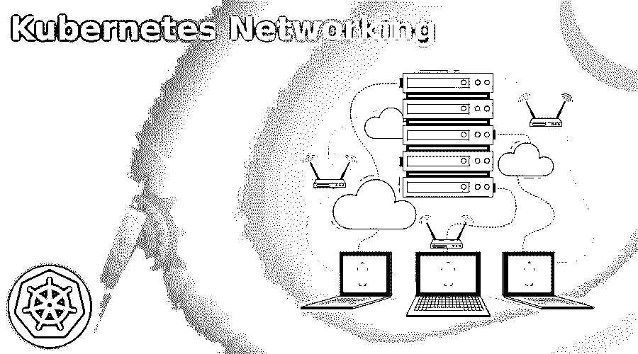

# Kubernetes 网络

> 原文：<https://www.educba.com/kubernetes-networking/>

## Kubernetes 网络简介

正如我们所知，Kubernetes 帮助我们在不同的集群中自动化应用程序的部署、维护、操作、调度和各种操作。此外，顾名思义，Kubernetes 网络允许我们与 Kubernetes 的其他组件以及彼此之间进行通信；此外，Kubernetes 与任何其他网络平台都有很大不同，因为它不再需要手动将主机端口映射到容器端口。Kubernetes 包含描述 Kubernetes 网络工作的不同组件；在本教程的下一节，我们将详细介绍它是如何工作的，以及它的实现，以便初学者更好地理解和理解。

### 什么是 Kubernetes 网络？

正如我们已经讨论过的，Kubernetes 网络允许我们与不同的组件进行通信。此外，Kubernetes 中的网络非常不同；它消除了开发人员的大量手工工作。在 Kubernetes 中，我们有如此多的核心组件需要理解，以便理解 Kubernetes 网络背后的概念；让我们看看下面的几个要点；

<small>网页开发、编程语言、软件测试&其他</small>

1) Pod

2)服务

3)主节点

4)工人节点

5)其他 Kubernetes 成分

这是 Kubernetes 网络概念中主要包含的几个要点。谷歌开发的 Kubernetes 网络，有几点我们应该记住；

1)我们有一名管理员，他使用 Kubernetes 集群网络在私有、公共和混合云基础架构之间移动。

2)通过使用 Kubernetes 网络，我们可以在组件和其他应用程序之间进行通信。

我们在 Kubernetes 中也有不同类型的网络，我们将在教程的下一节中讨论。

### 网络是如何工作的？

正如我们所知，我们在 Kubernetes 平台中有不同的组件，比如容器、pod、应用程序和节点，它们都使用不同类型的方法相互通信。因此，让我们来看看以下网络类型:

a)集装箱到集装箱

b) Pod 到服务的通信

c)吊舱对吊舱通信

d)外部到服务的通信

现在让我们仔细看看 Kubernetes 网络的重要或核心组件，它允许我们在 Kubernetes 集群内部拥有外部流量；

**a)负载平衡器:**该组件允许我们从外部连接到互联网的服务，因此在这种情况下，它将帮助我们将所有外部流量转发到相应的服务；正如我们在 Kubernetes 所知，我们对每项服务都有特定的知识产权。

**b) ClusterIP:** 这是 Kubernetes 的默认服务，允许我们在 Kubernetes 内部进行通信，这是内部通信，因此对于外部流量，它使用代理进行通信。当我们想要调试服务或者想要显示 interact Kubernetes 仪表板时，这个服务非常有用。

**c)节点端口:**该服务允许我们打开虚拟机上的端口，在此之后，流量被转发到这些端口。这是使用最多的服务之一。

**d)入口:**它是一个服务或控制器，允许我们使用负载均衡器将流量路由到服务。

**网络管理员实施**

本节将介绍 Kubernetes 网络的实施；我们有不同的方法来做这件事。在本节中，我们将通过 4 种方式来实现这一点；Gartner 在他的一份报告中给出了 2019 年，让我们开始吧；

**a)戴尔 EMC:** 这些方法支持云原生和传统两种类型的应用程序，并集成了对 Kubernetes 及其容器的支持。它是一个云平台。

**b)积云 NetQ:** 它是一个基于遥测的织物验证系统；这有助于我们在部署时了解容器内部的情况。

**c) VMware NSX-T:** 这是一个安全和网络虚拟化平台，可在多虚拟机管理程序和多云计算环境中为我们提供帮助，包括本机容器网络。

**Kubernetes 网络模型**

让我们仔细看看 Kubernetes 网络模型的细节；它由各种组件组成，下面是其中重要的组件。

**a)主节点:**这是主节点，它管理工作节点，也控制 pod 部署。

**b) Worker 节点:**这些是服务器的节点，帮助我们运行 Kubernetes 组件，包括应用程序容器和 pods 中的代理。

c)服务:它是 Kubernetes 中的一个抽象层，它有自己的 IP 地址和端口，充当内部负载平衡器或跨 pod 请求的代理。

**d) Pod:** 这是 Kubernetes 最基本的成分之一；它还包含自己的 IP 地址，可以包含多个或单个容器。

**e)其他 Kubernetes 组件:**其他组件如 API Server、Kubelet etcd 等。

### Kubernetes 服务和 DNS

Kubernetes 服务是一个逻辑的抽象层，它帮助我们将 pods 集连接到指定的抽象服务名和 IP 地址；让我们采取几点来详细了解 Kubernetes 服务；

1) Kubernetes 服务为我们提供了 pod 之间的路线和发现。

2)帮助我们连接一组 pod。

3) Kubernetes 服务帮助我们将应用程序前端连接到后端。

4)服务使用选择器和标签，这有助于我们将 pod 与其他应用程序相匹配。

5)它由各种类型的属性组成；下面提到了其中一些；

a)端口定义

b)帮助我们连接到 pod 的标签

c)端口号和分配的集群 IP 地址。

d)将输入端口映射到输出端口。

### Kubernetes 网络工具

*   **法兰绒:**是为 Kubernetes 设计的虚拟网络；它经营着一个叫弗兰德的代理。
*   **Project Calico:** 这个工具为我们提供了强大的访问控制列表和网络策略管理；通过使用它，我们可以轻松地配置方向、入站和出站规则、协议以及其他属性。
*   **运河:**它结合了法兰绒和印花布，创造出一种网状的解决方案。简而言之，它将法兰绒架构与 Calico 策略管理相结合。此外，它还是一个用于配置这两种工具的部署工具，比如法兰绒和印花布。

### 结论

网络是在开始使用 Kubernetes 之前需要了解的非常重要的部分；浏览教程以获得更好的清晰度和理解，并开始使用 Kubernetes 网络进行通信。

### 推荐文章

这是一个 Kubernetes 网络指南。在这里，我们讨论它是如何工作的和它的植入，以便初学者更好地理解和清楚。您也可以看看以下文章，了解更多信息–

1.  [Kubernetes 自动缩放](https://www.educba.com/kubernetes-autoscaling/)
2.  [Kubernetes 选择器](https://www.educba.com/kubernetes-selector/)
3.  [立方入口](https://www.educba.com/kubernetes-ingress/)
4.  密密秘

