# 立方结构 Configmap

> 原文:# t0]https://www . educba . com/kubrines-config map/

## kuble config map 简介

在 Kubernetes 中，ConfigMap 是表示 Pods 配置的字符串键值对的字典。这些值可以分配给容器化应用程序群集中的新容器，然后使这些值可用于相同的应用程序，或者可以根据以前的配置进行更改以创建新的环境。

您使用 ConfigMap 将您的应用程序代码与您的集群配置分开。这种设置允许您根据您的开发、测试和生产环境动态地、轻松地更改您的配置。理想情况下，ConfigMap 可以存储代码、连接字符串、用户名、密码、主机名、URIs 和 URL 的配置。

<small>网页开发、编程语言、软件测试&其他</small>

### 立方结构的 Configmap

Kubernetes 有两种这样的 API 对象，在创建或声明它时，它们可以被称为 Pod 中的配置数据，即。机密和配置映射。

Secret 和 ConfigMap 在 Kubernetes 中的行为类似，就像它们是如何被创建、引用或公开的一样。
本文关注配置映射，主要用于非敏感日期，如环境变量、配置文件等。

ConfigMap 基本上是一个 Kubernetes API 资源，它将配置数据存储为键值对。这个键值对数据可以由一个文件、多个文件、在命令行上具有多个文件或文字值的目录以及许多其他方式提供。pod 使用这些数据进行配置。

ConfigMap 为您提供了一种处理字符串的方法，您可以在创建时将这些字符串传递给 pod。此外，ConfigMap 将配置数据从容器映像内容中分离出来，以使容器化的应用程序以及工作负载可移植和可重用，从而创建另一个具有不同配置数据的环境，因为它更易于更改和管理。它还防止您在配置数据中为 pod 规格硬编码任何内容。

但是您必须注意，ConfigMaps 不是 Kubernetes Secrets 的替代品，在 Kubernetes Secrets 中您存储了您的集群的敏感信息；相反，ConfigMaps 只对共享和存储非机密或非敏感数据有用。

### Configmap 如何在 kubernetes 中工作？

在我们进一步举例之前，我们应该注意以下几点:-

*   创建 Pod 时，在引用 ConfigMap 之前，您必须有它。
*   ConfigMaps 驻留在特定的名称空间中，只有驻留在同一名称空间中的 pod 可以引用它。
*   您不能将配置映射用于 statis pods 就是不支持。
*   对于现有的 ConfigMap，您可以动态编辑它，并使用如下命令重新部署它。

这将在默认编辑器(如“vi 编辑器”)中以 YAML 格式打开配置图。

`kubectl edit configmap test-configmap`

正如我们之前讨论的，ConfigMap 是一个字典或键值对的集合。这些对要么通过文件提供，要么直接通过 Kubectl 命令行上的文字值提供。然后 Kubeclt API 将这些对打包成一个配置。

**例如:**

当您有如下所示的属性文件时:–

`cat test-user.properties`

您可以使用该文件创建如下所示的配置图:–

`kubectl create configmap user-configmap --form-file=test-user.properties`

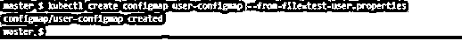

现在检查它是不是像下面这样创建的:-

`kubectl get configmaps user-configmap`

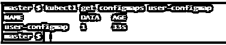

现在当你看到这个 YAML 格式的 ConfiMap，如下图所示。您可以看到使用您的文件创建的整个包，其中只有密钥对值。

`kubectl get configmaps user-configmaps -o yaml`

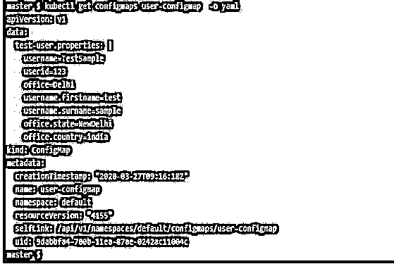

此外，要创建 ConfiMap，您可以使用如下所示的 YAML 文件:–
准备一个带有强制字段(如数据、种类、apiversion 等)的文件。

`cat user2.yaml`

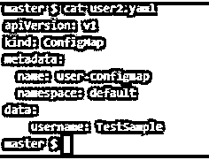

然后像下面这样使用 Kubectl 从这个文件创建一个对象。

`kubectl create -f user2.yaml`

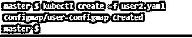

现在您可以使用 kubectl 查看内容和其他相关细节，如下所示:-

`kubectl describe configmap user-configmap`

现在，我们可以看到如何使用配置映射并在创建 pod 时引用它。

在下面的例子中:-

我们创建了一个文件，该文件包含用于创建配置图和 pod 的内容。这里我们使用 NGINX image 在 pod 中创建一个容器。

`cat testconfig.yaml`

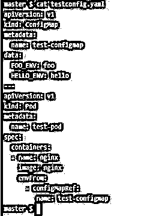

现在使用 kubectl 创建 ConfigMap 和一个基于 NGINX 的测试 pod。一旦创建了这些，您将得到如下输出:-

`kubectl create -f testconfig.yaml`

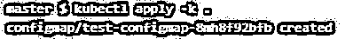

现在使用 kubectl，如下所示，从外部运行 pod 中的命令。这里我们使用了一个简单的 env 命令，它显示了所有的环境变量。在过滤输出时，您可以在 ConfigMap 内容中找到那些作为键值对设置的环境变量。

`kubectl exec “test-pod” -it -- hostname`

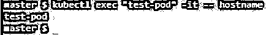

`kubectl exec “test-pod” -it -- env | grep _ENV`

### Kubernetes 配置图示例

在 Kubernetes 中，您有两种主要的方法来创建配置图。在这两种方式的每一种中，您都有几个其他可用的选项，可以根据您的要求和需要来使用。这些选项在不同的 Kubernetes 版本中可能会有所不同，所以最好查看一下 Kubernetes 版本的官方文档:-

1.使用带有许多选项的 below 命令。这里的<name>是您的配置映射名称，<data>是您的键值对的源。</data></name>

`kubectl create configmap <NAME> <DATA>`

您可以使用不同的来源，如下例所示:–

*   对于文件:–

`kubectl create configmap configmap-test --form-file=configmap-test-file.properties`

*   从目录:-

`kubectl create configmap configmap-test --form-file=./configmap-test-directory/`

*   来自多个文件:–

`kubectl create configmap game-config-2 --form-file=test-file_1.properties --from-file=test-file_2.properties`

*   从设置了环境变量的环境文件:–

`kubectl create configmap game-config-env-file --form-env-file=configmap-test-env-file.properties`

*   从文件中的一个键:-

`kubectl create configmap configmap-test --form-file=<my-key-name>=<path-to-file>`

*   从文字值:-

`kubectl create configmap special-config --form-literal=test.key1=sample1 --form-literal=test.key2=sample2`

2.从 1.14 版开始，通过 kubectl 使用 kustomization.yaml。您还可以在文件夹/目录内的 kustomization.yaml 中指定生成器，以创建配置映射，然后在创建 pod 时应用。

你也有很多选择，比如下面的例子:

*   从目录中的一个或多个文件，首先必须创建 kustomization.yaml，如下所示:

`cat << EOF >./kustomization.yaml`

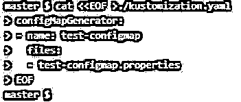

然后，根据您的要求将该文件移动到指定的目录，然后使用该文件创建 ConfigMap 对象，如下所示:

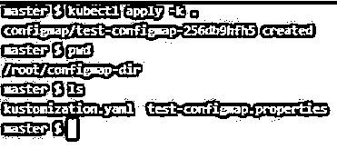

您可以检查 ConfigMap 是否已创建，如下所示:–

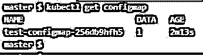

在上面的内容中，您必须注意，新创建的配置映射的名称通过对其内容进行哈希处理而附加了一个后缀，这确保了每次修改其内容时，都会生成一个新创建的配置映射，并且与其他配置映射不同。

*   从文字值:-

您可以使用下面的 like 在 kustomization.yaml 中给出键值对，并将 kustomization.yaml 放在一个目录中:-

`cat << EOF >./kustomization.yaml`

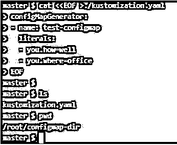

然后使用相同的方法创建配置映射，如下所示:–

### 结论

有效地使用 ConfigMap 允许您不必每次在对容器的需求有一些变化时都创建定制映像，但是您可以隔离您的通用映像并拥有多个 config map 或秘密。然后在开始创建新的 pod 时使用它们。因此，节省了管理和改进基础设施环境模块化的工作。

### 推荐文章

这是 Kubernetes 配置图指南。这里我们讨论 Kubernetes Configmap 的例子，它是如何工作的，以及如何使用它。您也可以看看以下文章，了解更多信息–

1.  [什么是 Kubernetes？](https://www.educba.com/what-is-kubernetes/)
2.  [安装立方仪表板](https://www.educba.com/install-kubernetes-dashboard/)
3.  [立方算子](https://www.educba.com/kubernetes-operators/)
4.  [立方替代物](https://www.educba.com/kubernetes-alternatives/)

