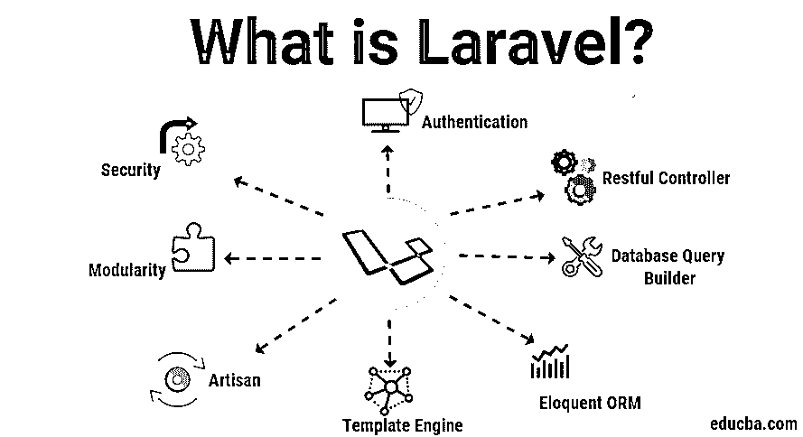

# 什么是 Laravel？

> 原文：<https://www.educba.com/what-is-laravel/>

## Laravel 简介

以下文章提供了什么是 Laravel 的概述？它是一个简单的 PHP 框架，经常用于基于 web 的开发或 web 应用程序开发，以其出色的特性而闻名，如可靠性、高性能、更高的效率、关节式 ORM 系统、多种身份验证选项、可扩展性、模块化、方便的缓存、安全的 SQL 处理、专用的 SQL 构建器、restful 控制器、简单的编码规则等。这个 PHP 框架允许代码开发人员进行特定的模板化、路由流提供和数据库操作/查询。

### Laravel 的主要特点

其中的框架有一个庞大的生态系统，包括即时部署、路由、模板、ORM、数据库查询和列表。

<small>网页开发、编程语言、软件测试&其他</small>

#### 1.依赖性管理

依赖性领导是最大的特征之一，学习当代互联网应用的关键方面是理解服务容器(IoC)的功能。Laravel 中管理类依赖关系的最强大的工具是 IoC (Control Invert)或服务容器。依赖注入是一种通过类似 composer 的工具移除和注入硬编码课程的方法。

#### 2.模块性

模块化是 web 应用程序各部分的分离和重组程度。您可以将公司逻辑划分为不同的组件，这些组件一起工作，作为一个 web 应用程序。它旨在模块化使用；这本身也是一套零件。您可以使用模块化框架轻松创建和设计广泛的公司应用程序。它为在 Laravel 中创建模块或包提供了一个非常简单的指南。

#### 3.证明

身份验证是每个当代 web 应用程序的一个组件。但是，将身份验证写入另一个框架(如 Codeigniter)会花费您大量的开发时间。因此，它提供了一个箱式身份验证，允许您使用一个简单的命令构建一个全功能的身份验证方案。它还为您自己的身份验证提供了方便的文书工作。

#### 4.贮藏

缓存是一种将信息存储在临时存储站点上的方法，可以在需要时快速获取。缓存主要用于提高应用程序的效率。例如，几乎所有从透视图到路径的信息都缓存在 Laravel 中。这有助于 it 部门提高效率，从而缩短处理时间。

#### 5.按指定路线发送

理解 Laravel 中的路由很简单，类似于 Ruby 的 rail 框架。它的路由可用于轻松创建 restful 应用程序。您可以将模型信息分组、命名、过滤并连接到路径。它的路线可以非常灵活和可控，以创建搜索引擎友好的网址。

#### 6.安全性

Laravel 提供了一种直观的方式来生成安全的 web 应用程序。它将所有密码保存为哈希，而不是纯文本密码。为了散列密码，它使用 BCrytp。此外，它还提供了 SQL 注入攻击安全性，并对所有用户条目进行转义以注入脚本标签。

#### 7.迁移系统

像 Ruby on Rails 一样，它提供了一个迁移系统来构建数据库。但是，您可以使用 PHP 而不是 SQL 来编写生成数据库结构的迁移程序。您可以使用这些迁移来创建库、表和索引。相反，您可以执行新的迁移；如果要更改表列，不需要再次重复创建表。

#### 8.技工

Artisan 是 Laravel 的命令行工具的名称。它包括几十个预构建的命令，可用于通过命令行界面执行任务。在开发过程中，这个工具可以避免最重复的任务。

#### 9.数据库查询生成器

Laravel 查询数据库的构建器提供了一种创建数据库请求的简单方法。它包括许多帮助函数，您可以使用这些函数来过滤您的数据。复杂的查询可以很容易地用 Laravel 链接实现。Laravel 查询生成器语法使得编写数据库查询变得容易理解和享受。

#### 10.模板引擎

刀片是拉弗尔的模板马达。Blade 提供了一些帮助函数来格式化视图中的数据。Blade 还使用传统模板来创建复杂的布局。所有刀片模板的文件扩展名。

#### 11.雄辩的 ORM

它雄辩的 ORM 是几乎所有数据库引擎支持的基础。MySQL 和 SQLite 配合得非常好。它为所有有说服力的功能提供了全面的文档。

#### 13.Restful 控制器

Laravel 的 restful 控制器允许您分离 GET 或 POST 请求背后的逻辑。也有可能产生易于用来生成 CRUD 的资源控制器。然后，您可以将资源控制器连接到该路径，以自动服务所有 CRUD 路径。

### 优势

下面是提到的优点:

*   它包含了对代码创建给予高度重视的一般增长哲学。
*   您应该通过遵循一些简单的规则和修改代码来保持快速的增长，而不用担心会违反当前的特性。

### 结论

在本文中，我们已经看到了它的基本含义以及它的特性和优点。因为所有上述特征和持续增强。它已经被证明是最好的 PHP 框架。这就是为什么它是使用最多的 PHP 框架。它有助于使用简单、有表现力的方法构建强大的应用程序。

### 推荐文章

这是一本关于什么是 Laravel 的指南？.在这里，我们详细讨论了 laravel 框架中的一些关键特性和优点。你也可以看看下面的文章来了解更多-

1.  [什么是 Laravel 框架？](https://www.educba.com/what-is-laravel-framework/)
2.  [Laravel 命令](https://www.educba.com/laravel-commands/)
3.  [Laravel 型号](https://www.educba.com/laravel-models/)
4.  [Laravel 控制器](https://www.educba.com/laravel-controllers/)

