# Laravel 命令

> 原文：<https://www.educba.com/laravel-commands/>

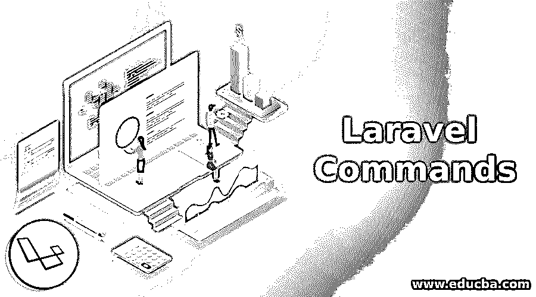

## Laravel 命令

Laravel 命令是目前最流行也是[使用最广泛的 PHP 框架](https://www.educba.com/php-alternatives/)，它基于 MVC(模型视图控制器)架构。它是一个开源的 web 应用程序开发框架，由 Taylor Otwell 创建。截至目前，laravel 框架的最新版本是 2018 年 9 月发布的 Laravel 5.7。

### 从 laravel 开始的先决条件

你应该了解以下基本/中级知识:

<small>网页开发、编程语言、软件测试&其他</small>

*   服务器端编程语言（Professional Hypertext Preprocessor 的缩写）
*   HTML / CSS
*   MVC 模式的工作原理
*   数据库知识

### 作曲家和工匠

composer 是一种工具，它允许用户根据给定的框架创建任何项目。它由所有的依赖项和库组成。

Artisan 是 Laravel 的命令行界面。它有一组命令，现在将详细讨论，这有助于[构建一个 web 应用程序](https://www.educba.com/how-to-build-web-applications-using-mongodb/)。

**Artisan 命令语法:**

`php artisan [ options] [ arguments]`

### 基本 Laravel 命令

下面提到了一些基本的 laravel 命令:

#### 1.列出所有 Artisan 命令

**php artisan list:** 该命令将列出 laravel-artisan 控制台中所有可用的命令。

首先给出执行命令的语法，即

`php artisan [command] [options] [arguments]`

在哪里，

*   **选项:**可以像–h(帮助)、-q(安静)、-v(版本)等使用。
*   **命令:**可以根据命令名后跟选项和参数来使用。很少的命令是 migrate、serve、make、help 等。

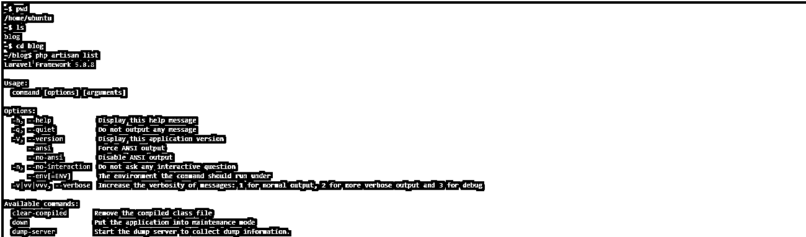

#### 2.php 工匠帮助<command-name></command-name>

该命令[用于获得特定命令名称的帮助](https://www.educba.com/get-help-in-powershell/)。比方说，如果你想知道更多关于这个命令的用法和含义，你可以利用 Artisan 提供的帮助工具。

`php artisan help makes:auth`

在哪里

*   **make: auth:** 这是我们想了解更多的命令名。

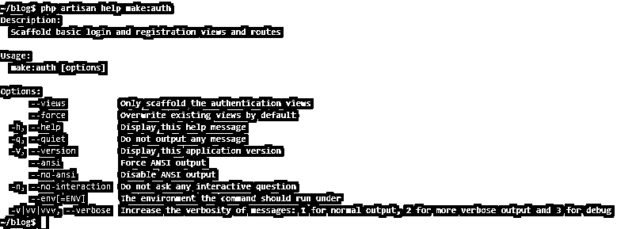

`php artisan –version`

这个命令将列出您正在使用的 Laravel 框架的版本。

`php artisan down`

该命令用于将[laravel 应用程序](https://www.educba.com/what-is-laravel/)置于维护模式。

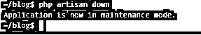

`php artisan up`

这个命令用于恢复 laravel 应用程序的启动和运行。

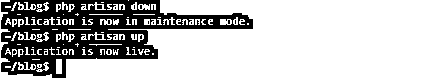

`php artisan env`

这个命令将告诉您 laravel 应用程序运行的环境。

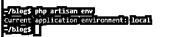

`php artisan view: clear`

这个 laravel 命令将清除所有编译过的视图文件。

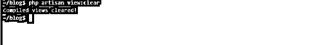

`php artisan route: list`

此命令将列出所有注册的路由。

`php artisan route: clear`

该命令将清除所有的路由缓存文件。

`php artisan route: cache`

此命令创建路由缓存文件，以加快路由注册

### 中间 Laravel 命令

下面提到了一些需要中间 laravel 命令的类型:

`php artisan serve`

该命令用于启动一个 laravel 项目，默认情况下，该应用程序将托管在端口号为 8000 的本地主机上

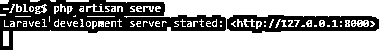

`php artisan make: model EduCBA`

该命令用于创建一个新的模型类。

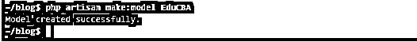

如果我们执行命令 php artisan list，我们会发现几个 makes 命令。要查看 make 命令列表，请按键盘上的 shift + pg down 键浏览所有页面。

`php artisan make: controller UserController`

该命令将在以下文件夹中创建一个新的控制器文件:

应用程序/Http/控制器

`php artisan make- request EduCBA_BlogPost`

此命令用于在以下文件夹中创建新的表单请求类:

应用程序/Http/请求

`php artisan make seeder EduCBASeeder`

该命令用于创建新的数据库种子类。

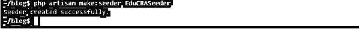

`php artisan make middleware Middleware_Name`

该命令用于创建一个新的中间件类。

`php artisan make: policy OurPolicy`

此命令用于创建新的策略类。

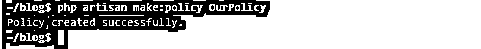

`php artisan make: mail Course_Enrolled@EduCBA`

该命令用于创建新的电子邮件类别。

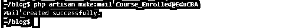

`php artisan make: event EduCBA_Analytics_Enrolled`

该命令用于创建一个新的偶数类。

`php artisan make: command compose_email`

该命令用于创建一个新的 artisan Laravel 命令

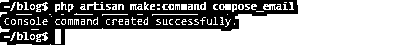

### 高级 Laravel 命令

下面是一些高级的 laravel 命令，如下所示:

`php artisan make: model Project --migration --controller --resource`

该命令用于为模型(迁移)创建一个新的迁移文件，为模型(控制器)创建一个新的控制器，并为生成的控制器创建一个资源控制器。

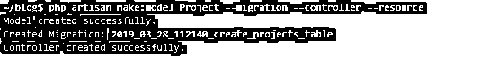

`php artisan make:listener SendEnrollement_Notification`

该命令用于创建新的事件监听器类。

`php artisan migrate [--bench="vendor/package"] [--database[="..."]] [--path[="..."]] [--package[="..."]] [--pretend] [--seed]`

该命令用于进行数据库迁移。

`php artisan vendor: publish`

该命令用于从供应商包中发布任何可发布的资产。

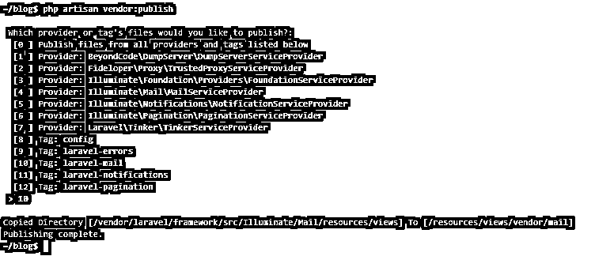

`php artisan make provider OurServiceProvider`

该命令用于创建新的服务提供者类。

`php artisan migrate:make name [--bench="vendor/package"] [--create] [--package[="..."]] [--path[="..."]] [--table[="..."]]`

该命令用于创建新的迁移文件

`php artisan make job SendReminderEmail_for_ANalytocs@EduCBA`

该命令用于创建新的作业类。

### 推荐文章

这是 Laravel 命令的指南。在这里，我们借助例子讨论了基本的、即时的以及高级的 Laravel 命令。你也可以看看下面的文章来了解更多。

1.  [Docker 命令](https://www.educba.com/docker-commands/)
2.  [CSS 命令](https://www.educba.com/css-commands/)
3.  [Laravel 路线控制器](https://www.educba.com/laravel-route-controller/)
4.  [Laravel 型号](https://www.educba.com/laravel-models/)

