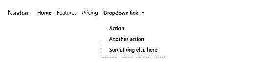

# Laravel 组件

> 原文：<https://www.educba.com/laravel-components/>

## Laravel 组件介绍

Laravel 组件用于构建可靠且可扩展的系统。它们让我们构建由可重用的、独立的和解耦的组件组成的大型应用程序。Laravel 为我们提供了如此多的工具来帮助构建可靠的 web 应用程序，并将开发时间大幅缩短。Laravel 由可重用的组件组成，这些组件被有效地定义和编译在一起，构成了整个系统。

### Laravel 的成分是什么？

几乎所有的现代系统都是由独立的、可重用的小实体组成的。这些实体中的每一个都具有向系统整体提供的特定功能。Laravel 组件是一个小实体，具有定义良好的接口。这些是大型软件系统的组成部分。所有相关数据都封装在可重用单元中。

<small>网页开发、编程语言、软件测试&其他</small>

让我们举一个例子来说明这一点。假设您希望创建某种按钮，用于应用程序中的不同位置。所以你在这里可以做的是把按钮构建成一个组件，然后当你在应用程序中需要一个按钮的时候就可以调用它。

#### 1.构建组件

为了更清楚地理解建筑构件的概念，我们来分小块学习一下。因此，我们将整个过程分为一些易于理解的小步骤，如下所示:

第一步:首先，我们需要创建新目录。这个新目录将位于 Resources 目录中。你这边会有一个类似下面写的结构:

**资源/视图/布局/组件**

**步骤 2:** 现在，您必须创建一个新文件，并将其保存在上一步创建的“components”目录下。我们将称之为‘navbar . blade . PHP’。

**步骤 3:** 现在将下面的 Navbar 代码写到 navbar.blade.php 文件中。任何 IDE 都可以用(比如 sublime)。

##### 示例#1

**代码:**

`<nav class="navbar navbar-expand-lg navbar-light bg-light">
<a class="navbar-brand" href="#">Navbar</a>
<button class="navbar-toggler" type="button" data-toggle="collapse" data-target="#navbarNavAltMarkup" aria-controls="navbarNavAltMarkup" aria-expanded="false" aria-label="Toggle navigation">

</button>

<a class="nav-item nav-link active" href="#">Home (current)</a>
<a class="nav-item nav-link" href="#">Features</a>
<a class="nav-item nav-link" href="#">Pricing</a>
<a class="nav-item nav-link disabled" href="#" tabindex="-1" aria-disabled="true">Disabled</a>

</nav>`

这段代码将生成如下所示的导航栏:

**输出:**

##### 实施例 2

让我们看看另一个 navbar 示例，如下所示:

**代码:**

`<nav class="navbar navbar-expand-lg navbar-light bg-light">
<a class="navbar-brand" href="#">Navbar</a>
<button class="navbar-toggler" type="button" data-toggle="collapse" data-target="#navbarNavDropdown" aria-controls="navbarNavDropdown" aria-expanded="false" aria-label="Toggle navigation">

</button>

<ul class="navbar-nav">
<li class="nav-item active">
<a class="nav-link" href="#">Home (current)</a>
</li>
<li class="nav-item">
<a class="nav-link" href="#">Features</a>
</li>
<li class="nav-item">
<a class="nav-link" href="#">Pricing</a>
</li>
<li class="nav-item dropdown">
<a class="nav-link dropdown-toggle" href="#" id="navbarDropdownMenuLink" role="button" data-toggle="dropdown" aria-haspopup="true" aria-expanded="false">
Dropdown link
</a>

<a class="dropdown-item" href="#">Action</a>
<a class="dropdown-item" href="#">Another action</a>
<a class="dropdown-item" href="#">Something else here</a>

</li>
</ul>

</nav>`

这段代码将生成如下所示的导航栏:

**输出:**

#### 2.使用组件

到目前为止，我们已经创建了我们的目录'组件'，创建了一个新的文件'导航条'和编写代码到 navbar.blade.php。最后，我们将使用这个组件。在“视图”目录中，假设您的应用程序的一个页面，如 index.blade.php，使用刀片指令，如下所示:

`@component('layouts.components.navbar')
@endcomponent`

你已经使用了你的第一个组件。但这是一个硬编码的导航条。在构建现代动态应用程序项目时使用这种方法并不是一个好主意。让我们对 navbar.blade.php 文件中的导航条标签做一点修改。

现在我们将 brandName 变量添加到 navbar 代码中，注意我们为 navbar 编写的前一段代码中所做的修改。我们只是展示了进行了修改的那部分代码。

`<nav class="navbar navbar-light bg-light">
<a class="navbar-brand" href="#"> {{$brandName}} </a>
</nav>`

如果希望将值传递给组件，可以借助 blade-directive 注入一个变量。让我们看看显示指令' @slot '用法的代码，如下所示:

`@component('layouts.components.navbar')
@slot('brandName')
value and it could be anything
@endslot
@endcomponent`

##### 例子

`@component('alert')
@slot('title')
Forbidden
@endslot
You are not allowed to access this resource!
@endcomponent`

这里，不在指令@slot 中的内容将通过变量$slot 传递给组件。

**使用组件的更好方法描述如下:**

如果我们只使用指令@navbar 就可以调用我们的组件，会怎么样？那岂不是简单多了？是的，它将更具可读性，同时也更容易。我们走吧。要实现这一点，我们只需定义@navbar 与您刚刚创建的文件 navbar.blade.php 的意思相同。一旦我们成功地做到了这一点，当我们调用@navbar 时，Laravel 将自动获取 navbar.blade.php。

为此，我们必须将下面提到的代码添加到文件中的“boot()”函数中

**app/providers/appserviceprovider . PHP**

`Blade::component('layouts.components.navbar','navbar');`

在这里的代码中，第一个参数是组件的位置，第二个参数是您想要给它的新名称(在我们的例子中是 navbar)。你可能听说过这个过程，这就是所谓的混叠。现在你只需要调用@navbar 来调用你的组件。

如果没有添加槽，可以排除元件的参数。

`@alert
You are not allowed to access this resource!
@endalert`

**Note:** You have to either add the following line of code before your class name or import Blade Facade in appServicesProvider.php use Illuminate\Support\Facades\Blade.

您的组件现在已经被重命名，您可以在应用程序项目中的任何位置使用@navbar 调用您的组件。

让我们看看您将如何调用您的组件，如下所示:

`@navbar(['brandName'=>'Insert any value'])
@endnavbar`

现在，您已经成功地调用了组件 navbar 并向其传递了数据。

**Note:** Here we have passed data in associative array like [‘Name’]=>[‘value’] pairs. Remember that name/key pairs should be written as they are in the component. If your component contains more variables, they can be added to the array as shown ahead:
[‘variable1’=>’value1’, ‘variable2’=>’value2’,..]

现在，这个组件可以在您的应用程序开发项目中随时随地重用。

### 推荐文章

这是 Laravel 组件指南。在这里，我们讨论了介绍和什么是 Laravel 组件，以及不同的例子和它的代码实现。您也可以看看以下文章，了解更多信息–

1.  [拉韦勒刀片](https://www.educba.com/laravel-blade/)
2.  [Laravel 创建表格](https://www.educba.com/laravel-create-table/)
3.  [Laravel 表单](https://www.educba.com/laravel-forms/)
4.  [拉勒韦尔拔毛](https://www.educba.com/laravel-pluck/)

