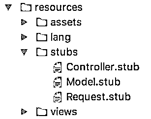
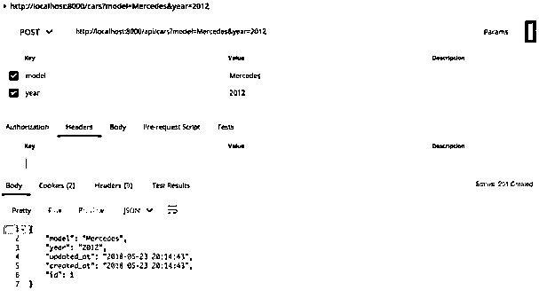
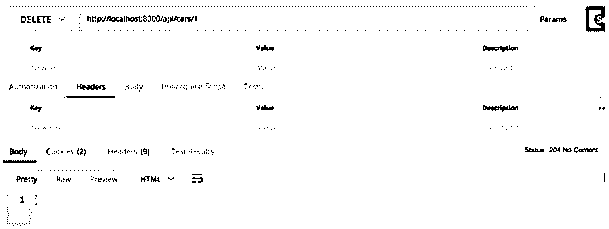

# Laravel 积垢发生器

> 原文：<https://www.educba.com/laravel-crud-generator/>


## Laravel 积垢发生器简介

CRUD 实际上是描述数据存储的四种不同行为的首字母缩写词:创建、读取、更新和删除。Crud Generator 是一个特殊的工具，它有助于构建用户界面，以便您可以对可用数据执行上述操作。它主要考虑不同类型的字段和实例之间的关系。Laravel Crud 生成器接收或发现数据库的结构。除此之外，它还接收描述需要显示的字段以及如何显示它们的配置。它还根据数据类型和小部件之间的映射生成 UI。

### Laravel 的 Crud Generator 是什么？

Laravel 是一个非常受欢迎和众所周知的开源 PHP 框架，它有许多先进和必要的功能，对开发人员和程序员来说非常方便。借助 Laravel 中的 crud 生成器，您可以根据自己的需求轻松创建、查看、编辑和删除任何文章。对我们有利的是，我们可以利用资源控制器来使我们的工作变得非常简单和方便，这样我们就不必再重复我们的操作，因为它实际上是为了推动一些 Laravel 路由技术而设计的。

<small>网页开发、编程语言、软件测试&其他</small>

借助 Laravel Crud Generator，您可以执行以下操作:

1.  添加，编辑页面
2.  模态，视图，控制器
3.  搜索，按字段排序
4.  页码
5.  导出 csv/pdf
6.  单个和多个删除选项
7.  左接合。从外部表中搜索、排序数据
8.  生成字段，如输入，文本区，图像，日期，时间，下拉列表，复选框等。

Laravel Crud 生成器的最新版本经过了更新，为用户提供了额外的功能。一旦您在 Laravel 中生成了 Crud，您就不必担心要经历一个漫长的过程来输入命令以执行操作。您的 Laravel Crud 生成器将在几秒钟内根据需要创建您的数据。这是一个用户友好的发电机，也是完全响应。它还有一个引导管理面板。您可以轻松地将生成的代码集成到项目中，而不会出现任何错误。编码也非常干净、舒适和容易。额外的好处是有无限的领域供您使用。对此没有任何形式的限制。这是快速编程。在 Laravel crud generator 的帮助下，您可以根据自己的格式轻松组织数据，并创建必要的列来反映数据。这也是有帮助的，因为编码是容易和简单的。即使是初学者也可以尝试使用 Laravel crud generator，因为它并不困难，简单的编码知识足以让您上手。Laravel crud 生成器经过微调，许多内部函数已经在 Laravel 中解决了。

### Laravel 积垢发生器示例

为了更加清楚，现在让我们看一个 Laravel Crud 生成器的例子。

**步骤 1:** 创建一个新的 Laravel 项目

**步骤 2:** 通过将 Laravel 应用程序连接到数据库并链接到服务器来设置它。

步骤 3: 创建一个 crud 生成器命令，例如 php artisan make:命令 Crud 生成器

**第四步:**创建蓝图。创建存根目录，并相应地命名文件。存根文件将有占位符。您将使用的标题是 Model。存根，控制器。存根和请求。烟蒂




**第五步:**打开你创建的 CrudGenerator.php。你必须在那里更改签名和描述。为存根创建一个函数来激活它。

**代码:**

```
protected $signature= 'crud:generator
{name : Class (singular) for example User}';
protected $description = 'Create CRUD operations';
```

**步骤 6:** 从资源/存根创建一个模型。用所需的值替换占位符。决定一个特定的值，并用所需的值替换所有的位置。

**第 7 步:**创建新文件，您可以在其中使用从 model.stub 文件获得的数据。

**步骤 8:** 对控制器和请求重复动作。输入(在我们的例子中是 car)应该在命令的帮助下通过。接下来，创建一个路由资源并将其附加到 api.php 文件中。

**第九步:**打开一个终端运行:php artisan crud: generator car

**步骤 10:** 创建迁移表。在这种情况下，它是汽车迁移表。将“up”函数更改为 public，从而迁移表。

```
php artisan make:migration create_cars_table --create=cars
```

**步骤 11:** 通过检查您创建的表上的所有选项来测试命令。




**摧毁**




**解释:**在上面的图片中，您可以找到迁移表，它很好地表达了进一步行动所需的所有选项。上面显示的例子是汽车模型和其他附加的细节。很容易组织汽车模型的数据，也很容易定义它们的生产年份和其他重要数据，这些数据是用户在开始命令创建表中的选项时设置的。一旦用 Laravel crud generator 创建了这种格式，它就变得很容易，而且对表列的创建没有限制。一旦您在最后一步快速运行该命令，您将会看到该命令将不会有错误或无错误地运行和处理。在任何可能出错的错误的情况下，将有对错误的明确解释，因此对于用户或程序员来说，处理小错误并纠正它们以完成 crud 生成的过程将变得方便。

您可以使用 postman(存储、索引、查找、更新和销毁)来测试服务直到结束，这样您就可以确信数据是清晰和精确的，并且在使用适当的数据输入表中的字段时，数据生产和处理中不会出现错误。

### 结论

Laravel Crud Generator 专门设计用于方便地创建包含所有字段的放大表格，以便以表格等形式组织数据和信息。此外，一旦数据被输入表格，它可以被系统地组织，并可以在更新 Laravel Crud 生成器时以用户定义的多种可用格式进行检索。

### 推荐文章

这是一个指南 Laravel Crud 发电机。在这里，我们讨论了介绍，什么是在 Laravel 的 Crud 生成器，以及实施步骤的例子。您也可以浏览我们的其他相关文章，了解更多信息——

1.  [Laravel 型号](https://www.educba.com/laravel-models/)
2.  [Laravel 控制器](https://www.educba.com/laravel-controllers/)
3.  [拉勒维尔集体](https://www.educba.com/laravel-collective/)
4.  [Laravel 仪表盘](https://www.educba.com/laravel-dashboard/)


