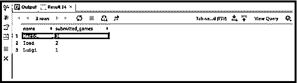
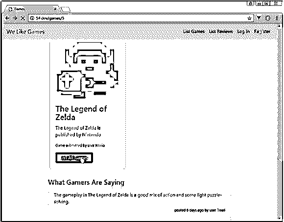

# Laravel 原始查询

> 原文：<https://www.educba.com/laravel-raw-query/>

## Laravel 原始查询简介

Laravel 框架是近来最受欢迎的框架之一。主要原因是它所孕育的简单化方法，这种方法使开发人员能够创建各种各样的功能。Laravel 框架还以其健壮的结构和灵活性而闻名。它是电子商务开发社区首选框架的原因之一是因为它的深度和灵活性。Laravel 框架还擅长与第三方解决方案集成，以创建独立的系统。它的查询构建方法是正确的，并且整个框架是可伸缩的。在开发解决方案时，对我们帮助很大的查询之一是 Laravel RAW 查询。

### 什么是 Laravel 原始查询？

原始查询是为了提供一种简单的方法来执行像 aggregate 这样的原始表达式。此外，DB:: raw()用于生成一个任意的 SQL 命令，查询构建器不会进一步解析该命令。让我们看看 Laravel RAW 是如何工作的。

<small>网页开发、编程语言、软件测试&其他</small>

我们将从一个简单的 SQL 查询开始:

`SELECT
users.name,
count(*) submitted_games
FROM users
JOIN games ON games.user_id = users.id
GROUP BY users.name
ORDER BY submitted_games DESC`

**解释:**这可以通过构建 SQL 查询的增量步骤来实现。我们使用 Select 来获取用户名。然后，我们必须让查询知道从哪里查找名字。因此，提供了目标数据库。我们使用 JOIN 来合并两个表，这两个表现在将用户与他们提交的游戏相关联。然后我们通过 GROUP BY 和 ORDER BY 对它们进行连续分类。就这么简单。

**输出:**

### 动人的

现在让我们同样在雄辩中尝试:

**第一步:**

`$activeusers = User::selectRaw('users.name, count(*) submitted_games')
->join('games', 'games.user_id', '=', 'users.id')
->groupBy('users.name')
->orderBy('submitted_games', 'DESC')
->get();`

我们可以继续将查询添加到 index()方法中:

**第二步:**app/Http/Controllers/games controller . PHP

`<?php
namespace App\Http\Controllers;
use Illuminate\Http\Request;
use App\Game;
use App\User;
class GamesController extends Controller
{
public function __construct()
{
$this->middleware('auth')->except(['index', 'show']);
}
public function index()
{
$games = Game::latest()->get();
$activeusers = User::selectRaw('users.name, count(*) submitted_games')
->join('games', 'games.user_id', '=', 'users.id')
->groupBy('users.name')
->orderBy('submitted_games', 'DESC')
->get();
return view('games.index', ['games' => $games, 'activeusers' => $activeusers]);
}
public function show(Game $game)
{
return view('games.show', ['game' => $game]);
}
public function create()
{
return view('games.create');
}
public function store()
{
$this->validate(request(), [
'title' => 'required|unique:games',
'publisher' => 'required',
'releasedate' => 'required',
'image' => 'required',
]);
$game = new Game;
$game->title = request('title');
$game->publisher = request('publisher');
$game->releasedate = request('releasedate');
$game->image = request()->file('image')->store('public/images');
$game->user_id = auth()->id();
$game->save();
return redirect('/games');
}
}`

设计部分的一些工作:

**第三步:**resources/views/partials/active users . blade . PHP

`<table class="table table-sm table-hover">
<thead class="thead">
<tr>
<th>User Name</th>
<th>Games Submitted</th>
</tr>
</thead>
<tbody>
@foreach($activeusers as $activeuser)
<tr>
<td>{{ $activeuser->name }}</td>
<td>{{ $activeuser->submitted_games }}</td>
</tr>
@endforeach
</tbody>
</table>`

**第 4 步:**这是我们要展示在点评部分最活跃的用户的部分

`<?php
namespace App\Http\Controllers;
use Illuminate\Http\Request;
use App\Game;
use App\Review;
use App\User;
class ReviewsController extends Controller
{
public function __construct()
{
$this->middleware('auth')->except(['index', 'show']);
}
public function index()
{
$reviews = Review::latest()->get();
$activeusers = User::selectRaw('users.name, count(*) submitted_games')
->join('games', 'games.user_id', '=', 'users.id')
->groupBy('users.name')
->orderBy('submitted_games', 'DESC')
->get();
return view('reviews.index', ['reviews' => $reviews, 'activeusers' => $activeusers]);
}
public function create(Game $game)
{
return view('reviews.create', ['game' => $game]);
}
public function store(Game $game)
{
$this->validate(request(), [
'body' => 'required|min:3'
]);
$game->addReview(request('body'), auth()->id());
return redirect()->to('/games/' . request()->route()->game->id);
}
public function show(Review $review)
{
return view('reviews.show', ['review' => $review]);
}
}`

**第五步:**资源/视图/评论/索引. blade.php

`@extends('layouts.master')
@section('content')

@foreach($reviews as $review)

{{ $review->user->name }} left a <a href="/reviews/{{$review->id}}">review</a>
for <a
href="/games/{{ $review->game->id }}">{{ $review->game->title }}</a> {{$review->created_at->diffForHumans()}}

@endforeach

@include('partials.activeusers')

@endsection`

**第六步:**app/Http/Controllers/games controller . PHP

`<?php
namespace App\Http\Controllers;
use Illuminate\Http\Request;
use App\Game;
use App\User;
class GamesController extends Controller
{
public function __construct()
{
$this->middleware('auth')->except(['index', 'show']);
}
public function index()
{
$games = Game::latest()->get();
$activeusers = User::activeusers();
return view('games.index', ['games' => $games, 'activeusers' => $activeusers]);
}
public function show(Game $game)
{
return view('games.show', ['game' => $game]);
}
public function create()
{
return view('games.create');
}
public function store()
{
$this->validate(request(), [
'title' => 'required|unique:games',
'publisher' => 'required',
'releasedate' => 'required',
'image' => 'required',
]);
$game = new Game;
$game->title = request('title');
$game->publisher = request('publisher');
$game->releasedate = request('releasedate');
$game->image = request()->file('image')->store('public/images');
$game->user_id = auth()->id();
$game->save();
return redirect('/games');
}
}`

**第 7 步:**定义活动用户()方法是现在的首要任务。它必须更新，这样它才能在游戏控制器中工作。

`app/User.php
<?php
namespace App;
use Illuminate\Notifications\Notifiable;
use Illuminate\Foundation\Auth\User as Authenticatable;
class User extends Authenticatable
{
use Notifiable;
/**
* The attributes that are mass assignable.
*
* @var array
*/
protected $fillable = [
'name', 'email', 'password',
];
/**
* The attributes that should be hidden for arrays.
*
* @var array
*/
protected $hidden = [
'password', 'remember_token',
];
/**
* Add a mutator to ensure hashed passwords
*/
public function setPasswordAttribute($password)
{
$this->attributes['password'] = bcrypt($password);
}
public function games()
{
return $this->hasMany(Game::class);
}
public function reviews()
{
return $this->hasMany(Review::class);
}
public static function activeusers()
{
return static::selectRaw('users.name, count(*) submitted_games')
->join('games', 'games.user_id', '=', 'users.id')
->groupBy('users.name')
->orderBy('submitted_games', 'DESC')
->get();
}
}`

**第八步:**app/Http/Controllers/reviews controller . PHP

我们现在必须让审查控制器也变得漂亮。

`<?php
namespace App\Http\Controllers;
use Illuminate\Http\Request;
use App\Game;
use App\Review;
use App\User;
class ReviewsController extends Controller
{
public function __construct()
{
$this->middleware('auth')->except(['index', 'show']);
}
public function index()
{
$reviews = Review::latest()->get();
$activeusers = User::activeusers();
return view('reviews.index', ['reviews' => $reviews, 'activeusers' => $activeusers]);
}
public function create(Game $game)
{
return view('reviews.create', ['game' => $game]);
}
public function store(Game $game)
{
$this->validate(request(), [
'body' => 'required|min:3'
]);
$game->addReview(request('body'), auth()->id());
return redirect()->to('/games/' . request()->route()->game->id);
}
public function show(Review $review)
{
return view('reviews.show', ['review' => $review]);
}
}`

**输出:**

### 结论

Laravel RAW 查询用于需要更深入方法的开发项目。Laravel RAW 允许特异性以及灵活性。

### 推荐文章

这是一个 Laravel 原始查询指南。在这里，我们讨论一个介绍 Laravel 原始查询，步骤雄辩与适当的例子。您也可以浏览我们的其他相关文章，了解更多信息——

1.  [Laravel 创建表格](https://www.educba.com/laravel-create-table/)
2.  [Laravel 仪表盘](https://www.educba.com/laravel-dashboard/)
3.  [Laravel 命令](https://www.educba.com/laravel-commands/)
4.  [Laravel 控制器](https://www.educba.com/laravel-controllers/)

