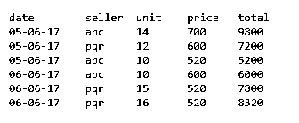
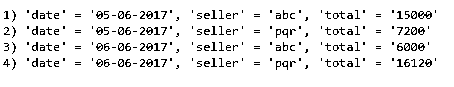

# 拉勒韦尔独特

> 原文：<https://www.educba.com/laravel-distinct/>

## Laravel Distinct 简介

Laravel 数据库查询生成器或 LDQB 是一个易于使用的界面，用于运行数据库查询。它与大多数数据库系统兼容，并支持所有数据库操作。查询构建器的一个相关特性是它基于 PDO 参数。这样做的好处是可以保护应用程序免受任何恶意的 SQL 注入攻击。该语法的一部分是 Laravel Distinct。这个查询所做的是挑选您一直在搜索的绝对相关的数据，并返回相同的值。例如，如果我必须搜索特定半径范围内的特定酒店类型，那么不同的查询将如下所示:

`$hCat = Hotels::select(
DB::raw('DISTINCT(hoteltype_id)'), // hotel category
DB::raw('6371 * acos( cos( radians(' . $airport->latitude.') ) * cos( radians( latitude ) ) * cos( radians( longitude ) - radians('. $airport->longitude .') ) + sin( radians('. $airport->latitude . ') ) * sin( radians( latitude ) ) ) AS distance'))
->having('distance', '<', $radius);
$hCategories = $hCat->distinct('hoteltype_id')->get();`

<small>网页开发、编程语言、软件测试&其他</small>

### 什么是 Laravel Distinct？

如前一段所述，Laravel 的 DISTINCT 语句是一个确定搜索的确切值的查询。它通过以下明确的方法从数据库中返回值:

`DB::table(‘tablename’)->distinct(‘name’)->count(‘name’);`

### Laravel Distinct 是如何工作的？

与 Laravel DISTINCT 合作时必须小心，因为它可能不总是能给你带来确切的回报。与之相反的是使用 GROUPBY 选项，它实质上是将所有相关的搜索结果分组并返回相同的结果。使用 DISTINCT 查询的一个缺点是，如果我们请求包含相似数据的多行，而这些数据必须合并在一起才能得到最终的输出，那么结果将不是我们所期望的那样。因此，在这些情况下，如前所述，我们将使用 GROUPBY 查询。

**例如:**

表格结构如下所示:

我希望得到类似这样的输出:

对于这样的事件，必须使用的 [Laravel 查询生成器](https://www.educba.com/laravel-query-builder/)是:

`DB::table(‘order’)->select(‘date’, ‘seller’, DB::raw( ‘SUM(total) as total’))
->groupBy(‘seller’)
->groupBy(‘date’)
->get();`

然而，对于没有发生多次合并的搜索，DISTINCT 查询工作得非常好。

因此，这里要记住的重要一点是 GROUPBY 和 DISTINCT 查询之间的区别。两者的返回值虽然不同。SELECT DISCTINCT 查询用于返回彼此不同的值。

“选择分组依据”查询用于查找多行中相同的值。此外，GROUP BY 查询与其他函数(如 COUNT、MAX、MIN、SUM、AVG)结合使用，而 DISTINCT 查询则作为独立函数使用。

### Laravel Distinct 的示例

使用 Laravel DISTINCT 查询的几个示例有助于理解:

1.我想运行一个将返回一个没有重复值的查询。

`The SQL query is going to be:
SELECT DISTINCT column_name
FROM table_name;
SELECT DISTINCT ‘ad_advertiser’ FROM ‘adverts’
The LARAVEL ELOQUENT query would be
MyModel::distinct()->get([‘column_name’]);`

2.如果我必须只返回数据库表中某一列的值。SQL 查询应该是

`SELECT DISTINCT ‘ad_advertiser’ FROM ‘adverts’`

拉勒维尔雄辩的疑问是

`$query = DB::table(‘adverts’)->distinct()->get([‘ad_advertiser’]);`

3.一个更复杂例子是显示忽略任何空值的值。SQL 查询应该是

`SELCT DISTINCT meta_value
FROM ‘wp_postmeta’`

拉勒维尔雄辩的疑问是。

`Meta::distinct()->whereNotNull(‘meta_value’)->get([‘meta_value’]);`

4.distinct 查询的更高级版本是，您希望从单独的列中获取数据，同时仍然保持该列的值是 DISTINCT。

`SELECT
Products.*
FROM
------ Get all the distinct product_id’s of ordered products.
------ (i.e. only show each product once, regardless of how many
------ times it has been ordered.
(SELCT DISTINCT product_id FROM orders) AS purchased_products
----- join back onto product table to show the full details of only
----- those products that have been ordered.
INNER JOIN products ON purchased_products.product_id = products.products_id`

这样做的目的是识别需要查询的值，并按要求返回它们。请注意，在这种情况下，一个额外的功能，如内部连接。

5.与 DISTINCT 查询相关的一个更简单的示例是:

`$picks = Picks::distinct()->select('user_id')->where('weeknum', '=', 1)->groupBy('user_id')->get();`

与此类似的 SQL 查询是:

`SELECT DISTINCT user_id FROM picks WHERE weeknum = 1`

Laravel 揭示了一种无痛的编码方法，并简化了逻辑。因此，特定于独特查询的简单语法在理想情况下应该是这样的:

`$users = DB::table('users')->distinct()->get();`

DISTINCT 查询的主要任务是强制该过程只显示唯一或不同的值。在使用 DISTINCT 查询时，我们许多人都会犯的一个语法错误如下:

`$players = Round::where('round_id', $currentgame)->distinct('steamid')->get();`

它不符合上述内核。

正确的语法应该是:

`$players = Round::where('round_id', $currentgame)->distinct()->get(['steamid']);`

其他几个变化可能是:

`$players = Round::distinct()->where('round_id', $currentgame)->get(['steamid']);`

`$players = Round::select('steamid')->where('round_id', $currentgame)->distinct()->get();`

Laravel 5 推出了一个独特的查询。这与 DISTINCT 具有相似的功能。此外，它接受可选的$Key 参数。这限制了要返回的项目。

一个例子是:

`public function unique(
$key = null,
$strict = false
);`

多年来，PHP LARAVEL 框架已经成为 web 开发中最值得信赖的工具之一。原因有很多。

*   Laravel 使用起来更简单。它还为开发人员提供了类似功能的选项。例如，DISTINCT 总是可以替换为 UNIQUE，或者在高级版本中替换为 GROUP BY。
*   它集成了邮件服务。
*   与该工具的集成使得构建 web 应用程序更快更流畅。
*   自动化测试是 Laravel 中最快的测试之一。

正是由于这些原因，市场上充斥着基于 LARAVEL 平台的 web 应用程序。

### 结论

雄辩的 LARAVEL 框架中的 DISTINCT 查询是一个重要的功能。然而，由于一些缺点，这个查询限制了它的使用。不过 LARAVEL 有相当多的其他查询，它们做了同样值得称赞的工作，返回不同的值。这并没有以任何方式贬低独特的查询。这是一个重要的齿轮。

### 推荐文章

这是一个拉勒维尔独特的指南。在这里，我们还将讨论 laravel distinct 的介绍和工作原理。并附有示例。您也可以看看以下文章，了解更多信息–

1.  [Laravel 积垢发生器](https://www.educba.com/laravel-crud-generator/)
2.  [幼虫工匠](https://www.educba.com/laravel-artisan/)
3.  [Laravel 迁移](https://www.educba.com/laravel-migration/)
4.  [Laravel Orderby](https://www.educba.com/laravel-orderby/)

