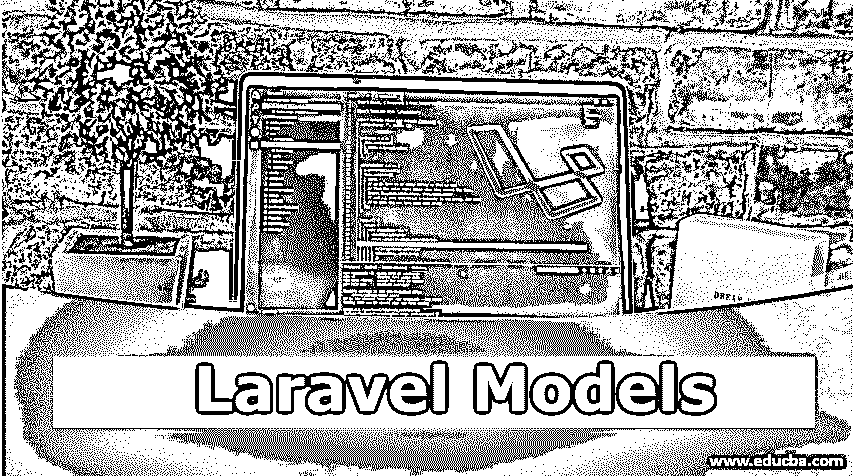

# Laravel 模型

> 原文：<https://www.educba.com/laravel-models/>




## Laravel 车型有哪些？

模型对应于 [MVC 框架](https://www.educba.com/what-is-mvc/)中的字母‘M’。任何模型视图控制器框架 web 应用程序中模型的动机都是管理业务逻辑。模型只不过是 Laravel 框架中的一个类。这个类负责与底层数据库表进行交互。Laravel 与雄辩的 ORM 能够更有效地处理数据库。ORM 代表“对象关系映射器”,它负责您与数据库的快速交互。这些模型为您提供了一种从表中更新、插入或检索数据的简单方法。

首先，我们需要使用“config/database.php”连接到数据库。现在我们将[深入研究 Laravel](https://www.educba.com/laravel-collective/) 模型创建如下。

<small>网页开发、编程语言、软件测试&其他</small>

### 定义雄辩模型

让我们看看如何创建一个模型。我们将告诉您使用 Artisan 命令创建模型实例的最简单方法。您只需编写 make:model 命令，其语法如下:

**语法:**

```
php artisan make:model <Model-Name>
```

让我们举一个模型的简单例子如下:

```
<?php
namespace App;
use Illuminate\Database\Eloquent\Model;
class Teacher extends Model
{
//
}
```

我们将使用这个模型来存储和检索教师数据库中的信息。

这里可以注意到，concertive 自动假定记录存储在“教师”表中，因为显然 class 的复数形式被用作表名，除非您明确指定它。

如果您想要显式指定它，可以按如下方式进行:

```
<?php
namespace App;
use IlluminateDatabaseEloquentModel;
class Teacher extends Model
{
/**
* table to store teachers records.
*/
protected $table = 'my_teachers';
}
```

如果您希望同时生成模型和数据库迁移，可以使用–m 或–migration 选项来完成。

```
php artisan make:model Teacher --m
php artisan make:model Teacher -migration
```

按照惯例，列' id '是每个表的主键。与显式指定表名类似，我们也可以按如下方式指定主键:

```
<?php
namespace App;
use IlluminateDatabaseEloquentModel;
class Teacher extends Model
{
/**
* Primary key.
*/
protected $primaryKey = 'teacher_id';
}
```

默认情况下，主键总是被假定为一个总是递增的“int”值。也可以通过分别设置“incremental”属性和“keyType”属性来自定义增量和类型属性，如下所示:

```
<?php
class Teacher extends Model
{
/*
* Defines incrementing or non-incrementing.
*
* @var bool
*/
public $incrementing = false;
protected $keyType = 'string';
}
```

现在让我们看看如何像前面一样在数据库上执行各种操作。

### 雄辩和粗鲁的操作

雄辩的 ORM 由 CRUD 操作组成，使用户与各种数据库的交互更加简单。各种数据库操作和表到对象模型的映射都是用它来执行的。执行 CRUD 操作所需的所有与数据库的交互都由它来处理。

让我们像前面一样逐一理解所有这些操作。

#### 1.记录的创建

在数据库中创建新记录的步骤:

*   模型实例创建
*   设置属性
*   调用“保存”功能

```
<?php
namespace App\Http\Controllers;
use App\Teacher;
use Illuminate\Http\Request;
use App\Http\Controllers\Controller;
class TeacherController extends Controller
{
/**
* teacher instance creation
**/
public function storage(Request $request)
{
$teacher = new Teacher;
$teacher->name = $request->name;
$teacher->save();
}
}
```

#### 2.记录的检索

如前所述，借助于雄辩的 ORM，从数据库中查找或检索信息是相当容易的。您可以简单地查询您的数据库并获得所需的记录。

可以使用各种方法来检索数据，其中一些方法如下:

##### 获取()

如果想要多条记录，那么可以使用 get()方法。它将得到一组结果作为输出。

**举例:**

```
$rankTeachers = Teacher::where('teacher_rank', '<', 4)->get();
```

这段代码将得到排名小于 4 的教师的数组。

##### 首先()

与 get()方法不同，这个方法将只产生一个结果作为输出。

**举例:**

```
$CarolDuff = Teachers::where('name', '=', 'Carol Duff')->first();
```

该代码将根据所提供的属性找到特定的教师。

##### 全部()

这个方法将产生一个表的所有记录。

**举例:**

```
$teacher = Teachers::all();
```

这个代码将产生所有教师的记录。

##### 查找()

find()方法根据查询/代码中传递的参数返回所有匹配的记录。

**举例:**

```
$teacher = Teachers::find(2);
```

这个代码将通过 id 产生一个特定的教师记录。

#### 3.记录的更新

更新数据库中记录的步骤:

*   查找并检索记录
*   设置属性
*   调用 save()方法

更新记录与上面讨论的其他操作一样简单。您只需检索要更新的记录，设置所需的属性并调用 save()方法。

让我们通过下面的例子来理解这一点:

```
$CarolDuff=Teachers::where('name', '=','Carol Duff')->first();
$CarolDuff->rank_level = 4;
$CarolDuff->save();
```

这段代码会将卡罗尔达夫的教师等级级别更改为 4。在这里，我们首先找到并检索了需要更新的特定教师的记录。其次，我们已经设置了所需的属性，然后调用 save()方法。

#### 4.记录的删除

删除记录的步骤:

*   检索要删除的记录
*   调用 delete()方法

运筹学

*   调用 destroy()方法

删除和其他数据库操作一样简单。首先，您必须找到要删除的记录，取出记录，然后调用 delete()方法。

**举例:**

```
$teacher = Teachers::find(2);
$teacher ->delete();
```

或者您可以简单地调用 destroy()方法，如下所示:

*   要删除一条记录:

```
Teachers::destroy(2);
```

*   要删除多条记录:

```
Teachers::destroy(2, 3, 4);
```

这里需要注意的是，可以在 delete()方法中传递数据库表的任何列，而在 destroy()方法中只能传递主键列。

### 结论——Laravel 模型

当 Laravel 包含雄辩的 ORM 时，它将成为一个强大而健壮的框架，为您提供竞争优势。可以非常有效地使用它来管理和处理数据库及其与您的 [web 应用程序开发](https://www.educba.com/what-is-web-application/)的交互。它允许您使用简单的查询与数据库中的不同表进行交互。

### 推荐文章

这是 Laravel 模型的指南。在这里，我们讨论了雄辩的模型以及雄辩和 crud 操作的例子。您也可以阅读以下文章，了解更多信息——

1.  [Laravel 命令](https://www.educba.com/laravel-commands/)
2.  [在 Laravel 中验证](https://www.educba.com/validation-in-laravel/)
3.  [Laravel 仪表盘](https://www.educba.com/laravel-dashboard/)
4.  [Laravel 清除缓存](https://www.educba.com/laravel-clear-cache/)


