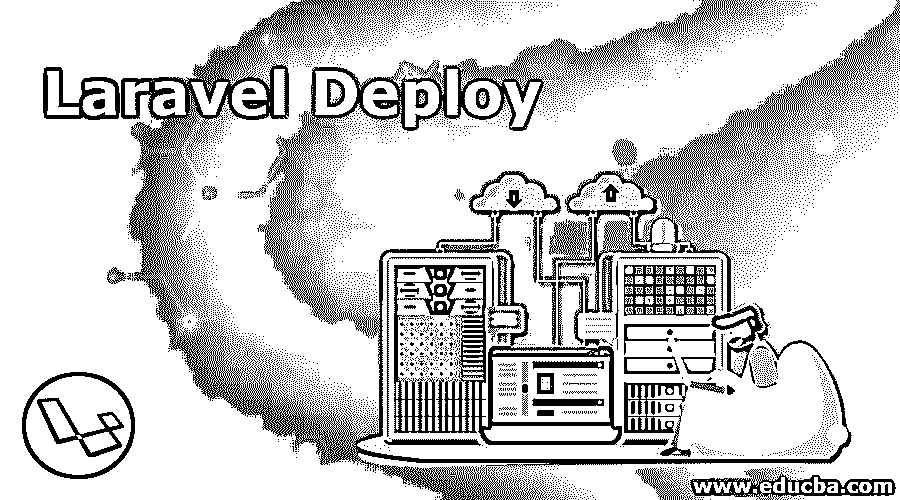
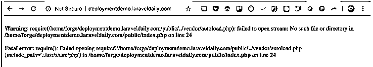
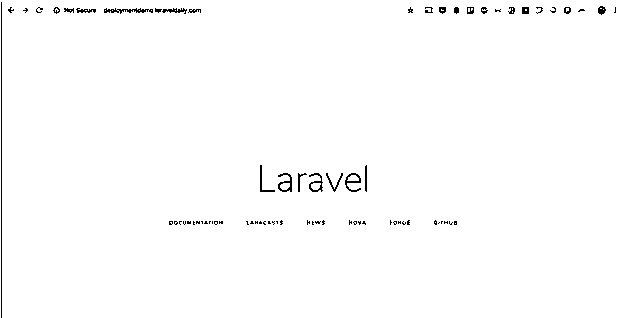

# Laravel 部署

> 原文：<https://www.educba.com/laravel-deploy/>

## Laravel 部署简介

当您准备好应用程序并完成托管或生产时，您必须利用 Laravel 部署选项来继续下一步。此外，确保应用程序按预期平稳运行也很重要。当应用程序最终准备好用于生产或托管时，它不应该有任何错误或故障。根据应用程序的需要，部署有几个步骤。生产中最常用的系统是“Git ”,但是也有其他选项可以用来部署 Laravel 项目。

### Laravel 部署了什么？

准备一个 Laravel 项目需要花费大量的时间来完成所有的过程，还要组织和格式化你在 Laravel 的帮助下可能制作的应用程序的内部功能。当您的开发过程在交叉检查错误并纠正它们之后最终完成时，是时候将它托管在一个真实的环境中，或者完成生产，以便它可供使用。

<small>网页开发、编程语言、软件测试&其他</small>

从开发到生产，需要几个步骤来协助这个过程。

1.  克隆已准备好的生产代码。
2.  正在安装编写器依赖项。
3.  Laravel 使用 dotenv (PHP 库)进行配置，因此。env 文件需要格式化，也需要根据服务器的设置进行调整。
4.  在 Artisan 的帮助下应用配置缓存和路由缓存。

这些过程确保在 Laravel 的帮助下开发的应用程序的部署得到适当的部署。为了希望制作和托管他们的应用程序的用户的利益，许多 web 托管服务器是在线可用的。

Laravel 本身具有从头开始准备应用程序的所有设置。当您在 Laravel 中不同的可用设置的帮助下准备应用程序时，您已经根据应用程序的需要准备好了，无论您是要在线托管它还是要制作它，以便它可以完全供用户和他们的作品使用。

### Laravel 如何部署工作？

Laravel deploy 辅助应用程序的最后一步。它有助于生产或主持。许多网站让你选择在他们的网站上托管你的内容，而且价格合理。如果您希望将“Git”用于生产，您也可以这样做。各种其他领域也进行生产。Laravel 部署因网站不同而不同。“Godaddy”提供共享主机服务，既经济又合理。还有其他像 HostGator，cloudways 等。提供同样的服务。它们是专门为托管而设计的，组织良好，接受所有类型的文件进行托管。

此外，还提供了命令行界面。需要使用第三方部署服务，Laravel 部署服务在这方面提供帮助，以便应用程序的结果可用。这也有助于在必要时对 Laravel 本身进行更改。大多数应用程序都需要建立一个“Github”库。所以最好有好的了解。获得 Laravel 应用程序是必要的，以确保应用程序功能良好。根据需要，您可以在共享主机或专用服务器上托管 Laravel 应用程序。

当应用程序开发完成后，最终需要进行一些优化过程。需要优化配置、路由和视图，以确保它们正确加载。优化将有助于寻找漏洞，并进行必要的修改，以避免错误再次出现并造成问题。

### Laravel 部署示例

将 Laravel 项目部署到 Live Server

确保您已经从互联网上的任何地方购买或订购了服务器。此外，考虑安装 LEMP 或灯栈，这只是一个点击安装，将使这一过程更容易。接下来，需要根据项目的需要配置 SSH 访问。

运行 PHP artisan、git pull 等命令。在服务器上运行 Composer 安装。配置可以下载和配置的 git 存储库代码。另外，配置 MySQL，这样您就有了一个专门针对您的项目的数据库。网络服务器的配置需要完成，这样你的网站就有一个特定的文件夹。稍后需要将该域指向服务器。您必须更改 DNS 记录，使其指向您自己的新 IP 地址。

将代码放入存储库(最好是 GitHub ),开始启动项目。

`git init
git add README.md
git commit -m "first commit"
git remote add origin https://github.com/LaravelDaily/DeploymentDemo.git
git push -u origin master`

下面是一个例子:

在我们的服务器中执行 SSH 并导航到项目的文件夹后，启动 git clone 命令。克隆后，文件将可见。结果将如下:

Laravel 有一个名为. env.example 的文件，其中已经包含了配置值。

使用此命令–CP . env . example。env 并使其成为主。环境文件。编辑它，使其成为 vi .env。不能更改的主要变量如下

`APP_URL=http://localhost
DB_CONNECTION=mysql
DB_HOST=127.0.0.1
DB_PORT=3306
DB_DATABASE=homestead
DB_USERNAME=homestead
DB_PASSWORD=secret`

设置应用程序 URL 以及数据库凭据。安装编写器。通过生成 PHP artisan key: generate 来生成应用程序密钥。

如果你想迁移任何数据，然后启动 PHP artisan 迁移

运行已经准备好的数据库:PHP artisan DB: seed

最后，在浏览器上尝试一下:

这将是服务器上的结果。

### 结论

因此，Laravel Deploy 非常重要，因为当应用程序准备就绪，需要在线发布到服务器上或需要制作出来供其他用户使用时，它在 Laravel 中扮演着非常重要的角色。如果我们正确地遵循所有选项，结果将是适当的。任何小错误都可能改变路由或设置，我们可能不得不从头开始重新工作。所以，在踏上这最后一步时要小心。

### 推荐文章

这是 Laravel 部署指南。在这里，我们分别讨论什么是 Laravel 部署以及它如何工作和例子。您也可以阅读以下文章，了解更多信息——

1.  [Laravel Orderby](https://www.educba.com/laravel-orderby/)
2.  [Laravel 迁移](https://www.educba.com/laravel-migration/)
3.  [Laravel 表单](https://www.educba.com/laravel-forms/)
4.  [拉韦尔组件](https://www.educba.com/laravel-components/)

