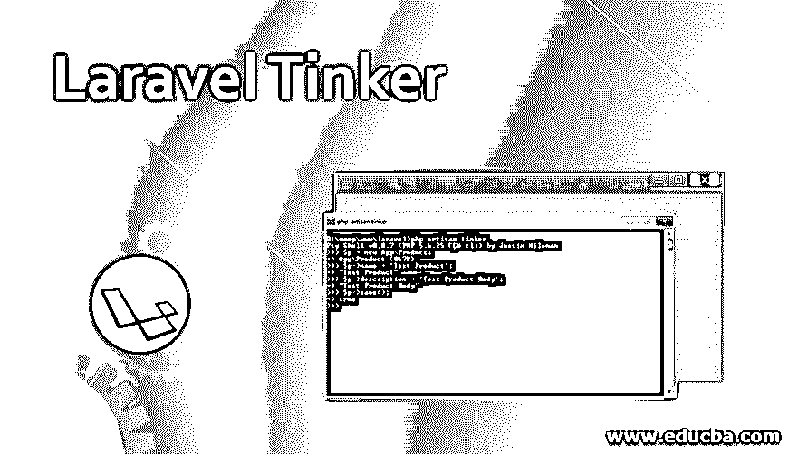
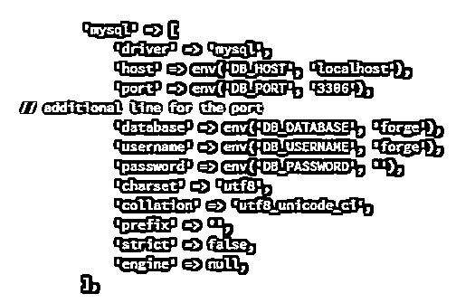
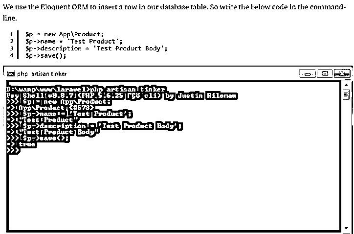
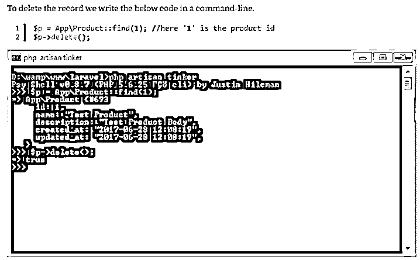

# Laravel Tinker

> 原文：<https://www.educba.com/laravel-tinker/>

## 拉勒维尔·廷克简介

Laravel 的 tinker 其实就是一个 repl (read-eval-print 循环)。是一个非常好的交互语言外壳。作为一个流程，它在内部接受用户提供的信息或输入，并对其进行详细评估，然后将准确的结果返回给提供输入的特定用户。它由 PsySH 控制台提供动力。它允许用户从命令行进行交互。它主要并且通常用于在数据库中进行简单的更改。Tinker 是在 php artisan tinker 命令行的帮助下访问的，这个命令行是由 Laravel 提供给用户的，用于对数据库进行细微的修改。

### 拉勒维尔·廷克到底是什么？

Laravel 使用的命令行称为 artisan。artisan 中有一些强大的功能，方便用户或开发人员根据自己的需要进行修改。Php artisan tinker 是一个 artisan 命令，它可以加速工作流而不会延迟太多。它允许用户以多种方式与应用程序完全交互。作为一个 Repl(Read-Eval-Print 循环),它为您提供了一个提示，然后使用应用程序所使用的语言的本机语法来允许与用户的应用程序进行交互。REPL 是一种特殊类型的交互式 shell。它收集用户信息，处理和评估给定的信息，然后将最终结果返回给用户。作为一个交互式的语言外壳，它允许你非常容易和方便地读取数据库，并根据需要插入和删除数据。

<small>网页开发、编程语言、软件测试&其他</small>

您可能希望在您的应用程序中读取和操作可用的模型。Tinker 是处理这种情况的最佳方式，因为它提供了解决问题的便利条件，并确保您的工作不受妨碍。Post::all()就是这样一个命令，特别用于浏览数据库的内容。好处是您不需要创建测试路径。直接的数据库操作是可能的。所以当你写代码的时候，你经常不确定你正在探索的特定库的语法。Tinker 使尝试和管理代码变得更加容易和方便，这比执行脚本要快得多，在执行脚本时，您必须等待错误出现或发生。很有可能它甚至不显示任何错误。Laravel 集合方法的功能非常有效。

工作流的调试是由很多 Laravel 开发者完成的，他们使用以下函数:在代码中插入 add() dump 和 die。页面刷新完成后，重复该过程。它完成了工作，但是很耗时，可能需要你一次又一次地重复工作。当您设置 xDebug 时，工作量会变得更容易。在 tinker 中，可以用代码的特殊部分代替 DD():eval(\ Psy \ sh())；通过这种方式，可以得到一个 tinker 提示，让用户直接进入给定的应用程序，并到达将要执行的确切位置。

### Laravel Tinker 到底是怎么工作的？

Crud 操作可以在 Laravel Tinker 的帮助下进行。我们需要首先在作曲家的帮助下安装它。要使用的命令是:

作曲家需要拉勒维尔/廷克

#### 1.数据库设置

例如，我们可以创建一个名为 mentorcode 的数据库，配置可以在。env 文件可用。

需要迁移用户表的默认迁移文件。Php artisan 迁移命令可用于此处理。

#### 2.播种数据库

Tinker 的用途是非常常见的种子数据库。因此，用单个命令填充数据库成为可能。类似工厂的命令(App\User::Class，8)-> create()；允许您在数据库中植入 8 行数据。

#### 3.访问数据库

app/User::all()；用于访问用户的数据列表。

#### 4.手动插入记录

使用手动模式插入记录也是可能的。我们必须根据需要获取模型，并将其存储在一个变量中。然后需要对变量进行属性赋值。完成后，我们可以方便地调用 save 方法。

#### 5.更新数据库

从数据库更新任何信息也是可能的。我们需要获取记录，分配一个新的属性，并将其保存到数据库中。

#### 6.删除记录

在 tinker 的帮助下，您可以插入数据，也可以在需要时删除记录。

#### 7.阅读文档

Tinker 也帮助你阅读函数文档。您必须在函数名称前键入 doc。

#### 8.检查来源

当我们使用 repl 函数时，我们可以很容易地找到类的源代码。我们还可以查看在 tinker 帮助下完成的类甚至函数文档。这取决于拥有文档块的类或函数。

### tinker 中可用的其他命令

*   **Trace-** 打印完整的堆栈跟踪。
*   **Wtf-** 它显示了最近的异常回溯的几行。
*   **历史-** 它列出了命令历史。还有一些方便的选项可用于搜索历史和回放历史。
*   **wheremi-**它打印用户的当前执行位置以及文件和行号。

### 结论

许多开发人员使用 Laravel tinker 来对他们现有的数据库进行小的修改。它还允许您在必要时进行编辑、添加数据和删除，您可以在方便时自由地进行批量编辑，甚至选择编辑。

### 推荐文章

这是拉勒维尔·廷克的指南。这里我们将讨论 Laravel Tinker 是如何与 Tinker 中的其他命令一起工作的。您也可以看看以下文章，了解更多信息–

1.  [Laravel 控制器](https://www.educba.com/laravel-controllers/)
2.  [什么是 Laravel？](https://www.educba.com/what-is-laravel/)
3.  [Laravel 型号](https://www.educba.com/laravel-models/)
4.  [拉勒维尔集体](https://www.educba.com/laravel-collective/)

