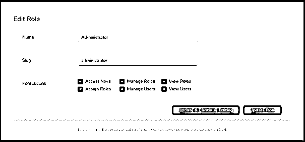
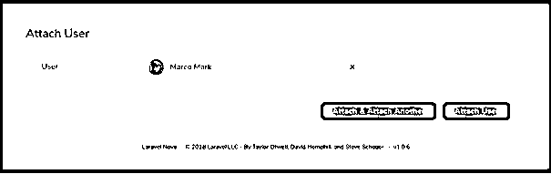
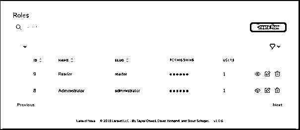
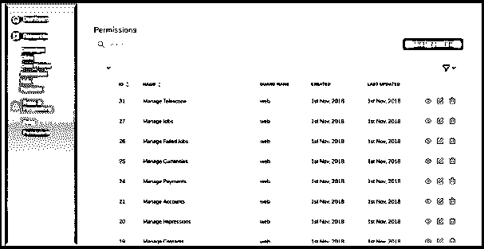
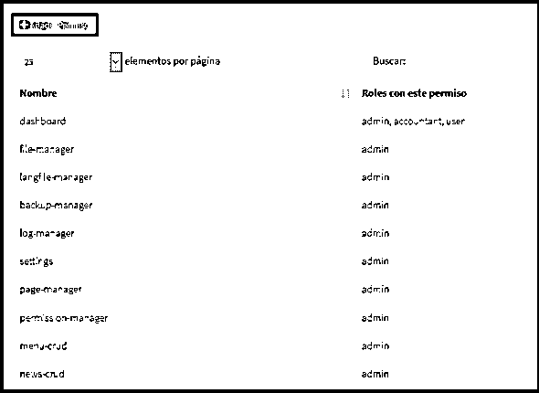

# Laravel 权限

> 原文：<https://www.educba.com/laravel-permissions/>

## Laravel 权限介绍

Laravel 是最受欢迎的电子商务开发框架之一。这种流行的原因是易于使用。Laravel 允许开发人员使用简单而富于表现力的语法创建复杂的结构和功能。Laravel 是可扩展的，这也是电子商务网站所有者喜欢使用它的原因。这给他们提供了广泛的选择来迎合高要求的顾客。Laravel 以其庞大的查询库而闻名，它提供了快速开发所需的一切。该框架还能够与第三方查询集成以形成独立的系统。

使开发变得容易的一个查询是 Laravel 权限。

<small>网页开发、编程语言、软件测试&其他</small>

### 什么是拉腊维尔许可？

Laravel 权限允许开发人员通过角色和基于权限的访问控制(ACL)向用户提供访问控制。因此，人们可以从网站的后端编辑并向用户提供访问权限。

### Laravel 许可是如何工作的？

通过角色和权限，用户可以创建具有不同角色和权限的几种类型的用户，有些用户只有查看权限，有些用户还可以编辑项目，有些用户可以继续进行删除。访问权限通常由超级管理员提供。

#### 示例#1

安装工具:需要运行迁移:PHP artisan migrate

**1。**has role 需要添加到用户模型中:

`class User extends Authenticatable
{
use HasRoles;
...
}`

**2。**现在必须将其加载到工具中，以便显示角色:

`// app/Providers/NovaServiceProvider.php
public function tools() /* defining the function tools */
{
return [
new NovaToolPermissions(),
];
}`

**3。**如果要从用户资源分配角色，则添加附加关系:

`// app/Nova/User.php
public function fields(Request $request)
{
return [
...
BelongsToMany::make('Role', 'role', Role::class),
];
}`

**4。**由于我们使用 Nova 工具获得许可，viewNova Gate 缺省值可以替换为 Gate():

`protected function gate()
{
//
}`

**5。**此程序带有默认权限:

`"viewNova":
"viewRoles":
"manageRoles":
"assignRoles":
"viewUsers":
"manageUsers":`

**6。**需要知道的是，某些部分需要常规许可。这是为了确定只有正确的权威才能访问博客的各个部分或整个博客。

例如，与 blog:PHP artisan make:policy blog policy 相关的策略现在需要分配策略:

`class AuthServiceProvider extends ServiceProvider
{
use ValidatesPermissions;
protected $policies = [
\App\Blog::class => \App\Policies\BlogPolicy::class,
];
public function boot()
{
collect([
'viewBlog',
'manageBlog',
])->each(function ($permission) {
Gate::define($permission, function ($user) use ($permission) {
if ($this->nobodyHasAccess($permission)) {
return true;
}
return $user->hasRoleWithPermission($permission);
});
});
$this->registerPolicies();
}
}`

**7。**最后一步。必须在策略中指定访问控制:

`// app/Policies/BlogPolicy.php
use Illuminate\Support\Facades\Gate;
public function viewAny($user)
{
return Gate::any(['viewBlog', 'manageBlog'], $user);
}
public function view($user, $post)
{
return Gate::any(['viewBlog', 'manageBlog'], $user, $post);
}
public function create($user)
{
return $user->can('manageBlog');
}
public function update($user, $post)
{
return $user->can('manageBlog', $post);
}
public function delete($user, $post)
{
return $user->can('manageBlog', $post);
}
public function restore($user, $post)
{
return $user->can('manageBlog', $post);
}
public function forceDelete($user, $post)
{
return $user->can('manageBlog', $post);
}`

**8** 。现在添加标签:

`{
"viewBlog": "View Blog",
"manageBlog": "Manage Blog"
}`

**输出:**

**这是编辑角色:**

**这个是添加用户**

现在需要分配角色。

#### 实施例 2

另一个简单的例子:

安装:通过 composer 安装到使用 Nova 的 Laravel 应用程序中。如果禁用了包发现，请注册提供程序。它将注册在 config/app PHP 文件中，如下所示:

`'providers' => [
NovaPermissionServiceProvider::class,
]`

**1。**现在工具需要注册，如下所示:

`//NovaServiceProvider.php
/*defining tools method */
public function tools()
{
return [
/*…*/
LaravelNovaPermission::make(),
];
}`

**2。**现在，Morph 对许多资源的添加如下:

`use Laravel\Nova\Field\MorphToMany;
/*defining method*/
public function field(Request $request)
{
return [
/* ...*/
MorphToMany::make('Role', ‘role’, Role::class),
MorphToMany::make('Permission', ‘permission’, Permission::class),
];
}`

**3。**现在，向 config/nova.php 添加类遗忘权限，如下所示:

`/* config/nova.php */
/*Registering middleware*/
‘middleware’ =>[
‘web’,
/*adding different classes*/
DispatchServingNovaEvent::class,
Authenticate::class,
Authorize::class,
BootTools::class,
ForgetCachedPermissions::class,
],`

**4。** Artisan 命令行可用于本地化文件发布:供应商:发布。自定义角色的用法:

`/*app/Providers/NovaServiceProvider.php*/
/*defining tools method */
public function tools()
{
return [
/* ...*/
LaravelNovaPermission::make()
->permissionsResource(CustomPermissions::class)
->rolesResource(CustomRoles::class),
];
}`

**5。**将默认授权(基于策略)更改为基于权限的授权:

`/* app/Nova/MyNovaResource.php*/
class MyNovaResource extends Resource
{
use PermissionsBasedAuthTrait;
/* defining array*/
public static $permissionsForAbilities = [
'all' =>‘managing products’,
];
}`

**6。**单独的权限可以定义如下:

`public static $permissionsForAbilities = [
'view' =>'viewing products',
'viewAny' =>'viewing any products',
'update' =>'updating products',
'create' =>'creating products',
'restore' =>'restoring products',
'delete' =>'deleting products',
'attachAttribute' =>'attaching product attributes',
'addAttribute' =>'adding product attributes',
'forceDelete' =>'forceDelete products',
'detachAttribute' =>'detach product attributes',
];`

**输出:**

在这里，用户可以创建角色，并向用户以及其他已经定义了角色的人授予访问权限。必须记住，在访问控制层次结构的顶端，是超级管理员。超级管理员的角色是为特定的职责提供明确的访问控制授权。开发人员在创建 ACL 或访问控制列表时需要小心，因为这里的一个错误举动可能会危及整个项目。

### 提供 Laravel 权限的步骤

提供权限的另一种方式是:

#### 第一步

PHP artisan make:播种机许可播种机

#### 第二步

`<?PHP
use Illuminate\Database\Seeder;
use Spatie\Permission\Models\Role;
use Spatie\Permission\Models\Permission;
class PermissionSeeder extends Seeder
{
/**
* Run the database seeds.
* @return void
*/
public function run()
{
$roles=[
'admin',
'accountant',
'user'
];
$permissions=[
'dashboard'=>['admin','accountant','user'],
'file-manager'=>['admin'],
'langfile-manager'=>['admin'],
'backup-manager'=>['admin'],
'log-manager'=>['admin'],
'settings'=>['admin'],
'page-manager'=>['admin'],
'permission-manager'=>['admin'],
'menu-crud'=>['admin'],
'news-crud '=>['admin'],
];
//create roles
foreach ($roles as $role) {
$rolesArray[$role]=Role::create(['name' => $role]);
}
//create permissions
foreach ($permissions as $permission=>$authorized_roles) {
//create permission
Permission::create(['name' => $permission]);
//authorize roles to those permissions
foreach ($authorized_roles as $role) {
$rolesArray[$role]->givePermissionTo($permission);
}
}
}
}`

向用户添加角色

`$user1=User::create([‘name’=>’eduardo’,’email’=>’example@gmail.com’,’password’=>bcrypt(‘1234);`

`$user1->assignRole(‘admin’);`

继续刷新数据库:

*   php 工匠迁移:新鲜种子

### 结论

从访问控制的角度来看，Laravel 权限很重要。访问控制列表是授权用户进行特定级别访问的一组简明信息。Laravel 权限基于层次结构工作。开发人员将获得比前端用户更高的访问级别。

网站管理员将获得更大的访问权限。最终访问权属于超级管理员。他/她将为每个人提供角色及其访问权限。

### 推荐文章

这是一个 Laravel 权限的指南。这里我们讨论什么是 Laravel 权限，它是如何用例子来实现的。您也可以浏览我们的其他相关文章，了解更多信息——

1.  [幼虫工匠](https://www.educba.com/laravel-artisan/)
2.  [拉勒韦尔拔毛](https://www.educba.com/laravel-pluck/)
3.  [Laravel 命令](https://www.educba.com/laravel-commands/)
4.  [LARAVEL 电子商务](https://www.educba.com/laravel-ecommerce/)

