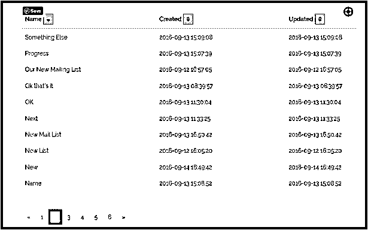

# 拉腊维尔 Orderby

> 原文：<https://www.educba.com/laravel-orderby/>

## Laravel Orderby 简介

Laravel 是最流行的框架之一，原因是众所周知的。它易于编码，并且足够健壮，可以扩展。它为开发人员提供了足够的选项来简化他/她的任务。Laravel 还与其他框架兼容，因此是一个令人愉快的工作。许多附属框架与 Laravel 集成得很好，Sprite 计费系统就是一个很好的例子。与 Laravel Cashier 完美结合，创建一个全面的订阅管理系统。

有很多例子反映了框架的灵活性和易用性。这就是为什么 Laravel 也是最受欢迎的电子商务框架之一。客户可以使用库中可用的众多方法和查询来简单地扩大规模。

<small>网页开发、编程语言、软件测试&其他</small>

其中之一是被大量使用的 Orderby。

### 什么是 Laravel Orderby？

假设您有一个产品列表，其中包含许多您想要查看的子类别。如果它们都是随意出现的，那就太麻烦了。你想要混乱世界的秩序。查询生成器为您提供命令 Orderby。现在一切都正常了。你可以通过它们的名字和有效期来查看它们(如果是易腐物品的话)。它可以是任何东西。重要的一点是 Orderby 查询按定义的顺序列出项目。

**一个简单的例子是:**

在类别和产品之间的一对多关系中，我们打算以有序的方式查看产品。最好是他们的名字。雄辩的关系将是这样的:

**代码:**

`class Category extends Model
{
public function products()
{
return $this->hasMany('App\Product');
}
}
However, the correct way of presenting it would be:
public function products()
{
return $this->hasMany('App\Product')->orderBy('name');
}`

Laravel Orderby 提升了所提供参数的顺序。在这种情况下，“名称”。因此，随后可能出现的列表将以产品名称的形式出现，没有其他细节。

### Laravel Orderby 是如何工作的？

Laravel Orderby 的工作原理是简单地对查询结果进行排序。因此，如果该列有一个包含 20 个数据的列表，它可以按照提供的参数对列表进行排序。也可以按升序或降序创建订单。

**按升序:**

`$users = DB::table('users')->orderBy('name', 'asc')->get();`

**按降序排列:**

`$users = DB::table('users')->orderBy('name', 'desc')->get();`

#### 示例#1

第一步:这一步是提供一些必要的查询

`data: function() {
return {
newMList: { name: ''},
mLists: [],
orderToggle: 1,
orderAttr: 'name',
pagination: {
total: 0,
per_page: 10,
current_page: 1,
last_page: 0,
from: 1,
to: 10
}
}
}`

**步骤#2:** 插入附加参数以及查询顺序

`<tr v-for="mList in mLists | orderByorderAttrorderToggle">
<td>{{ mList.name }}</td>
<td>{{ mList.created_at }}</td>
<td>{{ mList.updated_at }}</td>
</tr>`

**步骤#3:** 模板现在将插入排序按钮并命名为 onClick

`<tr>
<th>Name <button @click="changeSort('name')"><i class="fa {{ getSortIcon('name') }}"></i></button></th>
<th>Created <button @click="changeSort('created_at')"><i class="fa {{ getSortIcon('created_at') }}"></i></button></th>
<th>Updated <button @click="changeSort('updated_at')"><i class="fa {{ getSortIcon('updated_at') }}"></i></button></th>
</tr>`

**步骤#4:** 现在插入两个新方法。它们是:change sort()和 getSortIcon()

`changeSort: function(attr) {
varorderToggle = ( this.orderAttr == attr ) ? this.orderToggle * -1 : 1;
this.fetchMLists(attr, orderToggle);
}
fetchMLists: function (orderAttr, orderToggle) {
varorderBy = orderAttr ?orderAttr : this.orderAttr;
var order = orderToggle ?orderToggle : this.orderToggle;
var progress = this.$Progress;
varmLists = [];
let params = {
perPage: this.pagination.per_page,
page: this.pagination.current_page,
orderBy: orderBy,
order: ( order == 1 ) ? 'asc' : 'desc'
};
this.$http.get(this.resourceUrl, {params : params}).then(function(response) {
if ( response.data&&response.data.data&&response.data.data.length ) {
this.$set('mLists', response.data.data);
this.orderAttr = orderBy;
this.orderToggle = order;
var pagination = {
total: response.data.total,
per_page: response.data.per_page,
current_page: response.data.current_page,
last_page: response.data.last_page,
from: response.data.from,
to: response.data.to
};
this.$set('pagination', pagination);
}
}, function(error) {
swal('An Error Occurred', 'Please refresh the page and try again.', 'error');
});
}`

**输出:**

*   **说明:**Order By 查询按照提供的说明对 Name 参数进行排序。另一个选项是使用排序查询。这做同样的事情，但是这两者之间有一个主要的区别。
*   Orderby 影响整个查询集。这主要意味着整个查询集通过单个缩减器。现在，如果数据集又短又甜，这就没问题了。但是对于更大的数据集，这可能需要更长的时间。
*   Sort By 通过一个局部缩减器来实现这一点。因此，完成了本地订购。在这里，每个缩减器的输出将被排序。不会对整个数据集进行总排序。然而，它会更快。这是许多开发人员可能想要做出的权衡。

#### 实施例 2

**代码:**

`SELECT
rep_name, rep_country, sales_volume,
rank() over (PARTITION BY rep_country ORDER BY sales_volume DESC) as rank
FROM
salesrep;`

然而，使 orderBy()比 sortBy()更有效的是因为前者本质上是在尝试运行 SQL 查询。另一个例子是:

**代码:**

`<?php
// Plan out a query to retrieve the posts alphabetized Z-A
// This is still a query and has not actually run
$posts = Posts::select('id', 'created_at', 'title')->orderBy('title', 'desc');
// Now the query has actually run. $posts is now a collection.
$posts = $posts->get();`

//如果您想按 created_at 时间戳对集合对象进行排序，您可以这样做。这将在结果中有少量行的情况下快速运行，但基本上是不可用的/非常慢，如果集合包含数百或数千个对象，您的服务器将抛出 500 个错误。

`$posts = $posts->sortBy('created_at');`

也就是说，Order by 是一个影响大型查询集的强大查询。代码越干净或交叉越无缝，查询动作就越快。这也是 Laravel 作为一个整体的标志。它旨在通过其图书馆提供清晰的说明。

### 结论

与所有 Laravel 查询一样，orderBy()有助于无缝转换。这是一个重要的问题，有助于从疯狂中创造秩序。

### 推荐文章

这是一个指南拉勒维尔 Orderby。这里我们讨论什么是 Laravel Orderby，它是如何工作的，并举例说明以便更好地理解。您也可以浏览我们的其他相关文章，了解更多信息——

1.  [拉勒维尔集体](https://www.educba.com/laravel-collective/)
2.  [Laravel 路线控制器](https://www.educba.com/laravel-route-controller/)
3.  [在 Laravel 中验证](https://www.educba.com/validation-in-laravel/)
4.  [什么是 Laravel？](https://www.educba.com/what-is-laravel/)

