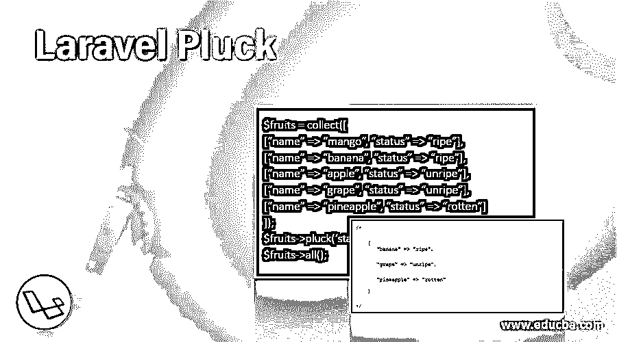
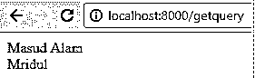
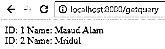
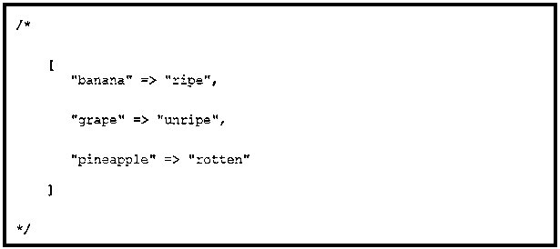
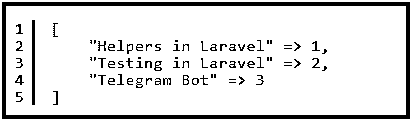
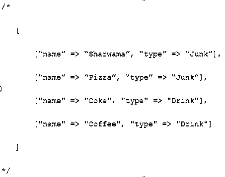

# 拉勒维尔拔毛

> 原文：<https://www.educba.com/laravel-pluck/>

## **拉勒维尔弹拨简介**

一段时间以来，Laravel 框架一直处于 web 开发的前沿。经过一段时间，它已经成为最流行的框架之一，主要是因为它易于使用的查询和健壮性。这也有助于框架轻松扩展。Laravel 框架也是最受欢迎的电子商务框架之一，因为它为客户提供了大量的功能供选择。Laravel 还与许多附属软件兼容，这有助于建立整个系统。

在本文中，我们将研究一个简单易用但功能强大的查询，称为 Laravel pluck()。

<small>网页开发、编程语言、软件测试&其他</small>

### Laravel pluck()是如何工作的？

顾名思义，Laravel pluck()提取某些值。它从给定的数组中提取信息并将其作为输出。然而，它对目标最有效，但对数组也同样有效。

#### 示例#1

第一种方法是使用一个参数。在本例中，我们看到 pull 机制仅用于一个参数。在这种情况下是“名字”。

**代码:**

`<?php
namespace App\Http\Controllers;
use Illuminate\Support\Facades\DB;
use Illuminate\Http\Request;
class getqueryController extends Controller
{
public function index(){
$names = DB::table('students')->pluck('name');
foreach ($names as $name) {
echo $name," ";
}
}
}`

**输出:**

#### 实施例 2

现在我们将使用两个参数:

**代码:**

`<?php
namespace App\Http\Controllers;
use Illuminate\Support\Facades\DB;
use Illuminate\Http\Request;
class getqueryController extends Controller
{
public function index(){
$names = DB::table('students')->pluck('name','id');
foreach ($names as $id=>$name) {
echo "ID: ", $id;
echo " Name: ", $name," ";
}
}
}`

**输出:**

如果你仔细看，我们使用了两个参数，即“id”和“name”。因此，当我们得到输出时，我们得到两列。

pluck()函数的作用是循环遍历一个集合，收集特定字段的所有数据，并将其存储在另一个集合中。这意味着，它从大量数据中提取相关值，并将其存储在一个单独的集合中以备后用。

**语法:**

`$userIds = User::all()->pluck(‘id’);
// $userIds now contains a collection of all user ids in that collection or table`

#### 实施例 3

**代码:**

`$collection = collect([
["name" => "person", "id" => 1],
["name" => "another person", "id" => 2] ]);
$names = $collection->pluck("name");
$names->all(); // ["person", "another person"]`

请注意，Laravel pluck()不仅限于雄辩的集合。它可用于任何 Laravel 系列。

你可以更进一步，想要一个联合数组，而不仅仅是弹拨的项目。为了指定需要如何对返回的集合进行键控，我们将第二个参数作为 pluck 函数的键:

`$collection = collect([
["name" => "person", "id" => 1, "occupation" => "student"],
["name" => "another person", "id" => 2, "occupation" => "developer"] ]);
$names = $collection->pluck("name", "occupation");
$names->all();`

**输出:**

此外，需要记住的一点是存在重复值。在使用 pluck()函数时，如果存在这样的数据，则返回最后与键匹配的项。

`$fruits = collect([
[“name” => “mango”, “status” => “ripe”],
[“name” => “banana”, “status” => “ripe”],
[“name” => “apple”, “status” => “unripe”],
[“name” => “grape”, “status” => “unripe”],
[“name” => “pineapple”, “status” => “rotten”] ]);
$fruits->pluck(‘status’, "name");
$fruits->all();`

**输出:**

#### 实施例 4

使用 pluck()仅提取一列的值:

`$title = $collection->pluck('title');
$title->all();` 

**输出:**

在 concertive 中开发时，可以将列名作为参数传递，以便提取值。

Pluck()还接受第二个参数，如果它恰好是一个雄辩的集合，它将是另一个列名。

`$title = $collection->pluck('user_id', 'title');
$title->all();`

**输出:**

为了进一步加强 pluck()函数，可以使用 within()函数。

#### 实施例 5

**代码:**

`$food = collect([
[“name” => “Rice & pepper soup”, “type” => “African dish”],
[“name” => “Egusi soup”, “type” => “African dish”],
[“name” => “Sharwama”, “type” => “Junk”],
[“name” => “Pizza”, “type” => “Junk”],
["name" => "Coke", "type" => "Drink"],
["name" => "Coffee", "type" => "Drink"],
]);
$junk = $food->whereIn(‘type’, [‘Junk’, 'Drink']);
$junk->all();`

**输出:**

上面的例子证明了查询的灵活性。我们使用了 with()函数和 pluck()查询来获得我们想要的结果。pluck()函数是一个多方面的命令集，它提取最相关的信息，还可以与其他相关查询协同工作。

pluck()函数是一个有用的函数，因为它从大量数据中挑选出相关信息。它易于使用，也可以根据需要进行修改。上面的例子是如何改变参数来改变输出的例子。

为了获得正确的输出，正确定义键和值是必要的。只有这样，查询才能识别信息并将其存储在另一个集合中。对于多个值，必须使用单独的集合来生成正确的输出。

### 结论

*   通过上面的例子我们已经能够确认函数 pluck()的功效。它不仅能够生成所需的输出，而且如果与其他函数(如 with()等)结合使用，也能很好地运行。这也是 laravel 框架的标志，它允许其查询简单易用，但对于协作效果来说足够灵活。
*   即使插入额外的参数来提取更多的信息，它也不会破坏形式。最好的例子是向输出结果添加更多的列。
*   有了 pluck()，我们现在有了一个现成的查询，它可以加速开发过程，而不用费太多力气。上面的文章充满了同样的例子。

### 推荐文章

这是拉勒维尔拔毛指南。在这里，我们讨论 Laravel Pluck 的介绍及其不同的示例以及代码实现。您也可以浏览我们推荐的其他文章，了解更多信息——

1.  [Laravel 控制器](https://www.educba.com/laravel-controllers/)
2.  [Dompdf Laravel](https://www.educba.com/dompdf-laravel/)
3.  [Laravel 调试](https://www.educba.com/laravel-debug/)
4.  [拉弗尔展开](https://www.educba.com/laravel-deploy/)

