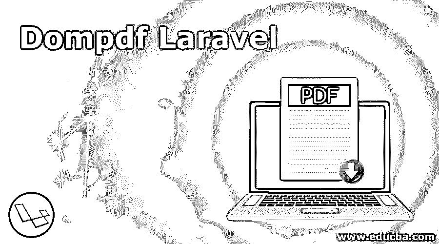
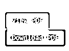
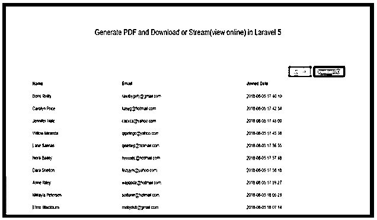

# Dompdf Laravel

> [https://www . educba . com/dompdf-laravel/](https://www.educba.com/dompdf-laravel/)

## 什么是 Dompdf Laravel？

Dompdf 是一个基于 Laravel 框架的查询，它将帮助生成一个 pdf 文件。基于 Laravel 框架，它可以集成到任何环境中。众所周知，Laravel 是最受欢迎的框架之一，多年来已经成为最受欢迎的电子商务解决方案。其原因是多方面:

*   强大的命令集。
*   容易写代码。
*   可扩展，支持电子商务服务的扩展。
*   无数的选择，为客户提供了许多选择。

所有这些使得 Laravel 框架成为一个梦想平台。

<small>网页开发、编程语言、软件测试&其他</small>

另一个经常被忽视的原因是 Laravel 将自己与附属框架集成的能力。例如，Laravel cashier 可以与 Sprint 计费系统集成，以创建完整的订阅配置文件。

在本文中，我们将研究 Dompdf 包，它使用户能够通过 Laravel 框架打印 pdf 文件。

### 如何使用 Dompdf Laravel？

*   它是一个查询，类似于其他 Laravel 查询表单，其中必须首先安装软件包，然后进行配置。此后需要创建布局刀片文件。需要创建模型和迁移文件，之后还需要创建控制器和路由。
*   现在需要为输入文件创建一个表单刀片。
*   将数据存储在数据库中。
*   因此，需要创建用于显示数据的视图文件。
*   必须定义下载 pdf 文件的路径。
*   blade.php 创建设计的 pdf 文件。
*   需要下载 pdf 文件。需要为此创建一个控制器。
*   PDF 准备好了。下载吧。

现在我们已经理解了相关的步骤，让我们看一个例子，这将使它更加清晰。

**第一步:**

必须下载一个包。这里我们将使用 laravel-dompdf 来帮助下载 pdf 文件

`//download a pdf file
return $pdf->download('users-list.pdf');`

**第二步:**

项目的创建:必须在 laravel 创建一个新的项目。这将通过作曲家创作。

`composer create-project laravel/laravel kodementor`

**第三步:**

建立数据库:一个 MYSQL 数据库已经建立。我们会把它命名为 kodementor。这将在。环境文件。

`// .env file
DB_CONNECTION=mysql
DB_HOST=127.0.0.1
DB_PORT=3306
DB_DATABASE=kodementor
DB_USERNAME=root
DB_PASSWORD=secret`

**第四步:**

身份验证的创建:这必须完成，因为用户列表必须导出。必须创建 laravel 身份验证，这是默认的身份验证。

`php artisan make:auth`

**第五步:**

现在需要迁移这些表:请记住，我们已经有了用户的默认迁移和密码的重置表。我们将使用这些迁移为用户和密码重置创建表。

`php artisan migrate`

**第六步:**

创建路线:需要创建三条路线:

1.  用户列表
2.  下载 pdf 文件
3.  在浏览器中查看 pdf

`// routes/web.php
Route::get('users', ['as' => 'users', 'uses' => 'UserController@index']);
Route::get('view-pdf/', ['as'=>'view-pdf','uses'=>'UserController@viewPDF']);
Route::get('download-pdf/', ['as'=>'download-pdf','uses'=>'UserController@downloadPDF']);`

**第七步:**

控制器的创建:必须创建一个用户控制器。这里需要定义三种方法。

1.  索引
2.  查看 pdf
3.  下载 PDF

`php artisan make:controller UserController`

**检索用户列表**

`// App/Http/Controllers/UserController.php
public function index()
{
$users = $this->user->get();
return view('users.index', ['users' => $users]);
}`

**创建 downloadPDF 方法**

`// // App/Http/Controllers/UserController.php
public function downloadPDF()
{
$users = $this->user->get();
// load view for pdf file
$pdf = PDF::loadView('pdf.users', ['users' => $users]);
return $pdf->download('users.pdf');
}`

**创建一个 viewPDF 方法**

`public function viewPDF()
{
$users = $this->user->get();
$pdf = PDF::loadView('pdf.users', ['users' => $users]);
return $pdf->setPaper('a4')->stream();
}`

因此，控制器现在看起来像这样

`// App/Http/Controllers/UserController.php
user = $user;
}
/**
* List all users
* @return view [description] */
public function index()
{
//get all users
$users = $this->user->get();
return view('users.index', ['users' => $users]);
}
/**
* Download PDF on Local Storage
* @return pdf [description] */
public function downloadPDF()
{
//get all users
$users = $this->user->get();
// load view for pdf
$pdf = PDF::loadView('pdf.users', ['users' => $users]);
//download pdf
return $pdf->download('users.pdf');
}
/**
* View PDF on the browser
* @return pdf [description] */
public function viewPDF()
{
//get all users
$users = $this->user->get();
// load view for pdf
$pdf = PDF::loadView('pdf.users', ['users' => $users]);
// stream pdf on browser
return $pdf->stream();
}
}`

**第八步:**

**创建视图:**现在我们已经能够设置设置、路线和控制器，是时候设置视图文件了。

因此将创建两个刀片文件:

index.blade.php 显示目录中的用户列表

`resources/views/users/`

users.blade.php 将被用作 pdf 文件的模板，该文件可以在 resources/views/pdf/目录中找到

`// resources/views/users/index.blade.php`

生成 PDF 并在 Laravel 5 中下载或流式传输(在线观看)

`@forelse ($users as $user)
@empty
No users
@endforelse`

姓名电子邮件加入日期

{ { $ user-> name } } { { $ user-> email } } { { $ user-> created _ at } }

这是所有用户的显示方式

现在对于视图文件:

//资源/视图/用户/index.blade.php

`Users List
@foreach($users as $user)
@endforeach`

姓名电子邮件加入日期

{ { $ user-> name } } { { $ user-> email } } { { $ user-> created _ at } }

需要一些额外的配置:

`return PDF::loadFile(public_path().'/myfile.html')->save('https://cdn.educba.com/path-to/my_stored_file.pdf')->stream('download.pdf');`

这可以将方法链接起来

可以改变方向和纸张尺寸:

`PDF::loadHTML($html)->setPaper('a4', 'landscape')->setWarnings(false)->save('myfile.pdf')`

**输出:**

### 结论

Dompdf 使开发人员更容易为 pdf 的生成创建查询。这是一个很好的方式来提供一种在全球范围内受到追捧的格式。使用 laravel-dompdf，可以轻松地创建可下载 pdf 文件。最好的部分是，而且已经说过，代码很容易写代码，不需要太多的工作。这也是 Laravel 框架的标志。这是一个充满选项的框架，可以直接最小化开发人员的工作并减少开发功能的时间。

Laravel-dompdf 就是这样一个例子。

### 推荐文章

这是 Dompdf Laravel 的指南。这里我们讨论什么是 Dompdf Laravel 及其不同的例子和代码实现。您也可以浏览我们推荐的其他文章，了解更多信息——

1.  [Laravel 控制器](https://www.educba.com/laravel-controllers/)
2.  [拉勒韦尔拔毛](https://www.educba.com/laravel-pluck/)
3.  [Laravel 调试](https://www.educba.com/laravel-debug/)
4.  [Laravel 权限](https://www.educba.com/laravel-permissions/)

