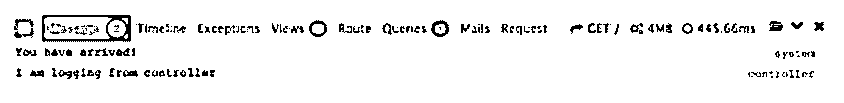
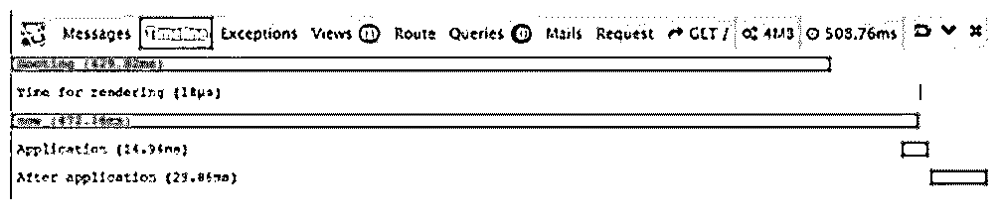
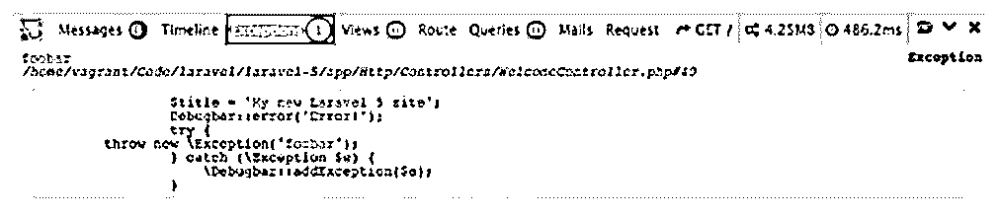
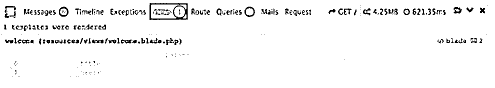
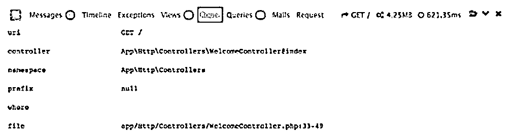
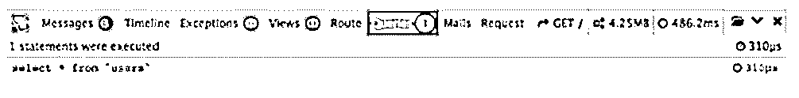

# Laravel 调试

> 原文：<https://www.educba.com/laravel-debug/>

## Laravel 调试简介

经常使用的查询之一是 Laravel Debug。它是一个应用程序，是 Laravel 框架的一部分，帮助开发人员记录开发阶段可能出现的错误和缺陷。这是一个方便的工具，因为它指出了应用程序开发过程中的错误。

### Laravel 调试功能如何？

使用 Laravel 调试选项最简单的方法之一是使用调试栏。

<small>网页开发、编程语言、软件测试&其他</small>

打开 Laravel 5 中的包装:

`composer require barryvdh/laravel-debugbar`

在 config/app.php 中，找到“array”应用程序并:

`'Barryvdh\Debugbar\ServiceProvider',`

可以给别名添加外观:

`'Debugbar' => 'Barryvdh\Debugbar\Facade',`

调试栏将如下所示:

这些消息位于单独的部分:

`Debugbar::info($object);`

`Debugbar::error('Error!');`

`Debugbar::warning('Watch out…');`

`Debugbar::addMessage('Another message', 'mylabel');`

时间线提供了调试问题的跟踪:

`Debugbar::startMeasure('render','Time for rendering');`

`Debugbar::stopMeasure('render');`

`Debugbar::addMeasure('now', LARAVEL_START, microtime(true));`

`Debugbar::measure('My long operation', function() {
// Do something…
});`

#### 例外

在异常记录器中，可以记录异常。

`try {
throw new Exception('foobar');
} catch (Exception $e) {
Debugbar::addException($e);
}`

#### 视图

查看是一个方便的选项。它显示了关于已经呈现的所有模板的信息以及已经通过它们传递的参数。其中一个原因是这是开发人员的最爱，因为它给出了所有视图的计数，随着应用程序的不断增长，这个计数也会不断增长。同样，有了这个功能，开发人员将能够检查视图是否正常工作，以及需要发送的数据是否正在发送。

#### 途径

路径功能告诉开发者应用的路径。

#### 问题

这是 Laravel 调试栏最重要的功能。加载特定系统时，查询将告诉开发人员问题出在哪里。创建系统时必须小心谨慎。较重的系统需要很长时间来加载。查询栏反映了相同的信息。

Laravel 调试栏是 Laravel 应用程序有用性的一个理想例子。调试栏可以安装在任何操作系统上，并且是易于使用的工具。Laravel debug()的主要目的是指出开发过程中可能已经进入查询集的错误。然而，这有一个严重的缺陷。调试模式虽然有助于识别错误和不正确的配置，但也有缺点。调试模式通常在站点上线之前使用。这让开发人员可以检查谬误。但是，很多时候是忘了禁用的。

现在，当这种情况发生时，网站上线，敏感数据暴露在公众面前。由于这次事故，类似于网站凭证的数据被公开。数据库凭证、管理员凭证是不需要告诉一般公众或与网站开发无关的人的信息。这带来了严重的风险，尤其是在黑客攻击的背景下。黑客可以利用这一点，试图侵入邮件服务器，访问代码结构，探索代码结构以找到弱点并加以利用，获得密码并修改它或在其他地方使用它来进入。

可能有更多的活动会对网站的安全性和安全性造成损害。因此，建议在网站上线前禁用调试选项。

其方法是:

**代码:**

`<?php return array(
/*
————————————————————————–
Application Debug Mode
————————————————————————–
When your application is in debug mode, detailed error messages with
stack traces will be shown on every error that occurs within your
application. If disabled, a simple generic error page is shown.
)
*/
?>
‘debug’ => true,`

但是，debug = true 意味着启用了调试模式。这个得改成假的。完成后，调试模式将被禁用。这个安全特性可能是 Laravel debug()查询中唯一的缺点。这是一个有用的查询，可以帮助开发人员检查在程序开发阶段可能出现的错误配置。

然而，需要提到的一点是，网站上线后没有调试所产生的问题更多的是人为错误，而不是软件缺陷。事实上，Laravel 文档清楚地说明了在网站上线后启用调试选项的风险。这是需要开发者遵循的。软件配置将简单地遵循它想要做的事情。

### 结论

正如我们在整篇文章中所看到的，Laravel Debug()是一个有用的工具，可以帮助开发人员创建近乎完美的系统，并提供令人惊叹的结果。我们也看到了不遵循文档的缺点。

### 推荐文章

这是 Laravel 调试指南。这里我们讨论 laravel 调试、异常、视图、路由和查询的介绍。您也可以看看以下文章，了解更多信息–

1.  [Laravel 表单](https://www.educba.com/laravel-forms/)
2.  [Laravel 创建表格](https://www.educba.com/laravel-create-table/)
3.  [拉韦尔组件](https://www.educba.com/laravel-components/)
4.  [Laravel 原始查询](https://www.educba.com/laravel-raw-query/)

