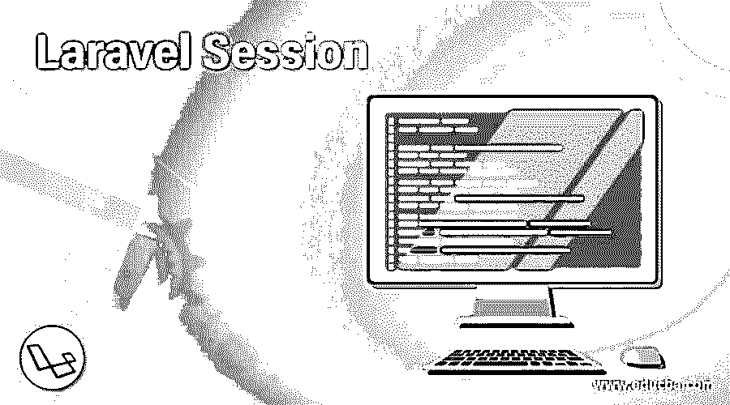

# 拉勒韦尔会议

> 原文：<https://www.educba.com/laravel-session/>

## Laravel 会话介绍

会话是 Laravel PHP 框架的重要组成部分。它有助于在服务器上存储跨多个请求的用户信息。统一 API 有助于访问 Laravel 提供的各种会话后端。会话配置的所有文件都存储在 config/session.php 中。Laravel 自动使用与许多应用程序兼容的文件会话驱动程序。驱动程序配置是一个为每个请求定义会话数据存储位置的会话。Laravel 中可用的不同驱动程序有 file、APC、array、cookie、Redis、Memcached 和 database。它们帮助处理会话数据。

### 什么是拉弗尔会议？

要获取所有会话数据，可以使用 all()方法，而不是 get()方法。

<small>网页开发、编程语言、软件测试&其他</small>

laravel 进程中提供的不同驱动程序如下:

*   **File** :这里的 sessions 存放在目录——storage/framework/sessions 中。
*   Cookie :安全加密的 Cookie 是存储会话的地方。
*   **数据库**:这里的会话存储在一个关系数据库中。
*   数组:一个 PHP 数组是存储会话的地方，它们将不再被持久化。
*   Memcached/Redis :这些是快速的基于缓存的存储，会话也存储在其中。

下面给出了操作会话的两种方式:

*   请求实例
*   全局会话助手

每当需要访问会话数据时，都会借助 HTTP 请求通过会话实例进行访问。get()方法在获取实例后使用，其中一个参数“key”用于获取会话数据。

`$value = $request->session () ->get ('key');`

对于全局助手，代码如下:

`//Global Helper
Session ([‘key’ => ‘value’]);`

在 Laravel 中可以检索会话数据。当您存储数据并希望以后随时检索时。

您可以通过两种不同的方式来完成，即借助会话助手和请求实例。

*   在全球助手的帮助下找回。

`$result= session (‘key’);`

*   使用请求实例进行检索。

`$result= $request-> session () -> get (‘key’);`

这就是如何在键的帮助下检索会话。

为了检索存储在应用程序中的所有数据，我们可以在请求实例上使用 all 方法。

`$result = $request -> session () -> all ();`

检索会话数据的另一个选项是使用可用的默认参数。

在由于会话不存在而无法检索会话值的情况下，返回指定的默认值 help。

`$request->session () ->get ('key', 'default value');
// Closure
$result = $request->session () ->get ('key', function () {
Return 'default value';
});`

### Laravel 会话是如何工作的？

Laravel session 帮助您访问会话数据，存储会话数据，删除会话数据，还可以检索会话数据。在 Laravel 应用程序中，有各种指定的步骤来执行这些不同的操作。借助会话，您可以处理用户的数据，并将其安全地存储在您的应用程序中。数据被很好地组织并保存在应用程序中。借助应用程序中可用的检索选项，用户可以随时查阅数据。此外，如果需要从存储空间中删除数据，也可以使用会话。此外，唯一的权力掌握在管理员手中。没有人能处理数据；无论是存储、删除还是检索。

会话对于任何 web 应用程序都是非常重要的。了解它的所有用例是很重要的。甚至认证状态和类似的日志数据也可以存储在会话中。如果用户没有正确编码或遵循，会话中可能会出现错误。也可能有 HTTP 请求错误。在这种情况下不要惊慌，并按照说明仔细返工。

需要使用 Has 方法来确认会话中是否存在要查找的值。has 方法的目的是，如果它出现在会话中，它有助于返回 true 值，如果它不存在，则在确认时返回 null。

`If ($request->session () ->has ('users')) {
//
}`

### 如何从会话中删除所有项目？

如果要从会话中清除所有数据，需要使用 flush 方法。这将擦除存在的每一个数据，因此象征性地称为刷新。

`$request->session () ->flush ();`

当您想要刷新会话中存在的所有数据时，您必须使用不同的方法。有时，您可能需要在会话中存储一些项，以备下一次请求时使用。当可能出现这种需求时，使用 flash 方法。只有在随后的 HTTP 请求期间，该数据才可用，之后将被删除。

`$request->session () ->flash ('status’, ‘Task was successful!');`

### Laravel 会话示例

下面是提到的例子:

**1。创建迁移表**

运行以下命令:

首先生成一个迁移文件

`Php artisan session: table`

现在，迁移生成的会话表

**2。Php 工匠迁移**

将生成示例迁移文件，其中包含以下内容。

`Schema::create('sessions', function ($table) {
$table->string('id')->unique();
$table->unsignedInteger('user_id')->nullable();
$table->string('ip_address', 45)->nullable();
$table->text('user_agent')->nullable();
$table->text('payload');
$table->integer('last_activity');
});`

创建迁移表后，打开。env 文件来更改其中的下面一行。

`SESSION_DRIVER=database`

### 结论

总之，我们可以说 Laravel Sessions 在保护和存储用户数据和日志细节方面起着重要的作用，可以在需要时存储、删除或检索这些数据和细节。它们可以根据以特定方式处理数据的需要进行定制。用户需要适当地遵循该方法来获得正确的结果。

### 推荐文章

这是一个拉腊维尔会议指南。这里我们讨论一下什么是拉勒韦尔会话？这堂课是如何与相应的例子一起工作的。您也可以看看以下文章，了解更多信息–

1.  [Dompdf Laravel](https://www.educba.com/dompdf-laravel/)
2.  [Laravel Orderby](https://www.educba.com/laravel-orderby/)
3.  [LARAVEL 电子商务](https://www.educba.com/laravel-ecommerce/)
4.  [Laravel 仪表盘](https://www.educba.com/laravel-dashboard/)

