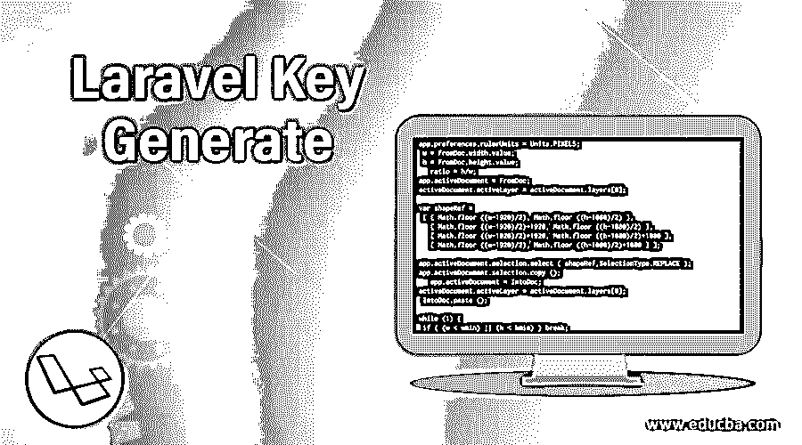

# Laravel 密钥生成

> 原文：<https://www.educba.com/laravel-key-generate/>

## Laravel 密钥生成简介

Laravel Key Generate 是一个命令，它通过设置。环境文件。当生成 composer create-project Laravel 命令时，默认情况下会直接运行该命令。当您倾向于使用 git 来处理您在 Laravel 上开发的项目时，它会复制您的项目，并将其放在除。不会复制 env 文件。任何希望使用您的应用程序的人都不会作为管理。不复制 env 文件。他们必须输入 PHP artisan 键:手动生成文件。

### Laravel 密钥是如何生成的？

Laravel Key Generate 帮助您在 Laravel Key Generate 中生成的密钥的帮助下生成应用程序。您开发的应用程序需要设置在一个随机字符串上，Laravel Key Generate 可以帮助您做到这一点。从哪里下载和安装 Laravel 应用程序也很重要，因为根据这个因素，可以确定是否设置了 PHP artisan key: generate 命令。如果使用了 composer 或正确的安装程序，那么肯定可以在 Laravel 应用程序中轻松设置该命令。

<small>网页开发、编程语言、软件测试&其他</small>

随机字符串通常约 32 个字符长。设置是在。env 文件(环境文件)。需要将. env.example 项复制到。env，它必须是一个新创建的文件。应用程序密钥必须设置确定，以便您的所有数据是安全的。除非设置了应用程序密钥，否则数据和用户信息将不会安全可靠，并且可能会被接触到该应用程序的其他人使用或误用。使用 GitHub Laravel 安装程序将解决应用程序使用不足时出现的许多问题。

有时可能会出现错误，说明没有生成或设置密钥，这表明在生成密钥时出现了一些错误。编码中的任何小错误或文件的名称更改都需要极其小心地进行精确编辑。没有密钥，项目无法运行，因为它是最终执行的主要组件。

### Laravel 键如何产生功？

当开发人员想要生成一个随机密钥时，可以使用密钥生成命令，这样就可以使用该随机密钥来访问应用程序和其中的所有数据，这些数据都是加密的，不会受到在线攻击者的攻击。在几种情况下，会检查在 Laravel 的帮助下开发的应用程序的漏洞。您可能会错过控制数据和数据流所需的基本要素。Laravel 是一个 PHP 框架，它可以完全自由地探索应用程序，并充分利用它提供的便利来成功开发应用程序。Key: Generate command 是 Laravel 应用程序中最后一个也是最基本的命令，用于确认所开发的应用程序的安全特性，该应用程序随后将根据开发人员和开发人员的计划在互联网上发布或实时托管。

密钥生成命令有助于加密过程，因此不会侵犯隐私和私人数据。该密钥更新存储在应用程序的环境文件中的密钥。对 show flag 提供了额外的支持。当指定标志时，它将显示生成的密钥，而不是任何配置或设置的更新。

Laravel 命令自动设置。环境文件。基于 web 的项目在与从 GitHub 的安装文件中安装的 Laravel 应用程序一起使用时是有益的。它会自动完成将文件复制到指定目标的步骤。唯一需要注意的是。不复制 env 文件，它是应用程序的环境文件。Git clone 可用于克隆项目，PHP artisan key: generate 命令需要手动执行。否则，应用程序将无法正常运行。

应用密钥的再生不会在第一密钥的帮助下解密所有加密的数据。旧密钥不允许新密钥解密任何数据，因此安全特性不会被篡改。它有它的优点和缺点。因此，在第一个密钥的帮助下解密旧数据，然后将所有数据收集在一起，并重新创建另一个应用程序密钥来加密数据，这将非常有帮助。

### Laravel 密钥生成示例

生成密钥最简单的方法是使用工匠的命令。

`ssh
PHP artisan key: generate`

此后，APP_KEY 值会自动在中设置。env 文件供您稍后使用。它用于加密应用程序中的文件。您将需要相同的 APP_VALUE 密钥进行解密。因此，请确保您的 APP_KEY 保存在安全的密码管理器中，以增加安全性。

如果不断出现一个错误，说明没有对应用程序加密密钥进行规范，请按照以下步骤解决问题:

借助 artisan 工具执行特定命令。

`[root@hostname ~]# PHP artisan key: generate
Application key set successfully.
[root@hostname ~]#
The content of the .env file will be as follows:
APP_NAME=Laravel
APP_ENV=local
APP_KEY=
APP_DEBUG=true
APP_URL=http://localhost
...
After a new APP_KEY is assigned it will look like this:
APP_NAME=Laravel
APP_ENV=local
APP_KEY=base64:dG/v+Dc73X/5wB4kKn/gjuaJucxR+TMrcTFuygOdWCQ=
APP_DEBUG=true
APP_URL=http://localhost`

### 结论

总之，我们可以说 Laravel 密钥生成是 Laravel 框架的一个非常重要的特性，因为它是存储在应用程序中的数据的安全性和加密的基础。数据加密对于避免数据滥用是必要的，并且它也有助于在必要时加密和解密数据。唯一的缺陷是需要将密钥保存在密码管理器中，因为解密时需要它。

### 推荐文章

这是一个指南，以 Laravel 密钥生成。在这里，我们还讨论了 laravel key generate 的介绍和工作原理，并给出了一个例子及其代码实现。您也可以看看以下文章，了解更多信息–

1.  [旅游路线](https://www.educba.com/laravel-route/)
2.  [Laravel 重定向到 URL](https://www.educba.com/laravel-redirect-to-url/)
3.  [Laravel 助手](https://www.educba.com/laravel-helpers/)
4.  [Laravel 哪里喜欢](https://www.educba.com/laravel-where-like/)

