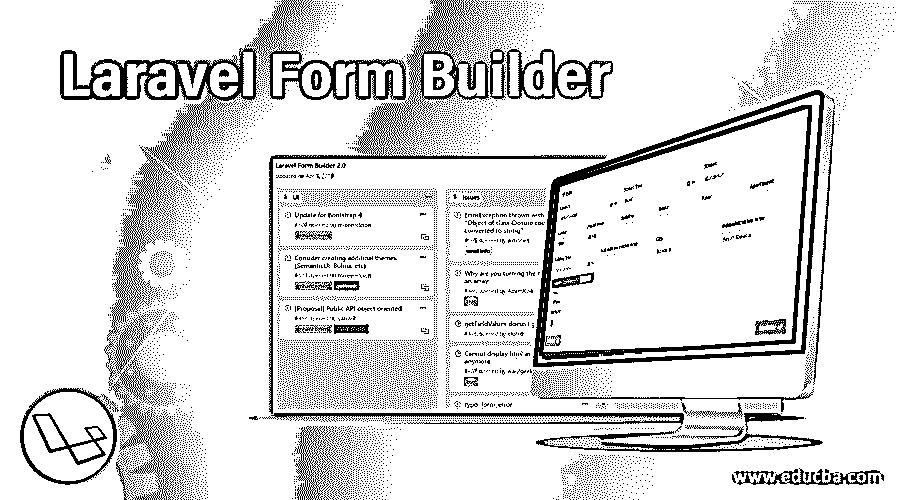
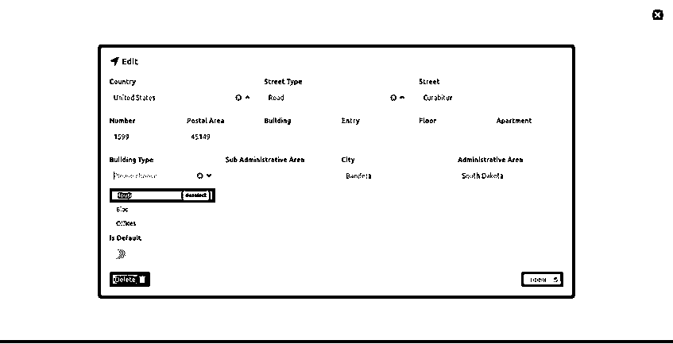
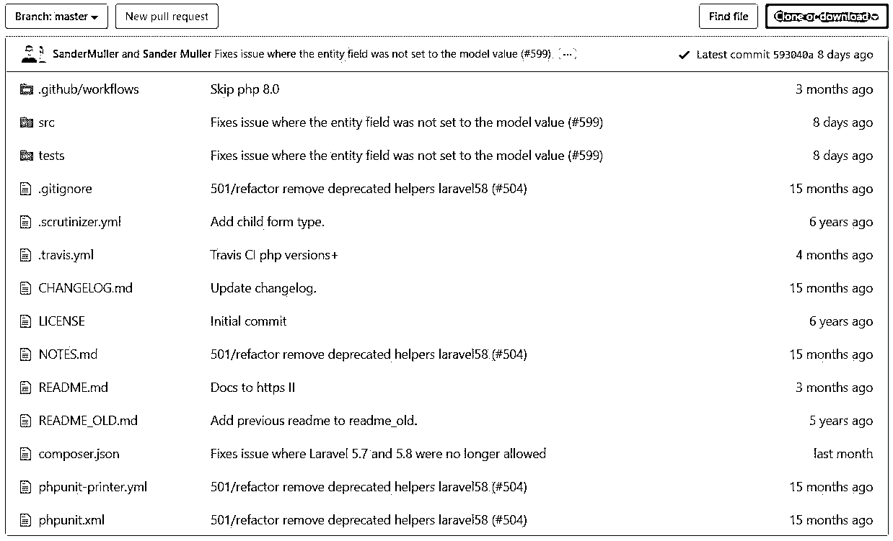
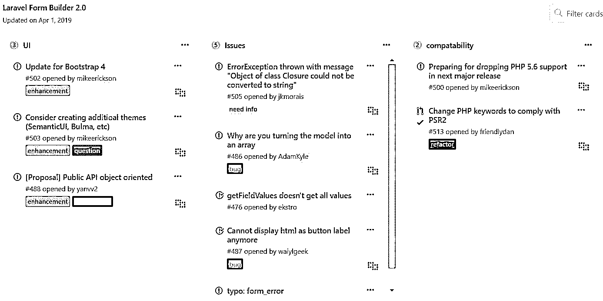
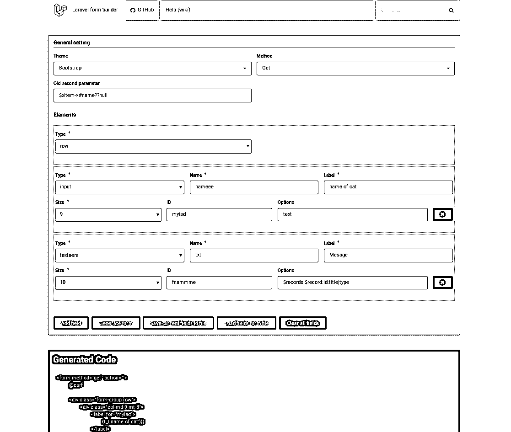
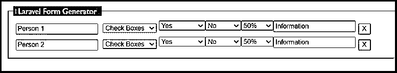
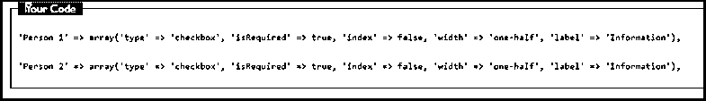

# Laravel 表单生成器

> 原文：<https://www.educba.com/laravel-form-builder/>

## Laravel 表单生成器简介

Laravel Form Builder 可以帮助你在 Laravel 上为你的项目设计表单。它帮助你设计你的网站或应用程序，并在几分钟内将表单嵌入其中。它包含了 CMS 和管理模块，使得在用户需要的地方生成表单变得更加容易。它有现成的表单设计，可以直接访问，不会产生任何复杂性。它帮助您以最简单的方式为用户创建的网站或应用程序构建表单。

### 什么是 Laravel 表单生成器？

在 Laravel 中作为表单生成器可用的软件包实际上是由克里斯蒂昂·胡萨克提供的，它还包含了一个 API，类似于 Symfony 的表单生成器。Symfony 的表单生成器是 Laravel 表单生成器的灵感来源。这个表单生成器可以很容易地作为独立安装运行，因为它是独立的，具有作为一个完整的包运行的所有必要要求。运行 Laravel 表单构建器不需要构建器代码，因为它操作简单，不需要编码。在 Laravel PHP 框架中，有现成的模板可以整合到用户希望为应用程序或网页创建的表单中。类似地，要注意的事实是，Laravel 不支持在其他 PHP 框架中创建的应用程序，也不支持在 Laravel 中进行编辑。基本需求是应用程序需要在 Laravel 的框架内创建。

<small>网页开发、编程语言、软件测试&其他</small>

在上图中，我们可以看到一个借助 Laravel Form Builder 创建的表单。在 GitHub 资源库中，有些开发人员在 Laravel Form Builder 的帮助下，使用 Laravel 提供的表单构建选项创建了他们的项目。

以上是 Laravel 表单生成器 GitHub 中的存储库图片。

在 Laravel Form Builder 的众多可用功能中，有几个重要的功能如下:

*   它允许快速创建表单
*   它很容易与 Laravel 请求验证集成，从而提高使用效率和可重用性。
*   构建器中的元素可以使用可定制的占位符。
*   它提供了一套非常有吸引力的设计，以一套图书馆的形式提供给形式创作。

在 Laravel Form Builder 的帮助下生成的用于构建表单的项目比 PHP 框架世界中的其他表单构建器更加高效。

在上图中，我们可以注意到 Laravel Form Builder 2.0，它描述了 UI、问题和兼容性细节。我们可以理解使用 HTML 编码和使用 Form Builder 之间的明显区别，前者很痛苦，后者很容易处理。

**HTML 代码:**

`@foreach($roles as $role)

<label>
<input type="radio" name="role" value="{{ $role->id }}"
{{ old('role', $user->role_id) == $role->id ? 'checked' : '' }}
{{ is_null($user->role_id) && $role->id == 1 ? 'checked' : '' }}
>
{{ $role->name }}
</label>

@endforeach`

**表单生成器:**

`@foreach($roles as $role)

<label>
{{ Form::radio('role', $role->id, 1) }}
{{ $role->name }}
</label>

@endforeach`

上面给出了用于表单构建的 HTML 编码和使用 Laravel 提供的表单构建器之间的明显区别。编码工作的差异是显而易见的。表单生成器是一个易于使用的应用程序或网站中的表单生成器。

### Laravel Form Builder 是如何工作的？

您可以通过为您的项目创建您想要的表单生成器来开始。您可以生成需要保存在项目中的表单类型，并开始处理它。在 Laravel 设计框架中可以包含各种类型的表单，同时希望为编辑目的制定表单。

此图像是表单生成器的模板，可用于根据需要创建典型的表单类型。您可以根据需要生成代码，这将有助于像插入代码一样创建表单。

一旦从 GitHub 或 Laravel 的任何其他来源下载了项目，您就可以克隆它并安装依赖项，因为它们是运行所需要的。在 Laravel 中提供的 composer 的帮助下安装您所拥有的软件包。之后，打开表单构建器的链接，您将能够在浏览器页面上看到该链接，并根据需要输入必要的代码来开始构建表单。稍后，可以对项目进行测试，以确认表单是否构建正确，没有任何错误。

### Laravel 表单生成器示例

在此代码的帮助下，可以生成一个简单的表单，如下所示:

`<?php
namespace App\Forms;
use Kris\LaravelFormBuilder\Form;
classSongForm extends Form
{
public function buildForm()
{
$this
->add('name', 'text', [
'rules' => 'required|min:5'
])
->add('lyrics', 'textarea', [
'rules' => 'max:5000'
])
->add('publish', 'checkbox');
}
}`

然后可以在控制器内部创建表单对象。

`$form = $formBuilder->create(\App\Forms\SongForm::class, [
'method' => 'POST',
'url' => route('song.store')
]);`

**然后使用以下内容来呈现表单对象:**

`{!! form($form) !!}`

**验证过程:**

`$form = $formBuilder->create(\App\Forms\SongForm::class);
if (!$form->isValid()) {
return redirect()->back()->withErrors($form->getErrors())->withInput();
}
// ...`

**可用于生成表格和字段的 artisan 命令:**

`php artisan make:form Forms/SongForm \
--fields="name:text, lyrics:textarea, publish:checkbox"`

**我们来看看为下面的表单图像创建的代码:**

**上图的代码如下:**

### 推荐文章

这是一个指南 Laravel 表单生成器。在这里，我们还将讨论 laravel form builder 的介绍以及如何与不同的示例和代码实现一起工作。您也可以看看以下文章，了解更多信息–

1.  [Laravel 查询生成器](https://www.educba.com/laravel-query-builder/)
2.  [Laravel 调试](https://www.educba.com/laravel-debug/)
3.  [Dompdf Laravel](https://www.educba.com/dompdf-laravel/)
4.  [Laravel Distinct](https://www.educba.com/laravel-distinct/)

