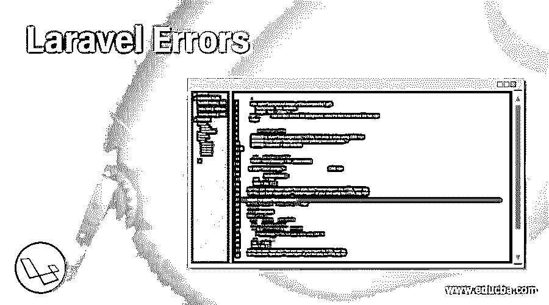
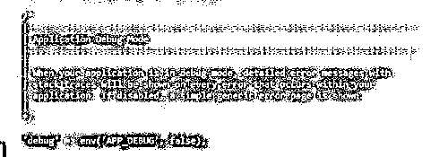
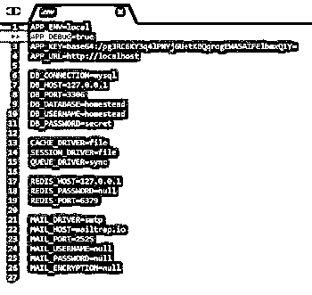
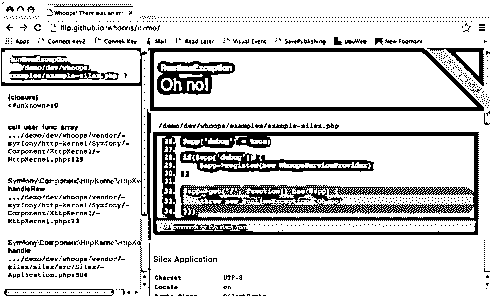
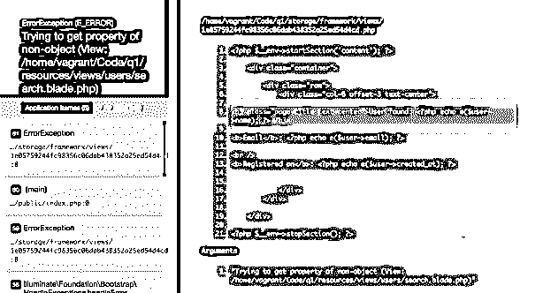
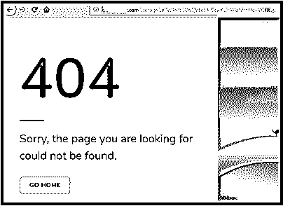
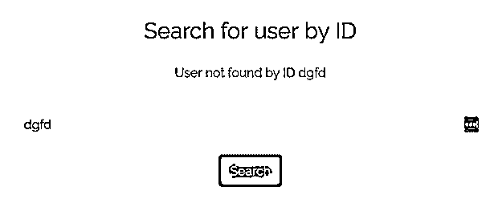

# Laravel Errors

> 原文：<https://www.educba.com/laravel-error/>

## Laravel 错误介绍

每当在 Laravel 框架中激活一个新项目时，都会为用户预先配置错误和异常处理。web 上的大多数应用程序都有自己定制的错误处理机制。在特定机制的帮助下，它们检测错误并记录它们，以便分析应用程序的情况和性能。在 Laravel 中，也有能够处理最终可能出现的各种错误的机制。Laravel 记录错误，并返回给用户来检测问题并解决它。

### 什么是 Laravel 错误？

App\Exceptions\Handler 是一个类，应用程序激发的所有异常都安全地存储在这个类中。从那里，它们被返回给用户进行进一步的分析和解决问题。Laravel 使用 Monolog 库为不同的日志处理程序提供必要的支持。Laravel 能够为用户配置几个处理程序。它允许在循环日志文件、单个日志文件甚至将它们写入系统日志之间进行选择。

<small>网页开发、编程语言、软件测试&其他</small>

识别和分析向用户显示了多少错误信息；您必须检查 config/app.php 中的 debug 选项。默认情况下，它已经根据 APP_DEBUG 环境变量的值预先设置好了。这存储在。环境文件。为了处理本地开发，用户必须将 APP_DEBUG 变量配置为 true。但是在生产环境中，用户必须确保该值设置为 false。这将使用户避免向应用程序的最终用户暴露敏感配置值的风险。

APP _ DEBUG 变量在应用程序中很容易设置为 false。

APP _ DEBUG 变量被转换为 true *。*

用户可以在 config/app.php 文件中配置 log 选项，以确定 Laravel 必须为正在运行的应用程序使用哪种存储机制。为了使用每日日志文件而不是单个日志文件，应用程序配置中的日志值需要设置为每日。

`'Log' =>'daily'`

需要注意的是，当用户使用每日日志模式时，Laravel 的默认设置是只保留五天的日志文件。但是，要进行必要的更改并增加天数，用户需要通过将 log_max_files 配置值添加到应用程序配置文件来更新必要的变更。

`'log_max_files' => 30`

当用户使用 Monolog 时，应用程序产生的日志消息可能有不同的严重级别。所有日志都由 Laravel 写入存储。但是，在生产环境中，用户可以通过向 app.php 配置文件添加 log_level 选项来自由配置用户希望记录的最低严重性。

`'log_level' => env ('APP_LOG_LEVEL', 'error'),`

### Laravel 错误是如何工作的？

Laravel 附带的错误报告设置为 E_ALL。它包括了 ouws 框架。它有助于创建可读的堆栈跟踪，帮助找出 PHP 错误发生的确切位置。

Laravel 将其收到的所有请求重定向到特定的中央 index.php 文件。

**#文件:index.php**

`require __DIR__.'/../bootstrap/autoload.php';
$app = require_once __DIR__.'/../bootstrap/start.php';
$app->run();`

有一个特殊的行有助于拉入应用程序引导，称为 start.php 文件。它还调用应用程序中的 run 方法。引导中的起始文件是 Laravel 核心表示应用程序文件的地方。它稍后从该位置返回应用程序的对象。

**# File:bootstrap/start . PHP**

`$app = new Illuminate\Foundation\Application;
//...
return $app;`

您也可以从 PHP include 或 require 语句返回值。

**# File:bootstrap/start . PHP**

`$framework = $app['path.base'].
'/vendor/laravel/framework/src';
require $framework.'/Illuminate/Foundation/start.php';`

bootstrap/start.php 文件位于应用程序的项目文件夹的根目录下。当用户使主要的和第一个 start.php 文件对后者或第二个 start.php 文件执行(要求的)动作时，它确定了应用程序管理器可以受益，因为用户可以容易地对 Laravel 框架进行任何将来可能发生的改进。

startExceptionhandling 方法是 Laravel 框架设置其自定义错误处理程序的地方。

**# File:vendor/laravel/framework/src/Illuminate/Foundation/start . PHP**

`$app->startExceptionHandling();
if ($env != 'testing') ini_set('display_errors', 'Off');`

**第二行如下:**

# File:vendor/laravel/framework/src/Illuminate/Foundation/start . PHP

`if ($env != 'testing') ini_set('display_errors', 'Off');`

### Laravel 错误示例

使用控制器，我们将有助于发现 Laravel 中的错误。如果我们有包含用户信息的数据，并且我们需要在 Laravel 的数据处理中寻找错误，我们需要遵循这些步骤。

`$user = User::find ($request->input ('user_id'));`

这是找不到用户时我们会找到的图片。

我们现在可以设置*。*带有 APP_DEBUG= false 的 env 文件。使用 User::findORFail()我们也可以找到错误。如果 Laravel 没有找到用户，它将显示一个 404 页面，并提到您正在寻找的页面无法找到。

在此之后，我们可以在框架中捕获与我们需要交叉检查的数据相关的错误，并将它们重定向回表单，在表单中，用户详细信息与实际可理解的详细错误消息一起显示。

在重定向详细信息之前，让用户知道异常类型是很重要的。在 User::findORFail() *，*的情况下会显示一个雄辩的异常 Modelnotfoundexception *。*因此，我们必须添加以下代码。

`Public function search(Request $request)
{
try {
$user = User::findOrFail($request->input('user_id'));
} catch (ModelNotFoundException $exception) {
Return back()->withError($exception->getMessage())->withInput();
}
return view('users.search', compact('user'));
}`

当您希望在 blade 中显示错误时:

`<h3 class="page-title text-center">Search for user by ID</h3>
@if (session('error'))

{{ session('error') }}

@endif
<form action="{{ route('users.search') }}" method="POST">...</form>`

要获取我们自己的消息，请添加:

`return back()->withError('User not found by ID ' . $request->input('user_id'))->withInput();`

**输出:**

### 结论

总之，我们可以说 Laravel 错误有效地解决了所有可能在 Laravel 的日志系统文件中被记录为错误的问题。有方法和手段来识别它们并检测错误以纠正它们并解决持续存在的问题。如果遵循上述适当的程序，将会有效地处理错误。

### 推荐文章

这是一个拉腊维尔错误指南。在这里，我们讨论 Laravel 错误的介绍，并举例说明，以便更好地理解。您也可以看看以下文章，了解更多信息–

1.  [Laravel 查询生成器](https://www.educba.com/laravel-query-builder/)
2.  [Laravel 原始查询](https://www.educba.com/laravel-raw-query/)
3.  [Laravel 调试](https://www.educba.com/laravel-debug/)
4.  [拉勒韦尔拔毛](https://www.educba.com/laravel-pluck/)

