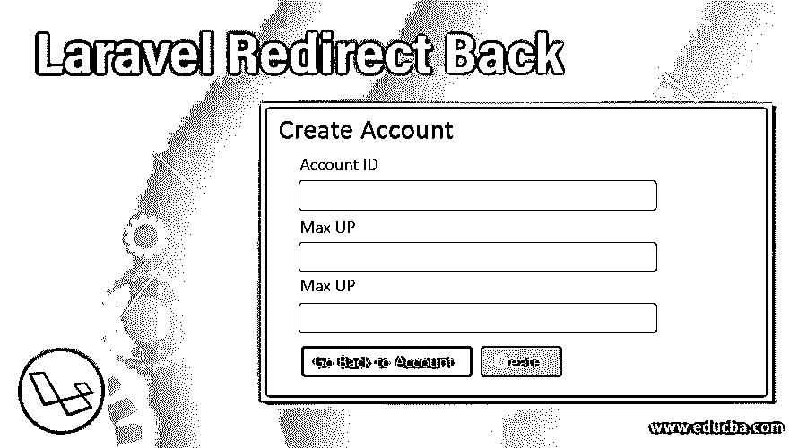
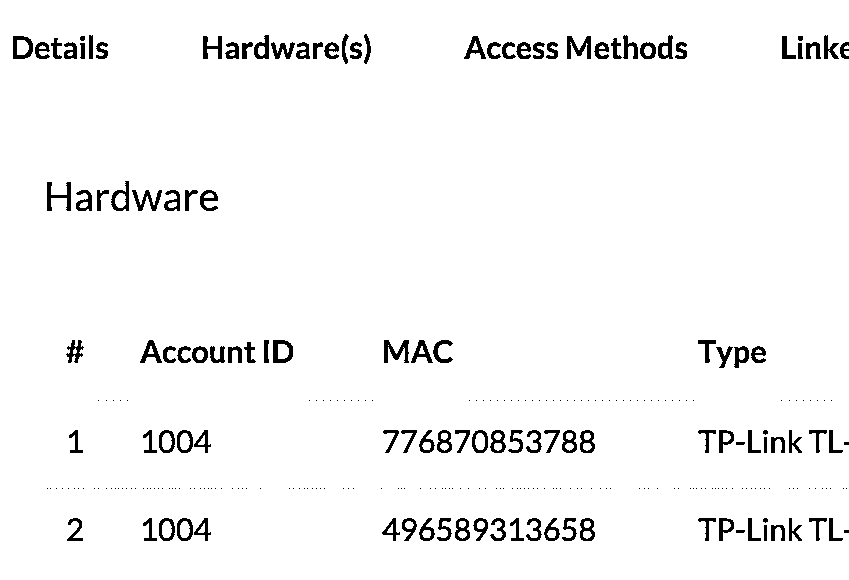
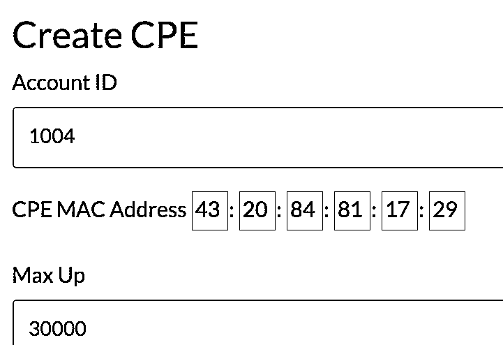
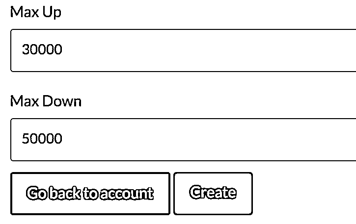
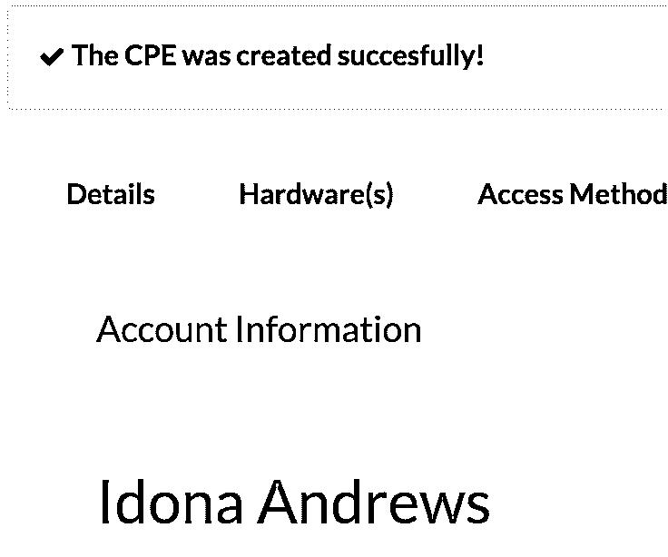

# Laravel 重定向返回

> 原文：<https://www.educba.com/laravel-redirect-back/>

## Laravel 简介重定向返回

Laravel 框架是最健壮的框架之一，它在虚拟世界掀起了一阵风暴。原因有很多。Laravel 框架是可伸缩的，更重要的是它是可表达的。这有助于开发人员花很少的时间来创建函数。它也有大量的库可供选择，因此具有必要的灵活性。

由于这些原因，Laravel 框架受到拥有电子商务网站的客户的追捧。电子商务业务本质上要求很高。必须在最快的时间内创建更新的功能，以便为消费者提供更好的服务。因为 Laravel 是易于使用的平台，这种支持的性质是可能的。这也是编码社区对此感到兴奋的原因。

<small>网页开发、编程语言、软件测试&其他</small>

一个主要的例子是表达式 Redirect Back()。它的主要任务是让用户返回到之前的页面，这个页面可能是也可能不是源页面。重定向回代码在用户必须登录才能访问的网站中很有帮助。如果登录成功，则用户将被带到前面，如果登录不成功，则用户将被重定向到登录页面或任何其他页面。不应将 Redirect back()与 return()混淆，return()在理想情况下会将用户返回到上一步。在大多数情况下，当 Return()是上一页时，重定向类似于绕道。

### Laravel 重定向回的示例

下面是一个关于商店的功能。

**代码:**

`public function store() {
$inputs = Input::all();
unset($inputs['_token']);
$cpe_mac = $inputs['mac1'].$inputs['mac2'].$inputs['mac3'].$inputs['mac4'].$inputs['mac5'].$inputs['mac6'];
$cpe = [];
$cpe['cpe_mac'] = $cpe_mac;
$cpe['bandwidth_max_up'] = (int)$inputs['max_up'];
$cpe['bandwidth_max_down'] = (int)$inputs['max_down'];
$json = json_encode($cpe);
$url = 'http://ift.tt/1Myb8d2';
$ch = curl_init($url);
curl_setopt($ch, CURLOPT_HTTPHEADER, array('Content-Type: application/json'));
curl_setopt($ch, CURLOPT_POSTFIELDS, $json);
curl_setopt($ch, CURLOPT_POST, 1);
curl_setopt($ch, CURLOPT_RETURNTRANSFER, true);
$result = curl_exec($ch);
curl_close($ch);
$result_json =  json_decode($result, true);
$id = $inputs['account_id'];
if ( $result_json['status'] == '200') {
return Redirect::to('/account/'.$id.'/#hardware') ->with('success','The CPE was created succesfully!');
} else {
return Redirect::to('/account/'.$id.'/#hardware') ->with('error', $result_json['message']);
}
}`

以下内容与设计有关:

`<!-- Nav tabs -->
<ul class="nav nav-tabs">
<li class=""><a href="#details" data-toggle="tab"><strong>Details</strong></a></li>
<li class=""><a href="#hardware" data-toggle="tab"><strong>Hardware(s)</strong></a></li>
<li class=""><a href="#access-methods" data-toggle="tab"><strong>Access Methods</strong></a></li>
<li class=""><a href="#linked-networks" data-toggle="tab"><strong>Linked Networks</strong></a></li>
<li class=""><a href="#options" data-toggle="tab"><strong>Options</strong></a></li>
</ul>
<!-- Tab panes -->

@include('account.show.details')
@include('account.show.hardwares')
@include('account.show.access-methods')
@include('account.show.linked-networks')
@include('account.show.options')

`

**输出:**

其他一些快速编码的例子。

*   重定向 URL:

`return redirect('user/dashboard');`

*   到上一页:

`return redirect()->back();`

*   这也可以写成

`return redirect()->back()->withInput();`

*   命名路由重定向:

`return redirect()->route('home');`

*   带参数的命名路由重定向:

`return redirect()->route('users', [1]);`

*   控制器操作重定向:

`return redirect()->action('App\Http\Controllers\UserController@index');`

*   带参数的控制器操作重定向:

`return redirect()->action('App\Http\Controllers\UserController@index', ['id' => 1]);`

*   邮件重定向:

`return redirect('home')->with('message', 'Welcome to ExpertPHP Tutorials!');`

redirect()命令行的一个优点是，它可以与任何其他命令行一起添加，或者成为一系列命令的一部分。

在一个动作结束后，它可以把用户带到无数的页面。关于我们遇到的例子。这不仅仅局限于电子商务网站，其他所有页面都可以使用。

redirect back()命令行的一个最佳示例是网站的注册页面或订阅页面。一旦用户试图访问该网站，他或她将被带到注册或订阅页面。在这个页面上，用户必须填写一个表单并提交。提交后，他或她将被重定向到网站的第一页或用户所在的任何页面。重定向命令主要用于为网站或功能提供顺序感。也不应该误认为重定向页面只对网站有效，而对功能无效。

如上例所示，数据库也可以具有相同的功能。

redirect back()有相当多的修改。其中一个被简单地重定向()。这或多或少做了同样的事情。它将用户带回到参数中提到的页面或环境。redirect back()可以封装在 return()命令行中，并与添加的参数一起使用。redirect back()也可以与消息纠缠在一起。这可能是错误消息，也可能是表示操作完成的消息。命令行中的消息提供了方向感。然后，命令行会将用户重定向到上一步，并要求他或她再次重试该步骤。

必须记住重定向响应来自 Illuminate \ Http \ redirect response。这个类需要正确的重定向头。正如我们从上面的例子中看到的，使用重定向命令行最简单的方法是使用全局重定向助手。

`It would look something like this:
Route::get('dashboard', function () {
return redirect('home/dashboard');
});
The other manifestation of this command line is the return back:
Route::post('user/profile', function () {
// Validate the request...
return back()->withInput();
});`

该命令行正在利用全局备份助手的帮助。

这些全局助手之所以为人所知，是因为它们可以与任何其他命令行结合在一起。它们在任何情况下都能工作，并提供相同的结果。此外，用户可以输入参数来定制他们的动作。如果一个人在尝试使用 ID 进行路由时使用了雄辩模型，那么开发人员可以使用模型本身。这将导致自动提取 ID。消息的显示也称为“闪存会话数据”。在这里，消息被闪现，重定向发生，这一切都是同时发生的。Laravel 确实为开发人员提供了大量选项来减轻工作负担。

### 结论

redirect back()命令行是开发人员用来创建简单功能的众多命令行之一。这些命令行具有足够的表达能力，可以根据情况的需要提供大量的修改。所有这些使得 Laravel 框架与众不同。

### 推荐文章

这是一个指南拉勒维尔重定向回来。在这里，我们还将讨论 laravel redirect back 的介绍，以及不同的示例和代码实现。您也可以看看以下文章，了解更多信息–

1.  [Laravel 查询生成器](https://www.educba.com/laravel-query-builder/)
2.  [Laravel 原始查询](https://www.educba.com/laravel-raw-query/)
3.  [拉勒韦尔拔毛](https://www.educba.com/laravel-pluck/)
4.  [LARAVEL 电子商务](https://www.educba.com/laravel-ecommerce/)

