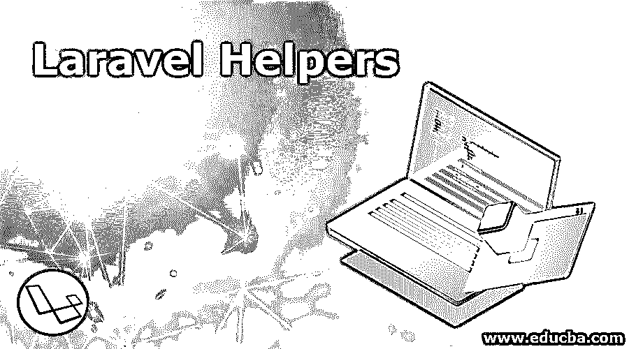

# Laravel 助手

> 原文：<https://www.educba.com/laravel-helpers/>

## Laravel 助手简介

助手是 PHP 框架的重要组成部分。Laravel 框架中有一些可用的全局函数，它们专门用于最小化您在项目上投入的时间，在 Laravel 帮助程序的帮助下，您可以避免使用重复的代码。也让工作流程变得便捷。除了现成的助手功能，您还可以根据您的即时需求定制您的 Laravel 助手功能。它帮助你节省时间，也帮助你用更好的工具管理你的代码框架，使你的工作更快完成。

### 什么是 Laravel 助手？

在 Laravel 本身的应用程序中，有相当多的函数可供使用，它们通常用于不同的编码目的。它们是基于它们所提供的功能组装起来的，对于打算使用它们进行编码的用户来说很容易使用。为了帮助用户执行重复的任务，Laravel 已经确保这些功能很容易使用，同时还可以根据需要在您的项目中定制新的 Laravel 帮助程序。它允许您创建新的 Laravel 助手，根据您的需要构建它们，并在您的项目中一次又一次地有效使用它们。

<small>网页开发、编程语言、软件测试&其他</small>

Laravel Helpers 中一些最流行和最容易使用的函数是——URL、字符串、路径、数组和对象。除了这个定制的 Laravel 助手，还可以在 Laravel 本身的框架内使用以下步骤进行设计。

### 定制设计 Laravel 助手的步骤

1.在应用程序目录中，您需要确保创建一个全新的目录，并将其命名为“Helpers”。另外，在这个目录中，创建一个名为“php”的新目录。您想要创建的任何帮助函数都可以添加到这个文件中。

2.为了确保 Laravel 能够识别我们将要创建的文件，并将其与应用程序同步，我们需要自动加载它。在“json”的帮助下，自动加载“helpers.php”文件。在那里添加下面几行。

`"autoload":{
"classmap":[
"database/seeds",
"database/factories"
],
"psr-4":{
"App\\":"app/"
},
"files":[
"app/Helpers/helpers.php"
] },`

3.将有一个称为转储-自动加载的命令。运行这个命令，您可以随时随地在应用程序中轻松地生成字符串命令。

### Laravel 助手是如何工作的？

为了理解 Laravel 助手的功能，让我们看看 Laravel 提供的各种函数并分析它们的用途。

#### 1.数组和对象

这是一个组，这里 Laravel 提供了许多操作数组的功能。很多时候，你需要对项目中存在的数组元素完成各种操作，而你对如何完成这些操作束手无策。这些助手帮助您操作数组元素。您可以很容易地将一个多维数组折叠成一个数组，甚至返回数组中第一个可用的元素。在这个助手功能下，可以执行许多其他类似类型的操作。

#### 2.小路

据说它们是所有现成的 Laravel 助手中最有用的。它们执行返回项目中不同目录的完全限定路径的功能。例如应用程序、配置、存储等。还使用了应用程序基本路径。app_path、database_path、storage_path 是这个函数中一些常见的例子。

#### 3.用线串

对字符串的操作是大多数已经完成和正在进行的项目的一部分。它变成了绝对重要的东西。这是用户在日常应用程序开发工作中的普遍需求。字符串可以转换成骆驼大小写，可以找出类的基名，可以让 htmlspecialchars 运行。在这个 Laravel 助手中，类似类型的各种字符串操作成为可能。

#### 4.资源定位符

在整个应用程序生成过程中，用户也普遍使用它们。资产、路由(用于控制器动作的 URL)的生成，以及动作 URL 的形成都是在这个函数的帮助下完成的，这个函数作为一个 Laravel 助手提供。甚至可以为特定的给定路径生成完全限定的 URL。

上面提到的 Laravel 助手及其功能当然是 Laravel 框架的必要部分，因为它们对于简化用户使用 Laravel 应用程序的应用程序创建过程非常重要。Laravel 助手的令人满意的功能和定制创建额外助手的需要也由 Laravel 完成。

### Laravel 助手示例

上面已经提到了 Laravel 框架中可用的不同示例。现在让我们看看激活定制的 Laravel 助手的例子，这些助手被用户普遍地用于他们的 Laravel 项目，并且通过这些例子理解 Laravel 助手除了预先注册的功能之外的功能能力。

调用 Laravel 中自定义创建的 Helper 函数，示例如下:

#### 示例#1

当你需要一个新的数字生成数字代码时，random_code()函数就用于这个目的。

`$code = random_code();
print_r($code);`

#### 实施例 2

当您希望从项目中可用的任何给定字符串中删除特殊字符时，您可以使用 Laravel 框架的 remove_special_char 函数来完成必要的工作。您可以很容易地在您的 Laravel 项目中修改这个函数。

`$str = "remove &amp; special #character *in string@$ example."
$remove = remove_special_char($str);
print_r($remove);
//output
remove special character in string example`

### 结论

总之，我们可以肯定地说，Laravel 助手是最需要的，并且是 Laravel 框架的核心功能。制作定制的 Laravel 助手以及在框架中随时可用的助手来缓解重复问题的好处是所有用户都很重视的，并且相信将永远是 Laravel 功能的重要部分。

### 推荐文章

这是一份 Laravel 助手指南。这里我们讨论定制设计 Laravel 助手的步骤，以及各种函数和编程示例。您也可以看看以下文章，了解更多信息–

1.  [Laravel Distinct](https://www.educba.com/laravel-distinct/)
2.  [Laravel 表单](https://www.educba.com/laravel-forms/)
3.  [拉韦勒刀片](https://www.educba.com/laravel-blade/)
4.  [拉韦尔组件](https://www.educba.com/laravel-components/)

