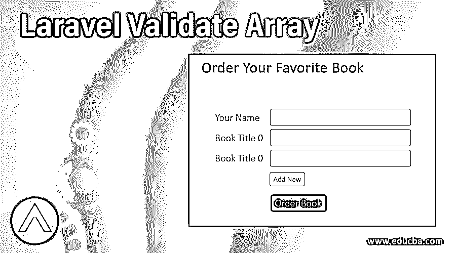
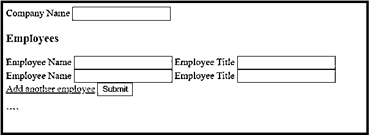
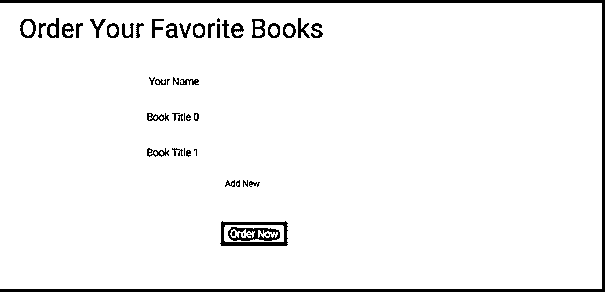

# Laravel 验证数组

> 原文：<https://www.educba.com/laravel-validate-array/>

## Laravel 验证数组简介

在 Laravel 中，我们可以获得很多机会来验证应用程序的传入数据。默认情况下，Laravel 在其基本控制器的帮助下使用 Validatesrequeststrait 来处理验证。这很方便，因为这是验证任何传入 HTTP 请求的一种更简单的方法。它还拥有各种强大而有用的验证规则。

Laravel 中的两种验证方式是:

<small>网页开发、编程语言、软件测试&其他</small>

*   控制器动作内部
*   在专用表格请求的帮助下

当验证由于任何技术错误而失败时，它通过向用户提交一个清晰的错误报告来提供帮助，该报告包含关于错误的详细说明。

### 什么是 Laravel 验证数组？

Laravel 的验证系统非常强大。借助 Laravel 的技术支持，您可以轻松完成验证任务。Laravel 框架本身包含了完成验证过程的所有东西。尽管通常来说，其他框架提供了验证，但总是存在复杂性，这往往会使整个过程变得复杂，并使事情变得乏味。同时，与创建应用程序的其他框架相比，在 Laravel 框架中验证更容易，也更简单。

Laravel 中存在预定义的验证规则。它帮助用户通过点击一个按钮来完成事情。互联网上的大多数 web 应用程序都需要验证数据。例如，如果有一个特定的注册表单需要用户填写，并附上他们的电子邮件 id 和密码，那么它需要验证以提供进一步的访问。Laravel 在验证器中有标准的规则。此外，在 Laravel 的“验证”中，可以根据需要创建新规则并进行定制。

在 Laravel 中可以生成基于数组的表单，而且生成它们并不困难。用户可以使用“点通知”来验证数组中存在的属性。甚至数组的每个元素都可以被验证。当用户希望以感兴趣的特定语言验证其中的消息时，必须使用*字符。用户可以对基于数组的字段使用单个验证消息。

**1。**如果有一个包含照片字段的传入 HTTP 请求，您可以借助以下工具来验证数据:

`$validator = Validator::make ($request->all(), [
'photos.profile' => 'required|image',
]);`

**2。**如果需要验证阵列中可用的每封电子邮件，则可以使用以下方法:

`$validator = Validator::make ($request->all(), [
'person.*.email' => 'email|unique:users',
'person.*.first_name' => 'required_with:person.*.last_name',
]);`

**3。**在验证过程中使用字符' * '时，可使用以下字符:

`'custom' => [
'person.*.email' => [
'unique' => 'Each person must have a unique e-mail address',
] ],`

### Laravel 验证数组到底是怎么工作的？

我们已经理解了 Laravel Validate Array 的含义，并开始理解该过程的确切内容以及该验证过程的好处。现在让我们看看这个验证实际上是如何处理和工作的。

为了验证一组对象或数组中的数据，Laravel 利用了各种验证选项。在最终选择其中一个之前，你可以考虑所有可能的选择。表单数组验证就是这样一个过程。它通过帮助验证 HTML 表单使用数组语法传递的不清楚的数据，简化了验证过程。让我们考虑这样一个用户，他需要添加一个“公司”,在这个部分中，他可以根据需要将雇员的名字添加到公司中。每个雇员肯定会有一个名字，也有一个特定的称号或头衔。

考虑到这一点，我们来看看代码:

**代码:**

`<form>
<label>Company Name</label>
<input type="text" name="name">
<h3>Employees</h3>

<label>Employee Name</label>
<input type="text" name="employee[1][name]">
<label>Employee Title</label>
<input type="text" name="employee[1][title]">

<label>Employee Name</label>
<input type="text" name="employee[2][name]">
<label>Employee Title</label>
<input type="text" name="employee[2][title]">

<a href="#" class="js-create-new-add-employee-box">Add another employee</a>
<input type="submit">
</form>`

**输出:**

*在此代码的帮助下，您可以创建一个选项，在验证过程中不断添加员工以验证条目。

类似地，您可以在 Laravel validate 数组中验证表单，其中有一个 Laravel 中可用的表单数组。

### Laravel 验证数组示例

当您希望创建一个数组表单并对其进行验证时，我们可以使用这个示例作为参考来理解它的工作和过程。

这里我们将使用动态字段来处理要验证的数据。当你希望用户以后添加更多的字段，这样就可以增加数据，我们可以试试这个。一个形象的例子:

在上图中，有一个“添加新数据”的选项。这将有助于加载一个新的输入字段来输入数据，字段名将是数组。在 JavaScript 的帮助下，这是可能的。下面是一个 PHP 示例:

**代码:**

`<input type="text" class="form-control" name="name" value="name">
@for ($i=0; $i < 2; $i++)
<input type="text" name="items [{{$i}}]" value="{{ $i }}">
@endforeach`

在 Laravel 中，您会发现 Validation::faade 选项、新表单请求以及控制器验证。利用 Artisan 让我们创造一个新形式的请求。该系统以自动方式生成文件。在终端中运行以下代码:

**代码:**

`$ php artisan make:requestOrderRequest`

您将收到成功创建请求的消息。以下内容将在 app/Http/Requests/order request . PHP 上提供。

**代码:**

`<?php namespace AppHttpRequests;
useAppHttpRequestsRequest;
classOrderRequest extends Request {
public function authorize()
{
return false;
}
public function rules()
{
return [
//
];
}
}`

从这里开始，您可以根据需要添加自定义验证规则并验证表单。

### 结论

Laravel Validate Array 是一个非常好的特性，可用于 Laravel 中的数据验证。在它的帮助下，用户可以验证所有必要的数组字段，这些字段通常用于应用程序处理中的表单。这是一种非常好的、有效的和无张力的方法，因为它被简化了，并且在加工中也没有复杂性。

### 推荐文章

这是一个 Laravel 验证数组的指南。这里我们讨论 Laravel Validate Array 的介绍，适当的语法，它是如何工作的，以及例子。您也可以浏览我们的其他相关文章，了解更多信息——

1.  [Laravel 迁移](https://www.educba.com/laravel-migration/)
2.  [幼虫工匠](https://www.educba.com/laravel-artisan/)
3.  [拉韦尔组件](https://www.educba.com/laravel-components/)
4.  [Laravel Crud Generato](https://www.educba.com/laravel-crud-generator/)

