# 拉勒韦尔路线

> 原文：<https://www.educba.com/laravel-route/>

## 拉勒维尔路线简介

Laravel 路由组允许开发人员路由所有的组。这有助于创建干净的代码，无论谁接管网站的开发，都将能够遵循准确的例行程序。对路径进行分组的另一个好处是，所有组可以共享所有属性。这样节省了很多时间。在任何其他框架中，这可能必须单独完成。然而，在 Laravel 框架中，这个特性表现为一种力量倍增器。路由分组还节省了重复，否则如果单独进行的话就会出现这种情况。像中间件和名称空间这样的属性可以在一个组中共享，而不必单独进行。

### 句法

该查询如下所示:

<small>网页开发、编程语言、软件测试&其他</small>

`Route::group( [ ] , callback);`

解释:正是因为这个原因，Laravel 框架是最受欢迎的框架之一。它很有表现力，它的库允许开发者从大量的查询中进行选择。这有助于创建健壮的功能。laravel 框架也是一个非常可扩展的框架，能够处理大多数挑战。laravel 框架的另一个特性是它灵活的查询命令行系统。这允许它集成第三方命令行。对于电子商务所有者来说，这是他们在线业务使用 laravel 框架的原因。

#### 参数的使用

以下是一些参数:

**代码:**

`Route::get('/page/{number}', function ($number) {
echo "Your are on page ". $number;
});`

**使用可选参数和默认值:**

**代码:**

`Route::get('/page/{number?}', function ($number = 1) {
echo "Your are on page ". $number;
});`

**使用表达式代替用于路由的参数:**

**代码:**

`Route::get('/page/{number?}', function ($number = 1) {
echo "Your are on page ". $number;
})->where('number', '[0-9]+');`

**路线的命名:**

**代码:**

`Route::post('/submit', 'ContactFormController@submitForm')->name('contact.submit');`

**路线分组:**

**代码:**

`Route::group(['prefix' => 'posts', 'as' => 'posts.'], function () {
Route::get('/', 'PostController@index')->name('index');
Route::get('/create', 'PostController@create')->name('create');
Route::post('/store' 'PostController@store')->name('store');
});`

**路线分组的另一种形式可以看起来像:**

**代码:**

`Route::group(['prefix' => 'posts', 'as' => 'posts.'], function () {
Route::get('/', 'PostController@index')->name('index');
Route::group(['middleware' => ['auth']], function () {
Route::get('/create', 'PostController@create')->name('create');
Route::post('/store' 'PostController@store')->name('store');
});
});`

**名称空间的用法:**

**代码:**

`Route::group(['namespace' => 'Post'])
// this route group will load all controllers
//from within the "App\Http\Controllers\Post"
Route::group(['namespace' => 'Post','prefix' => 'posts', 'as' => 'posts.'], function () {
Route::get('/', 'PostController@index')->name('index');
Route::group(['middleware' => ['auth']], function () {
Route::get('/create', 'PostController@create')->name('create');
Route::post('/store' 'PostController@store')->name('store');
});
});`

**如果必须路由缓存:**

`PHP artisan route: clear
PHP artisan route: cache`

**最后，如果必须调试路由:**

`PHP artisan route: list`

**路线分组的另一个快速示例:**

**代码:**

`// In Laravel 4.0 your routes would look something like this
Route::get('/', array('as' => 'home', 'uses' => 'Controllers\HomeController@index'));
Route::get('admin/dashboard', array('as' => 'admin.dashboard.index', 'uses' => 'Controllers\Admin\DashboardController@index'));
// etc. This gets messy very quickly.
// Laravel 4.1 allows us to write this a lot cleaner:
Route::group(array('namespace' => 'Controllers'), function()
{
Route::get('/', array('as' => 'home', 'uses' => 'HomeController@index'))
Route::group(array('namespace' => 'Admin'), function()
{
// Notice how, by nesting route groups, the namespace will automatically
// be nested as well!
Route::get('admin/dashboard', array('as' => 'admin.dashboard.index', 'uses' => 'DashboardController@index'));
});
});`

### 实现 Laravel 路由的示例

让我们看看提到的一些例子:

#### 示例#1

**代码:**

`Route::group([], function()
{
Route::get('/first',function()
{
echo "first route";
});
Route::get('/second',function()
{
echo "second route";
});
Route::get('/third',function()
{
echo "third route";
});
});`

**输出:**

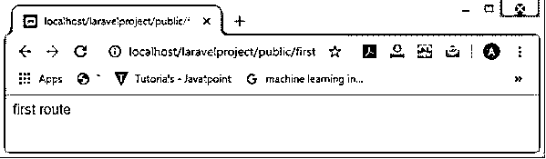

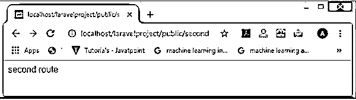

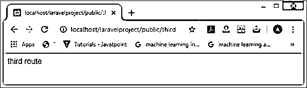

#### 实施例 2

**代码:**

`Route::group(['prefix' => 'tutorial'], function()
{
Route::get('/aws',function()
{
echo "aws tutorial";
});
Route::get('/jira',function()
{
echo "jira tutorial";
});
Route::get('/testng',function()
{
echo "testng tutorial";
});
});`

**输出:**

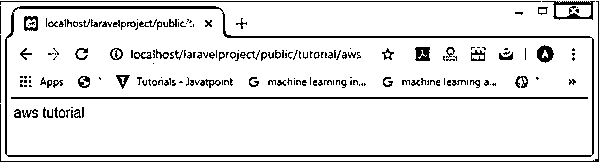

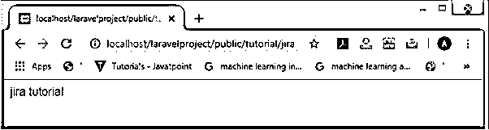

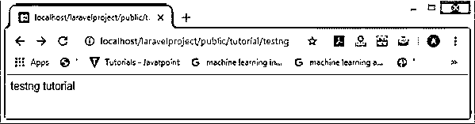

#### 实施例 3

**代码:**

`Route::middleware(['age'])->group( function()
{
Route::get('/aws',function()
{
echo "aws tutorial";
});
Route::get('/jira',function()
{
echo "jira tutorial";
});
Route::get('/testng',function()
{
echo "testng tutorial";
});
});
<?php
namespace App\Http\Middleware;
use Closure;
class CheckAge
{
/**
* Handle an incoming request.
*
* @param
\Illuminate\Http\Request  $request
* @param  \Closure  $next
* @return mixed
*/
public function handle($request, Closure $next)
{
//return "middleware";
echo "Hello javaTpoint  ";
return $next($request);
}
}`

**输出:**

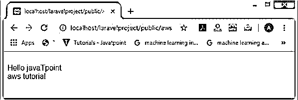

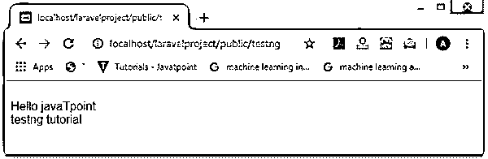

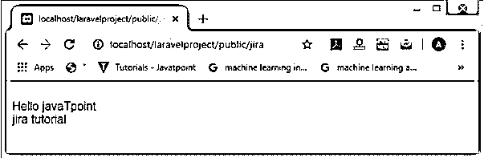

#### 实施例 4

**代码:**

`127.0.0.1       localhost
127.0.0.1       fakebook.dev
127.0.0.1       masud.fakebook.dev
127.0.0.1       sohel.fakebook.dev
::1             localhost
<VirtualHost *:80>
DocumentRoot "C:\xampp\htdocs\blog\public"
ServerName fakebook.dev
<directory "C:\xampp\htdocs\blog\public">
Options Indexes FollowSymLinks
AllowOverride all
Order Deny, Allow
Deny from all
Allow from all
</directory>
</VirtualHost>
Route::group(['domain' => 'fakebook.dev'], function()
{
Route::any('/', function()
{
return 'My own domain';
});
});
Route::group(['domain' => '{username}.fakebook.dev'], function()
{
Route::any('/', function($username)
{
return 'You visit your account: '. $username;
});
});`

**输出:**

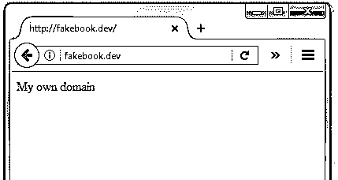

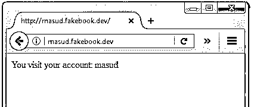

**代码:**

`Route::group(['domain' => 'fakebook.dev'], function()
{
Route::any('/', function()
{
return 'My own domain';
});
});
Route::group(['domain' => '{username}.fakebook.dev'], function()
{
Route::any('/', function($username)
{
return 'You visit your account: '. $username;
});
$data_user = [
'masud' => [
'profile' => ' a cute programmer. ',
'status' => [ 'I\'m cool!', 'I\'m cool very Cool!', 'Fantastic!'] ],
'sohel' => [
'profile' => 'a boss programmer.' ,
'status' => [ 'Sweet!', 'Today is incredible!', 'Nice ..'] ] ];
Route :: get ( 'profile', function ($username) use ($data_user)
{
return $username." is a ".$data_user[$username] [ 'profile'];
});
});`

**输出:**

**代码:**

`Route::group(['domain' => 'fakebook.dev'], function()
{
Route::any('/', function()
{
return 'My own domain';
});
});
Route::group(['domain' => '{username}.fakebook.dev'], function()
{
Route::any('/', function($username)
{
return 'You visit your account: '. $username;
});
$data_user = [
'masud' => [
'profile' => ' a cute programmer. ',
'status' => [ 'I\'m cool!', 'I\'m cool very Cool!', 'Fantastic!'] ],
'sohel' => [
'profile' => 'a boss programmer.' ,
'status' => [ 'Sweet!', 'Today is incredible!', 'Nice ..'] ] ];
Route :: get ('status/{id}', function ($username, $id) use ($data_user)
{
return $username. ' writes: '. $data_user [$username] ['status'] [$id];
});
});`

**输出:**

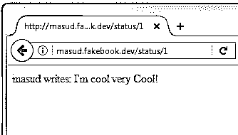

#### 实施例 5

**代码:**

`<?php
namespace App\Http\Controllers\Admin;
use Illuminate\Http\Request;
use App\Http\Controllers\Controller;
class NewsController extends Controller
{
//
}`

**输出:**

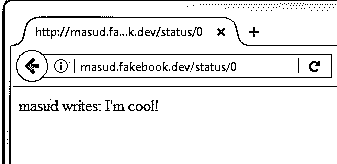

#### 实施例 6

**代码:**

`<?php
namespace App\Http\Controllers\Admin;
use Illuminate\Http\Request;
use App\Http\Controllers\Controller;
class NewsController extends Controller
{
//
}
Route::get('admin/news', [
'uses' => 'Admin\NewsController@index'
]);`

**输出:**

**代码:**

`Route::group(['namespace' => 'Admin'], function()
2
{
3
Route::get('admin/news', [
'uses' => 'NewsController@index'
]);
Route::get('admin/users', [
'uses' => 'UserController@index'
]);
});`

#### 实施例 7

**代码:**

`Route::group(['namespace' => 'Admin', 'prefix' => 'admin'], function()
{
Route::get('news', [
'uses' => 'NewsController@index'
]);
Route::get('users', [
'uses' => 'UserController@index'
]);
...
});`

**输出:**

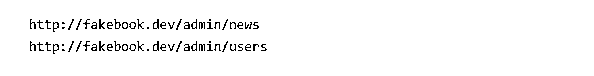

### 结论

Laravel 框架具有来自查询的启发性和表达性，有助于开发人员创建可伸缩的功能，能够经受住现代编程的考验。路由分组是保持代码整洁以及减少编程时间的好方法。

### 推荐文章

这是拉勒维尔路线指南。这里我们分别讨论 Laravel 路由、语法、参数使用、示例的介绍。您也可以浏览我们的其他相关文章，了解更多信息——

1.  [Laravel 路线控制器](https://www.educba.com/laravel-route-controller/)
2.  [Laravel 中间件](https://www.educba.com/laravel-middleware/)
3.  [Laravel 调试](https://www.educba.com/laravel-debug/)
4.  [Laravel Orderby](https://www.educba.com/laravel-orderby/)

