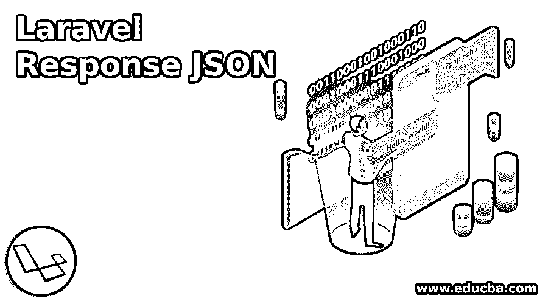
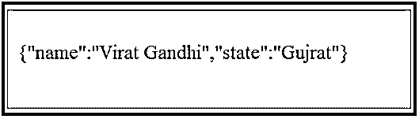

# Laravel 响应 JSON

> 原文：<https://www.educba.com/laravel-response-json/>

## Laravel Response JSON 简介

Laravel Response JSON，Laravel 框架在过去几年里一直有需求。它已经获得了发展框架市场的很大一部分。原因有很多。该框架最重要的特性之一是其富有表现力的命令行方法。Laravel 框架为开发人员提供了大量的选项来创建一些最流畅的功能。正因为如此，全世界的编码人员发现在这个框架中编码既容易又愉快。

该框架的另一个方面是它的伸缩能力。Laravel 框架以其健壮性和可伸缩性著称。它可以扩展以带来更多的服务。这就是为什么电子商务服务更喜欢建立在这个框架上的原因。Laravel 框架也能够与其他独立程序一起工作来创建功能。当开发人员试图在 laravel 框架上集成其他特性时，这很方便。关于 Laravel 框架库已经说了很多。这是一个储存大量信息的图书馆。它很容易访问，而且正如我前面提到的，它的表达能力足以为相同的功能提供多种选择。

<small>网页开发、编程语言、软件测试&其他</small>

让我们以这篇文章的主题为例:Laravel Response JSON。

需要记住的是，网站可以通过多种方式来回应用户发出的查询。这些方式通常基于用户已经设置的参数。这就是 Laravel 框架的表现力派上用场的地方。Laravel 为回答查询提供了多种方式。范围从简单的字符串响应到 JSON 响应。用户的需求通过他或她设置的考虑因素得到了回答。

### 实现 Laravel Response JSON 的示例

以下示例将充分说明这种灵活性的功效:

#### 示例#1

代码将被添加到以下文件中:app/Http/routes.php

**代码:**

`Route::get('/basic_response', function () {
return 'Hello World';
});
The URL needs to be visited for the response:
http://localhost:8000/basic_response
The output hence would be:
The same response can be got through the following method:
return response($content,$status)
->header('Content-Type', $type)
->header('X-Header-One', 'Header Value')
->header('X-Header-Two', 'Header Value');`

**输出:**

#### 实施例 2

我们还在处理 app/Http/routes.php

**代码:**

`Route::get('/header',function() {
return response("Hello", 200)->header('Content-Type', 'text/html');
});`

转到响应的 URL:

`http://localhost:8000/header`

**输出:**

#### 实施例 3

这一次，我们将更进一步。我们将在基本查询中附上苦力。重要的是要记住，Laravel 生成的每一个 cookie 都是用数字签名加密的，因此它不能被客户端读取甚至修改。

**代码:**

`Route::get('/cookie',function() {
return response("Hello", 200)->header('Content-Type', 'text/html')
->withcookie('name','Virat Gandhi');
});`

**输出:**

**解释:**URL 需要访问以测试响应，还有另一种发送响应的方式。这个使用 JSON 有一个工具。JSON 响应通过使用 content-type 头发送查询。

#### 实施例 4

我们仍然继续使用 app/Http/routes.php

**代码:**

`Route::get('json',function() {
return response()->json(['name' => 'Virat Gandhi', 'state' => 'Gujarat']);
});`

URL 现在必须访问以测试输出

`http://localhost:8000/json`

**输出:**

**解释:**如第一个例子所示，响应查询也可以由返回查询代替。意思是一样的。Laravel 框架因其灵活性而受到追捧的原因之一。当必须输入参数时，响应变得复杂。

这是他们变得定制化的时候。定制响应通常是常态。它们按照用户想要的方式成型。

让我们看几个反应的例子:

#### 实施例 5

**代码:**

`$response = Response::make($contents, $statusCode);
$response->header('Content-Type', $value);
return $response;`

**解释:**此响应继承自 Symfony \ Component \ http foundation \ Response。一个人得到的优势是在处理回应时的多样性。这些方法还负责构建 HTTP 的响应。

#### 实施例 6

**代码:**

`return Response::view('hello')->header('Content-Type', $type);`

**说明:**在这种响应类型中，用户希望返回一个视图作为响应内容。如前所述，还可以将 cookies 附加到响应方法中。我们也知道 cookies 是经过加密和签名的，以防止它们被用户操纵。

#### 实施例 7

**代码:**

`$cookie = Cookie::make('name', 'value');
return Response::make($content)->withCookie($cookie);`

**解释:**可能会混淆响应和重定向。重定向是将用户带到另一个 URL 或级别的查询。响应是要求输出的查询。

相关的问题是反应和回报之间的比较。

两者的方法相似。两者都在寻找产出。作为独立查询的返回适用于基本参数，而与返回结合使用的响应适用于在中设置了参数的复杂查询。用户可以根据功能的需要随时修改参数。特殊响应以 JSON 响应的形式出现。

#### 实施例 8

**代码:**

`return Response::json(array('name' => 'Steve', 'state' => 'CA'));
A JSONP response will look like:
return Response::json(array('name' => 'Steve', 'state' => 'CA'))->setCallback(Input::get('callback'));
The next query exemplifies a response for a file download:
return Response::download($pathToFile);
return Response::download($pathToFile, $name, $headers);
Another quick example:
Route::get('/api/users', function() {
return App\User::all();
});
// /api/user/
[
{"id":1,"name":"Bill Murray","email":"bill.murray@example.org","created_at":"2017-02-14 01:53:04","updated_at":"2017-02-14 01:53:04"},
{"id":2,"name":"John Doe","email":"john.doe@example.org","created_at":"2017-02-14 02:23:14","updated_at":"2017-02-14 02:23:14"}
] /** @test */
function test_json_response()
{
$response = $this->json('GET', '/api/user/1');
$response
->assertStatus(200)
->assertJsonFragment([
'name' => 'Bill Murray',
]);
}`

**解释:**查看大量示例，可以肯定的是，laravel Jason 响应主要作为输出查询工作，当与参数混合时，它为我们提供定制的查询。然而，在您开始开发一个功能之前，首先理解查询以及输出期望是什么是非常必要的。盲目编码只会导致冗余和纠正非常长的代码。

### 结论

与示例一样，laravel 框架有大量的查询，为用户提供精确的输出。根据具体情况，这些查询可以与其他相关查询混合使用。凭借 Laravel 展示的灵活性，毫无疑问，该框架是每个人的愿望清单上的第一位。

### 推荐文章

这是一本关于 Laravel Response JSON 的指南。这里我们讨论 Laravel Response JSON 的介绍和例子，以便更好地理解。您也可以浏览我们的其他相关文章，了解更多信息——

1.  [Laravel 查询生成器](https://www.educba.com/laravel-query-builder/)
2.  [Laravel 调试](https://www.educba.com/laravel-debug/)
3.  [拉勒韦尔拔毛](https://www.educba.com/laravel-pluck/)
4.  [Laravel Orderby](https://www.educba.com/laravel-orderby/)

