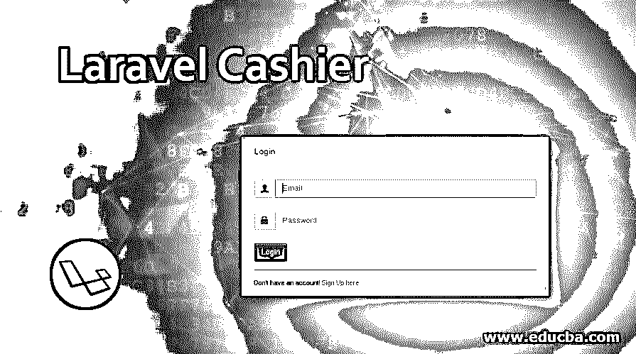
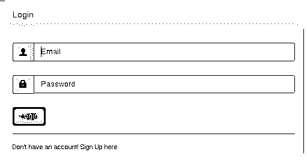
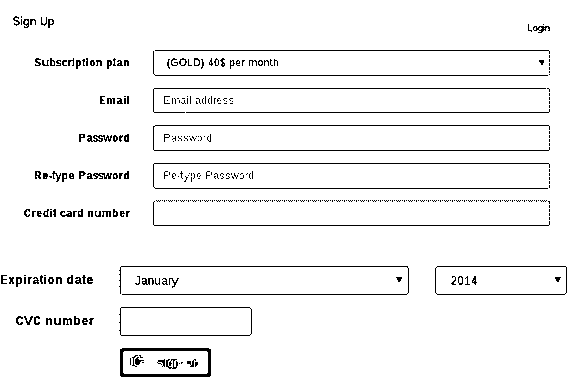
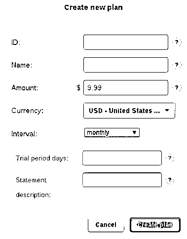
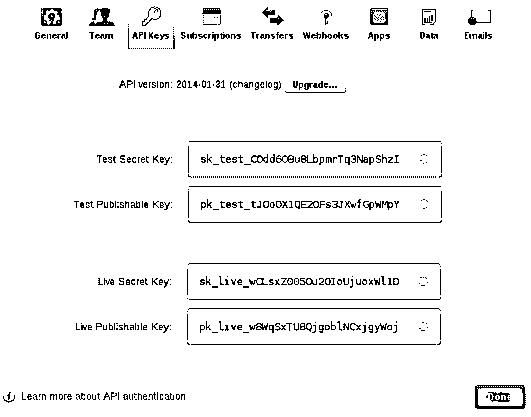
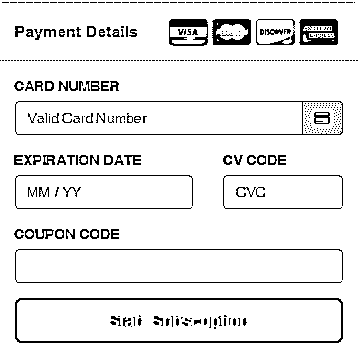

# 拉勒维尔收银员

> 原文：<https://www.educba.com/laravel-cashier/>

## Laravel 收银员简介

Laravel 是所有 PHP 开发框架中最流行的一个。Laravel Cashier 是订阅管理不可或缺的一部分。Laravel Cashier 不仅提供基本功能，还提供优惠券、取消宽限期、交换订阅。Laravel Cashier 也生成 pdf 格式的发票。它处理用于计费的整个订阅代码，并将开发人员从大量编码中解放出来。Laravel Cashier 提供了一个无缝流畅的界面，增强了 Stripe 计费服务的功能。

如上所述，Laravel Cashier 是一个命令集界面，有助于简化 Braintree 和 Stripe 的订阅服务计费。它支持各种支付方式、优惠券生成系统，并为系统提供大多数基于订阅的信息。它还检索客户信息、与支付相关的查询并生成发票。对于依赖 Stripe 的支付系统来说，这是一项重大改进，可以加快整个计费流程。

<small>网页开发、编程语言、软件测试&其他</small>

让我们看看各种命令集，看看它是如何工作的:

### 我们为什么使用 Laravel 收银机？

Laravel Cashier 的主要原因是有效地简化了条纹计费系统的工作。Laravel 收银员完成的一些任务是:

**货币配置:**

Laravel 收银台使用的默认货币是美元。然而，为了使它成为一个全球框架，已经提供了多种货币作为选择。

`CASHIER_CURRENCY=eur`

为了使发票更加个性化，添加了一个区域设置选项。此选项提供发票生成的地理区域信息。

`CASHIER_CURRENCY_LOCALE=nl_BE`

**客户:**

**检索客户详细信息:**

`use Laravel\Cashier\Cashier;
$user = Cashier::findBillable($stripeId);`

**创建客户:**

`$stripeCustomer = $user->createAsStripeCustomer();`

如果向客户添加了一个选项

`$stripeCustomer=$user->createAsStripeCustomer($options);`

这些选项可以是从添加客户之日起添加订阅，也可以是在以后添加。还可以使用 options 命令将附加参数添加到特定的客户名称中。

Laravel Cashier 是如此受欢迎的命令集的原因之一是因为它为 Stripe 计费服务提供了纯粹的选项。很少有任何其他订阅管理系统在性能上如此无缝。

**客户退货指令:**

`$stripeCustomer = $user->createOrGetStripeCustomer();`

**更新客户**

这个命令基本上允许用户用附加信息更新客户详细信息。

`$stripeCustomer = $user->updateStripeCustomer($options);`

**付款方式**

Laravel Cashier 拥有一系列与支付相关的 Stripe 计费系统的命令集。方法的种类取决于用户希望使用支付命令行的方式:

**订购付款方式**

在存储与客户相关的信用卡以备将来使用时，必须运行条带设置意图 API 来安全地收集客户的付款方式详细信息。“设置意图”发出信号，以区分向客户的支付方法收费的目的。收银员的可计费特征包括查询 createSetupIntent，以便轻松创建新的设置意图。您应该从路由或控制器调用此方法，该路由或控制器将呈现收集客户付款方式详细信息的表单:

`return view('update-payment-method', [
'intent' => $user->createSetupIntent()
]);`

在您能够创建设置意图并向视图承认它之后，您必须将它的秘密附加到将收集支付方法的元素。例如，考虑以下“更新付款方式”表单:

`<input id="card-holder-name" type="text">
<!-- Stripe Elements Placeholder -->

<button id="card-button" data-secret="{{ $intent->client_secret }}">
Update Payment Method
</button>`

现在轮到 Stripe.js 库的作用了。它将用于将 Stripe 中的一个元素附加到表单上，并帮助安全地收集客户的付款详细信息。

`
`

上面的代码是订阅支付方法的一个简单例子。同样，通过 Laravel Cashier，用户还可以为单笔费用创建支付方式。支付方式的不同，基本上凸显了 Stripe 的局限性。对于单次收费，客户必须在能够发起支付请求之前输入姓名和其他细节。这些支付细节将在 Stripe.js 库的帮助下输入。

该表单将如下所示:

`<input id="card-holder-name" type="text">
<!-- Stripe Elements Placeholder -->

<button id="card-button">
Process Payment
</button>`

下一步，Stripe.js 库将用于将 Stripe 中的一个元素附加到表单中，然后帮助安全地收集客户的支付细节。

`
`

接下来的步骤是识别卡的详细信息，并安全地检索支付方式标识符。因此，该表单将如下所示:

`constcardHolderName = document.getElementById('card-holder-name');
constcardButton = document.getElementById('card-button');
cardButton.addEventListener('click', async (e) => {
const{ paymentMethod, error } = await stripe.createPaymentMethod(
'card', cardElement, {
billing_details: { name: cardHolderName.value }
}
);
if (error) {
// Display "error.message" to the user...
} else {
// The card has been verified successfully...
}
});`

检索付款方式

对可计费模型实例的“paymentMethods”查询返回一组实例:

`$paymentMethods = $user->paymentMethods();`

要检索默认付款方式，必须使用默认付款方式方法:

`$paymentMethod = $user->defaultPaymentMethod();`

还可以使用 findPaymentMethod 方案恢复由可计费模型维护的明确支付方法:

`$paymentMethod = $user->findPaymentMethod($paymentMethodId);`

### 结论

Laravel 收银机是许多组件的组合。以上是支付方式组成部分的一个例子。

Laravel 收银台的其他组件包括:

*   捐款
*   单一费用
*   发票
*   处理失败的付款
*   强客户身份验证(SCA)

Laravel Cashier 在 Stripe 框架内创建了一个健壮、无错误的计费系统。Laravel 自己强大的指挥系统对它有很大的帮助。

### 推荐文章

这是拉勒维尔收银台的指南。在这里，我们讨论 Laravel Cashier 的各种命令集，以及它如何与支付方法一起工作。您也可以看看以下文章，了解更多信息–

1.  [拉勒维尔集体](https://www.educba.com/laravel-collective/)
2.  [在 Laravel 中验证](https://www.educba.com/validation-in-laravel/)
3.  [Laravel 命令](https://www.educba.com/laravel-commands/)
4.  [Laravel 路线控制器](https://www.educba.com/laravel-route-controller/)

