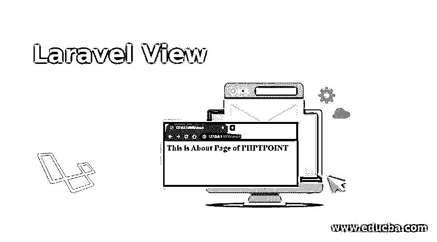
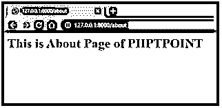
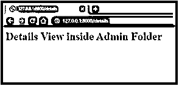

# 拉勒韦尔观点

> 原文：<https://www.educba.com/laravel-view/>




## Laravel View 简介

您正在构建的应用程序所提供的任何 HTML 数据都包含在视图中。视图还执行将应用程序的逻辑从表示的逻辑中分离出来的任务。视图的存储目录是资源或视图。HTML 数据展示了你的网站的网页的结构和设计，是你的应用程序制作的一个重要部分，因此视图作为存储点无论如何都很重要。此外，在构建应用程序时，所有数据都需要以 HTML 数据的格式传递给视图。在本主题中，我们将了解 Laravel View。

### Laravel View 到底是什么？

借助 Laravel 中可用的 Blade 模板引擎，应用程序逻辑与表示逻辑的分离得以完成。要求用户将数据从控制器传递到视图的过程非常容易和简单。在 Laravel 视图的帮助下，HTML 数据的存储得到了处理。此后，用户可以依靠视图来访问 HTML 数据，以便在构建手边的应用程序时进行进一步的处理。HTML 数据是人们关心的演示设计结构的核心，以 HTML 格式表示的数据需要被适当地保存和使用，这一点很重要。因此，在 Laravel 框架中，视图在按照数据包含的格式分离数据方面起着重要的作用。

<small>网页开发、编程语言、软件测试&其他</small>

虽然访问视图的主目录是 resources 或 Views 目录，但是它也可以嵌套在这个目录的子目录中。符号“点”主要用于优先选择嵌套在子目录中的视图。我们还需要考虑这样一个事实，视图目录名不能有“点”字符。为了确定和确认视图是否存在，用户可以使用视图外观，这在需要找到视图时很方便。如果 exists 方法反映为真，那么就可以确定视图确实存在于应用程序中，从而可以继续存储 HTML 数据。

视图被认为是 Laravel 结构中的全局助手。在视图的帮助下，可以在 Laravel 中选择回家的路线。我们可以用 home.blade.php 的例子来理解视图的用法和影响。它通常保存在仪表板目录中。用户需要确保需要将 home 传递给 view 方法。

### Laravel View 是如何工作的？

在第一种方法的帮助下，您可以方便地为应用程序上的工作创建第一个视图。它可以从已经给出的视图数组中使用。当您希望根据自己的兴趣定制或编辑应用程序的视图时，您可以这样做。

`The Data being passed to the Views`

当数据是一个数组并且有值对时，就可以传递信息了。稍后，当使用相应的键时，可以在视图内部访问每个值。也可以使用 with 方法的替代方法来获得所需的结果。所有采集的单个数据都可以添加到视图中。在 Laravel 中可以轻松配置视图路径。当你想定制路径时，你可以在 Laravel 中完成。config/views.php 配置文件也是如此。

`Composing Views with the View Composer`

流行的两种视图构造器是基于类的和基于闭包的。闭包有一个易于使用的结构，但问题是它可能导致特定服务提供者的过载和使用增加。基于类直接把你引向关注点分离，这是一个设计原则。这里的现有代码可以很容易地被其他开发人员维护，因为它可以很容易地测试一个单独的代码片段。

通过下面的代码可以理解 View composers 中的两个参数:

2.  View::composer('profile '，function ($view) {
3.  $view->with('user '，['…'])；
4.  });
5.  />
6.  //或者
7.  View::composer('profile '，' App \ Http \ view composers \ profile composer ')；
8.  查看 rawmedium-view-composers.php

第一个参数是存在的视图名称的数组。渲染之后，触发视图编辑器，然后将变量包含到视图中。

第二个参数是视图编辑器的闭包。在这个方法的帮助下，可以将变量附加到视图中，其中$view 被绑定为参数。

### Laravel 视图示例

以下是不同类型的 Laravel 视图及示例。

#### 示例 1–创建网站的结构

**步骤 1:** 在主文件夹 resource/views 中创建一个名为 About.blade.php 的文件。

```
<html>
<body>
<h1>This is About Page of <? php echo $name?></h1>
</body>
</html>
```

**第二步:**添加关于 web.php 的网址。这是向该页面添加路由。

```
Route::get('/about', function()
{
return view('About',['name'=>'PHPTOTHEPOINT']);
});
View() here has two arguments here.
```

**第三步:**在浏览器中执行运行该 URL 的动作

```
http://127.0.0.1:8000/about
```




#### 示例 2–嵌套视图

请注意，这可以在子目录文件夹中找到。

第一步:创建 details.blade.php。它必须作为管理员准备在一个文件夹中，代码需要粘贴在里面。

```
<html>
<body>
<h1>Details View inside the Admin Folder</h1>
</body>
</html>
```

第二步:需要制作 Showcontroller.php。在控制器内部，可以使用 Show()方法，并且可以很容易地返回 admin.detailsrecords 记录。

```
public function show()
{
return view('admin.detailsrecords');
}
```

**步骤 3:** 在 web.php 添加路线，以便创建 URL。

```
Route::get ('/details', 'ShowController@show'); Step 4: Let the URL run http://127.0.0.1/details
```




### 结论

因此，正如我们所看到的，视图的主要目的是保存和存储用户在使用 Laravel 准备或编写应用程序和流程时使用的 HTML 格式代码。由于 HTML 编码定义了呈现应用程序及其外观的设计结构，因此很重要的一点是要很好地掌握它，并确保没有错误。观点是有组织和有结构的，目的是为了帮助那些最重要的工作人员。

### 推荐文章

这是拉勒维尔景观指南。这里我们讨论 Laravel 视图是如何工作的，以及不同类型的视图的例子。您也可以阅读以下文章，了解更多信息——

1.  [幼虫工匠](https://www.educba.com/laravel-artisan/)
2.  [Laravel 仪表盘](https://www.educba.com/laravel-dashboard/)
3.  [Laravel 积垢发生器](https://www.educba.com/laravel-crud-generator/)
4.  [拉勒维尔集体](https://www.educba.com/laravel-collective/)


