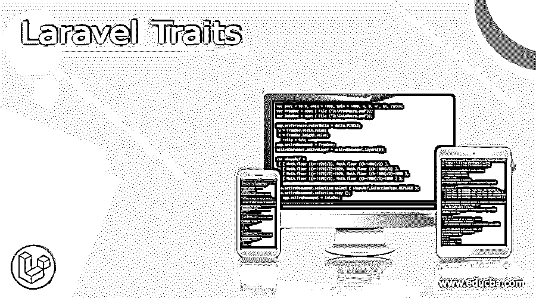
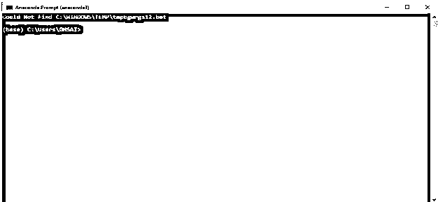
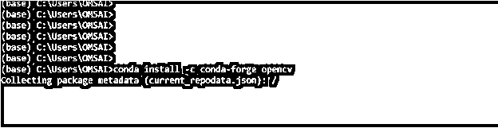

# 拉勒维尔特征

> 原文：<https://www.educba.com/laravel-traits/>

## 拉勒维尔特征介绍

Laravel traits 是一种不能以自己的方式创建的抽象类类型，Trait 有自己的方法来实例化或创建类的新对象，这些方法主要用于具体类型的类，它主要是在 PHP 5 上引入的。可以使用的更多版本属于 Laravel 框架，应用程序 traits 允许创建可重用的代码，它将通过使用控制器来注入。

### 什么是 Laravel 特质？

主要是 Laravel 应用程序特性，允许代码的可重用部分，它将被注入到控制器类及其模型中，以理解基于 web 的应用程序的整个过程，基本应用程序将通过后端的数据库记录呈现，并将在前端显示。助手和其他功能主要由框架使用，应用程序更需要。开发人员将需要自己的缺省函数，这些缺省函数需要更频繁地使用代码及其函数来创建特征，以及程序员在任何我们想要的地方使用它。

<small>网页开发、编程语言、软件测试&其他</small>

### 如何打造 laravel 特质？

首先，我们根据 Laravel 指南及其文档中的安装步骤创建 Laravel 项目。然后，我们需要建立新的数据库，可以通过 MySql 和其他数据库访问，如果我们需要的话，然后我们需要创建特征和添加路线。因为访问控制器类和其他模型更重要，程序员的观点将集中在 MVC 设计模式上，以表示用户端的 Laravel 项目。创建控制器类并查看文件，以便在浏览器的帮助下使用本地主机执行应用程序。我们创建虚拟记录并运行项目，traits 将能够基于 PHP 语言创建代码块和 Traits 的概念。总体设计模式将通过允许 web 开发人员在单个私有类中重用来自多个非依赖类的函数和方法来消除对继承的单一限制。

composer create-project laravel/laravel 项目文件夹名称–prefere-dist

上面的命令将用于创建 Laravel 项目，使用命令终端中的 cd 文件夹名，我们可以导航到 Laravel 文件夹并执行 Laravel 操作。在 Laravel 框架中，将会考虑在 PHP 5 以后更多地使用 traits。这种设计通过允许开发人员访问多个独立的类及其不同类层次结构的方法来减轻单一继承的一些缺点。

在使用 PHP artisan make:model model name-m 这样的命令创建模型之后

它会自动创建一个由编码器分配的模型。我们可以通过使用任何变量来声明属性或列。

然后 php artisan migrate 在这个命令的帮助下，我们可以像我们通过模型创建的那样迁移表，并将属性列映射到相应的值。

最后，我们使用 index()这样的默认方法在 app/Http 文件夹位置上创建特征，以便在 ids 和相应的数据库索引的帮助下获取值。

#### 示例#1

**月份型号:**

 `<?php
namespace App\Models;
use Illuminate\Database\Eloquent\Factories\HasFactory;
use Illuminate\Database\Eloquent\Model;
class Months extends Model
{
use HasFactory;
public $cds=[
'name',
] }`

**User.php:**

`<?php
namespace App\Models;
use Illuminate\Contracts\Auth\MustVerifyEmail;
use Illuminate\Database\Eloquent\Factories\HasFactory;
use Illuminate\Foundation\Auth\User as Authenticatable;
use Illuminate\Notifications\Notifiable;
use Laravel\Sanctum\HasApiTokens;
class User extends Authenticatable
{
use HasApiTokens, HasFactory, Notifiable;
protected $cds = [
'name',
];
}`

**DatabaseSeeder.php:**

`<?php
namespace Database\Seeders;
use Illuminate\Database\Seeder;
use Illuminate\Support\Facades\DB;
use Faker\Factory as Faker;
class DatabaseSeeder extends Seeder
{
public function run()
{
$demo = Faker::create();
$nm = $demo->randomElement(['january', 'february','march','april','may','june','july','august','september'.'october','november','december']);
foreach (range(1,12) as $index) {
DB::table('months')->insert([
'name' => $demo->name($nm),
]);
}
}
}`

**months strait . PHP:**

`<?php
namespace App\Http\Traits;
use App\Models\Months;
trait MonthsTrait {
public function index() {
$months = Months::all();
return view('welcome')->with(compact('months'));
}
}`

**Web.php:**

`<?php
use Illuminate\Support\Facades\Route;
use App\Http\Controllers\MonthsController;
Route::get('/', function () {
return view('welcome');
});
Route::resource('months', MonthsController::class);`

**MonthsController.php**

`<?php
namespace App\Http\Controllers;
use Illuminate\Http\Request;
use App\Http\Traits\MonthsTrait;
class MonthsController extends Controller
{
use MonthsTrait;
}`

**Welcome.blade.php:**

`<!DOCTYPE html>
<html lang="{{ str_replace('_', '-', app()->getLocale()) }}">
<head>
<meta charset="utf-8">
<meta name="viewport" content="width=device-width, initial-scale=1">
<title>Laravel Wlcome</title>
<link rel="stylesheet" href="https://stackpath.bootstrapcdn.com/bootstrap/4.5.0/css/bootstrap.min.css">
<!-- Fonts -->
<link href="https://fonts.googleapis.com/css2?family=Nunito:wght@400;600;700&display=swap" rel="stylesheet">
<!-- Styles -->

</head>
<body class="antialiased">

<table class="table">
<thead>
<tr>
<th>Id</th>
<th>Name</th>
</tr>
</thead>
<tbody>
@foreach($months as $mnths)
<tr id="user{{$mnths->id}}">
<td>{{$mnths->id}}</td>
<td>{{$mnths->name}}</td>
</tr>
@endforeach
</tbody>
</table>

</body>
</html>`

**样本输出:**

在上面的例子中，我们在月存储等基本场景中使用了 Laravel traits，并在 Laravel 框架的帮助下使用 trait 特性从数据库中检索。主要是我们可以检索月份数据，首先我们可以在默认命令的帮助下创建模型，如 php artisan make: model Months -m，然后我们可以在 createmonthstable.php 文件上创建表模式。使用 php artisan 迁移表数据并使用 databaseseeder.php 文件，我们可以在 php 文件上创建假数据或虚拟数据 php artisan db:seed 该命令将有助于创建虚拟数据最后，我们可以使用该命令创建控制器。

### 结论

特征是通过使用 PHP 类型的语言来重用具有单级继承的代码的机制和特性的类型。它也是借助默认类和允许开发人员使用的方法来设计数据。

### 推荐文章

这是一个拉勒维尔特征的指南。这里我们讨论介绍，什么是 laravel 特征，如何创建 Laravel 特征，代码实现的例子。您也可以看看以下文章，了解更多信息–

1.  [拉腊夫表单](https://www.educba.com/laravel-orm/)
2.  [Laravel 网址](https://www.educba.com/laravel-url/)
3.  [拉勒韦尔加入](https://www.educba.com/laravel-join/)
4.  [Laravel Tinker](https://www.educba.com/laravel-tinker/)

