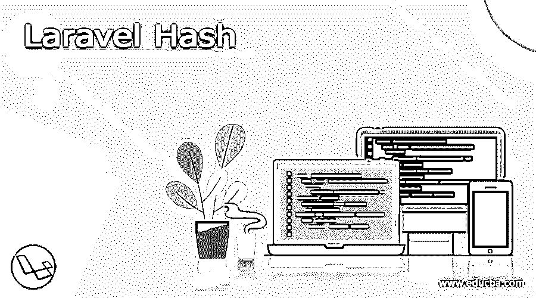
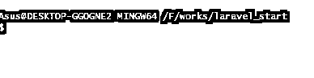
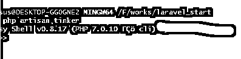
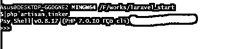
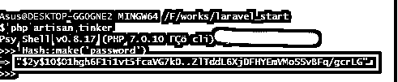

# 拉腊维尔哈希

> 原文：<https://www.educba.com/laravel-hash/>

## Laravel 散列的定义

哈希是将字符串转换为短常数值的方法，或者是表示原始字符串的关键字。Laravel 中的散列函数给出了以散列方式保存密码的安全方法，这是一种更短的方法。Laravel 中的哈希函数提供 Argon2 哈希和 Bcrypt 来保存用户的密码。如果用户使用的是 Laravel 应用程序，那么 Bcrypt 将用于以默认方式注册和认证。本文简要介绍了 Laravel 中散列操作的功能、实现和配置。

### 什么是 Laravel Hash？

简单地说，散列被用作映射对象数据以表示整数值的算法或函数。当在数据映射上定位这些对象的项目时，散列函数也用于简化搜索。例如，开发人员过去常常将数据存储在哈希表中，以值对和键的形式处理客户记录。哈希是将字符串转换为最小常数值的方法，或者它类似于指示实际字符串的键。Laravel hash 用于使用哈希过程保存密码。它使用 Argon2 和 Bcrypt 方法将用户密码存储在 laravel hash 中。如果用户开始处理应用程序，starter kit 开始运行，默认情况下，Bcrypt 用于身份验证和注册。

<small>网页开发、编程语言、软件测试&其他</small>

### Laravel 哈希的使用

Bcrypt 是散列密码的标准方法，它具有灵活的工作因素。这意味着当硬件的能力增加时，生成散列过程所花费的时间可以最大化。当散列密码时，它工作得较慢，建议以这种方式工作。只要算法消耗哈希密码，黑客生成彩虹表的时间就最长。所以过程越长，散列和安全性就越有效。当在应用程序中工作时，在强力攻击时使用字符串中所有可能的散列值。应用程序中的标准哈希驱动程序是在配置文件中的 config/hashing.php 中配置的。它现在主要用于受支持的驱动程序，如 Argon2 和 Bcrypt，也可以应用于 Argon2id 变体和 Argon2 变体。

散列密码可以用散列表上的 make 方法调用。它用于调整加密工作因子。如果用户正在使用 Bcrypt 算法，那么使用 make 技术来实现使用 round 方法的算法中的工作因子。默认情况下，工作因子由 Laravel 控制，大多数应用都接受它。

`$ hashed = hash: make(password, [ “rounds” -> 10,] );`

如果用户正在处理 Argon2 算法，make 技术使用户能够使用时间、线程函数和内存来控制算法的工作因子。然而，Laravel 中管理的标准值对大多数应用程序都是隐含的。
通过 check 方法验证密码是否与哈希值匹配。hash 外观使用户能够确保给定的标准文本字符串属于给定的 hash。

`if ( Hash:: check ('plain-text', $hashed Password))
{
// If the password matches...
}`

如果用户希望密码被重新散列，那么他应该暗示需要散列技术。因此，如果用户在一个哈希外观上工作，他能够决定哈希函数中的工作因子已经改变，直到密码被哈希。很少有应用程序选择在应用程序的身份验证过程中执行这种检查。

`If (Hash:: needsRehash ($hashed) )
{
$hashed = Hash:: make(‘standard text’);
}`

用户还可以使用 Bcrypt 选项在 laravel 中创建新的散列密码。Bcrypt 的语法是$ password = Hash::make(' password ')；

它在模型或控制器中创建散列密码，然后用户可以选择它。如果用户在 POST 方法的帮助下通过表单提交密码，那么他可以使用下面的语法散列密码

`$ password = Input:: get ( 'password form field'); // password is in form field
$hashed = Hash:: make ($password);`

### 如何使用密码 laravel hash？

变量$hashed 由散列密码组成，可以从表单中检索数据，进一步验证，再次散列并保存在数据库中。

*   在拉勒维尔 5 号。版本用户可以使用下面的语法，$ password = bcrypt(' name 1 ')；
*   另一种方法是在命令提示符下使用 artisan tinker。
*   打开命令提示符窗口，导航到根目录中的项目。
*   在搜索窗口中键入内容，导航至相关目录。

`Cd <name of the directory>.`

`Echo hash:: make (‘some string name’);`

*   它在控制台中显示哈希密码。现在，用户可以复制所需的数据。laravel 散列提供了安全的 Bcrypt 散列方法，包括保存用户密码的空间。如果用户有一个包含在 laravel 应用程序中的 login controller 和 register controller 类，该应用程序自动执行 Bcrypt 以进行身份验证和注册。散列密码是一种适应性选择，因为工作因子是灵活的。

`<?php
namespace App\Http\Controllers;
use Illuminate\ Http \Request;
use Illuminate\Suppor t\Facades \Hash;
use App\ Http\ Controllers\ Controller;
class Update Password Controller extends Controller
{
/**
* Update the password.
*
* Request $request
* @return
*/
public function update (Request $request)
{
// Validate the length of the password...
$request -> user() -> fill ([
'password' => Hash :: make($request -> newPassword)
]) -> save ();
}`

*   验证密码检查方法是隐含的，并且需要排练功能用于执行重新散列值。

### 结论

因此，Laravel hash 用于为用户提供一种强大且安全的方法来保护密码，并且具有如上所述的简单且容易的配置。

### 推荐文章

这是一个指南拉勒维尔哈希。这里我们讨论定义，什么是 laravel hash，如何使用密码 laravel hash，用代码实现的例子。你也可以看看下面的文章来了解更多-

1.  [拉勒维尔收银台](https://www.educba.com/laravel-cashier/)
2.  [拉腊夫表单](https://www.educba.com/laravel-orm/)
3.  [Laravel 网址](https://www.educba.com/laravel-url/)
4.  [Laravel Tinker](https://www.educba.com/laravel-tinker/)

