# laravel uuid

> 原文：<https://www.educba.com/laravel-uuid/>

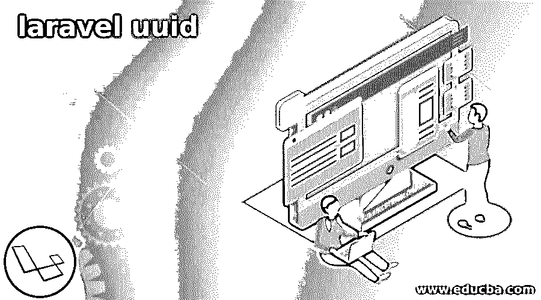

## laravel uuid 简介

Laravel uuid 也称为通用唯一标识符，它是 128 位值，用于标识表中的记录。基本用 UUID 代替自动递增 ID；UUID 被表示为一个十六进制字符串，它被分成五组并用连字符分开。我们可以使用 laravel 版本 7 在 laravel 应用程序中使用 UUID；此外，我们可以在其他版本中使用 UUID，即 5.8 和 6。然而，UUID 并不像序列或整数类型主键那样按顺序生成；主键索引的值越来越多。

### 什么是拉弗尔·UUID？

*   基本上，laravel UUID 是由 16 位值组成的，而不是 4 或 8 位整数值，所以 UUID 需要更多的空间来存储数据和索引。
*   与数值数据类型相比，UUID 的大小较大，因此 UUID 需要更多的 RAM 来缓存内存中的 UUID。
*   使用整型值，我们可以很容易地对数据进行排序，但 UUID 排序并不容易，因为 UUID 是随机生成的。
*   UUID 排序没有特定的方法；我们无法对 UUID 的数据进行排序，因为 UUID 没有排序。
*   下面是 UUID 的例子，例子如下。

`127c78de-7dcb-89bc-8767-a43442b9aaab`

<small>网页开发、编程语言、软件测试&其他</small>

*   在上面的示例中，我们可以看到 UUID 将被分成五个不同的组。
*   我们可以使用生成器创建 using 我们还可以使用 composer 包来生成 laravel 独特的 UUID。
*   此外，为了在 laravel 应用程序中生成 UUID，我们还可以使用 str faade。
*   我们可以在 laravel 的雄辩模型中使用 UUID，而不是使用增量 ID。
*   要在我们的应用程序中使用 UUID，首先，我们需要创建 laravel 应用程序。要在应用程序中使用 UUID，我们需要使用拉姆齐·UUID 的库。
*   拉姆齐·UUID 图书馆将有助于在 laravel 中生成通用的唯一标识符。要在现有的 laravel 应用程序中使用 UUID，我们需要在模型类中做一些更改。

### 在 Laravel 模型中使用 UUIDs

下面的例子显示了 UUID 在模型中的使用如下。要在模型中使用 UUID，我们需要遵循以下步骤。

**创建 laravel 应用程序—**

*   要在我们的 laravel 应用程序中使用 UUID，首先，我们需要创建应用程序。因此，我们必须将应用程序名称创建为 uuid。
*   为了创建新的应用程序，我们需要使用 create-project 参数。使用创建项目参数，我们必须创建项目。
*   在定义了 create-project 参数之后，我们已经定义了应用程序版本。

`# composer (composer command is used to create new laravel application) create-project (create new application) --prefer-dist laravel/laravel:^7.0 uuid (Create application name as uuid)`

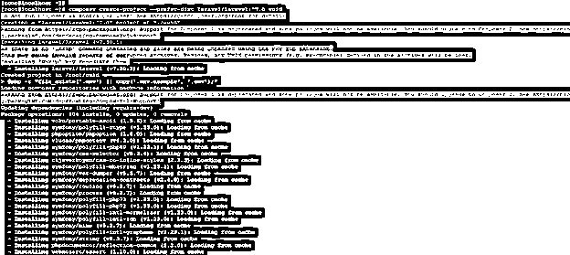

**创造 UUID 特质—**

*   在 app 目录下创建 Traits 目录。创建目录后，在 Traits 目录下创建一个新的 Uuid.php 文件。
*   为了创建 Uuid.php 文件，我们将在 traits 目录中创建 Uuid.php 文件。我们在文件中定义了代码，该代码假定整数值的增量模型中的主键。
*   要在 laravel 应用程序中使用 UUID，我们必须在字符串值而不是增量值中指定主键。
*   我们通过使用$keyType 和$ incrementing 参数实现了同样的目的。

`# vi Uuid.php`

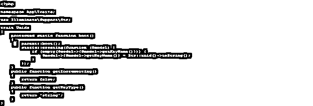

**更新迁移文件—**

*   第三步是更新迁移文件。例如，在迁移文件中更改 UUID 而不是 ID。这是更新项目迁移文件的一个非常重要的步骤。
*   在下面的应用程序中，我们更改了用户类。此外，我们还对用户迁移类进行了更改。

`# vi 2014_10_12_000000_create_users_table.php`

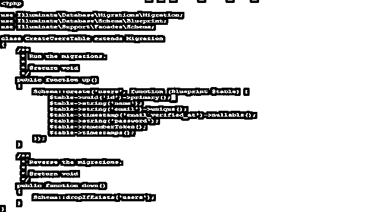

**在我们的模型类中使用特征—**

*   下面的例子显示了我们的模型类中的使用特征如下。在下面的例子中，我们需要在应用程序模型类中添加 Uuid.php 特征。

`# vi Uuid.php`

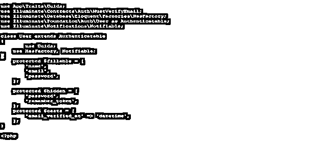

**使用 UUID 作为外键-**

*   第五步是更新迁移文件。更改迁移文件中的 UUID，而不是 ID。在我们的应用程序中，我们使用 UUID 主键作为外键，因此我们需要将该表的列类型更改为 UUID，在这里我们定义了外键。

`# vi 2019_08_19_000000_create_failed_jobs_table.php`

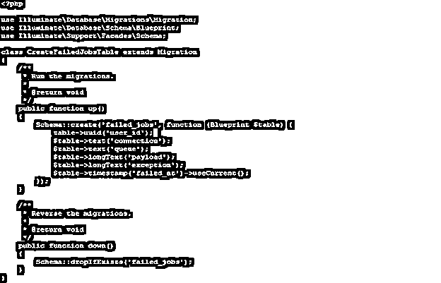

### 如何创建 Laravel 应用程序？

*   下面的例子显示了如何创建一个应用程序如下。我们将应用程序命名为 UUID-拉弗尔。
*   在下面的例子中，我们使用 create-project 命令创建了一个名为 UUID 的新应用程序。
*   在创建新的 UUID 应用程序时，我们使用的版本是 7。

`# composer (composer command is used to create new laravel application) create-project (create new application) --prefer-dist laravel/laravel:^7.0 UUID-laravel (Create application name as UUID-laravel)`

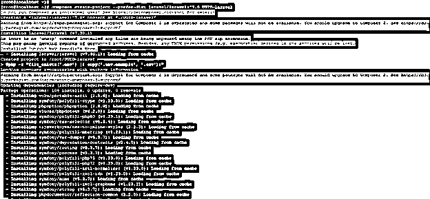

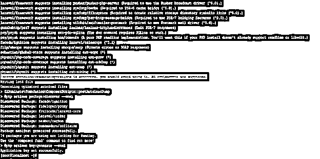

*   在上面的项目中，我们已经在根目录下创建了项目。因为应用程序是在当前主目录中创建的。
*   在下面的例子中，我们可以看到应用程序是在根目录下创建的，而应用程序目录是在应用程序目录下创建的。
*   在下面的例子中，我们可以看到在 UUID 目录下创建了多个文件夹。

`# cd UUID-laravel/
# ll`

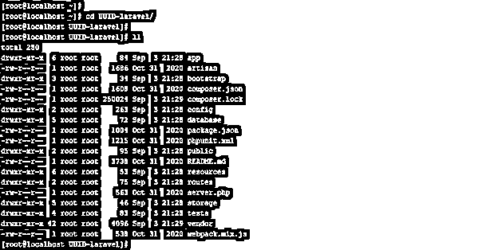

**创建一个名为拉勒维尔-UUID 的新拉勒维尔应用**

*   下面的例子，我们已经创建的应用程序如下。我们已经创建的应用程序名称为拉勒维尔- UUID。
*   在下面的例子中，我们已经使用 create-project 命令创建了一个新的应用程序名，名为 laravel- UUID。
*   在下面的应用程序中，我们已经在根目录下创建了项目。

`# composer (composer command is used to create new laravel application) create-project (create new application) --prefer-dist laravel/laravel:^7.0 UUID-laravel (Create application name as laravel- UUID)`

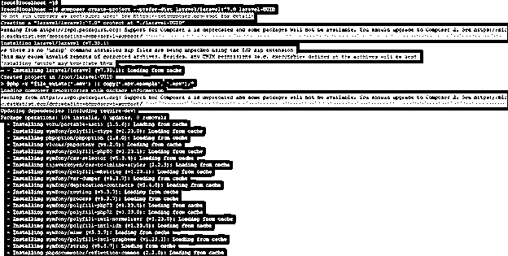

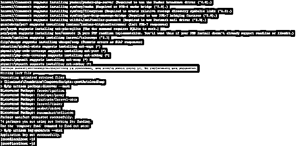

*   在下图中，我们可以看到所有与应用相关的文件都是在 UUID 目录下创建的。

`# cd laravel-UUID/
# ll`

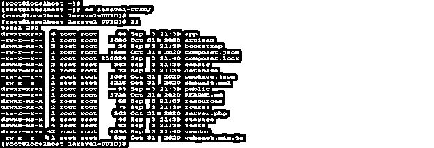

### 结论

Laravel uuid 被称为通用唯一标识符，它是 128 位值，用于标识表中的记录。基本上是用 UUID 代替自动递增 ID。与数值数据类型相比，UUID 的大小较大。

### 推荐文章

这是一本关于 laravel uuid 的指南。在这里，我们将详细讨论如何创建 Laravel 应用程序以及示例。您也可以看看以下文章，了解更多信息–

1.  [Laravel Tinker](https://www.educba.com/laravel-tinker/)
2.  [不在拉腊维尔的地方](https://www.educba.com/where-not-in-laravel/)
3.  [拉勒维尔发现](https://www.educba.com/laravel-find/)
4.  [Laravel 重定向回](https://www.educba.com/laravel-redirect-back/)

