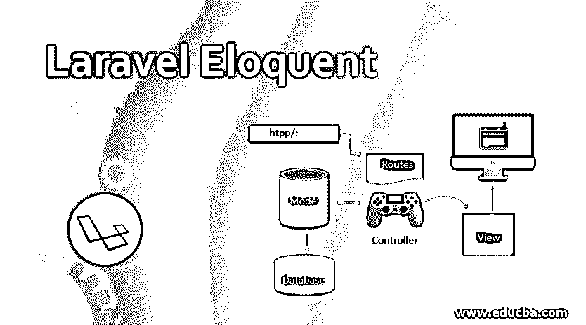
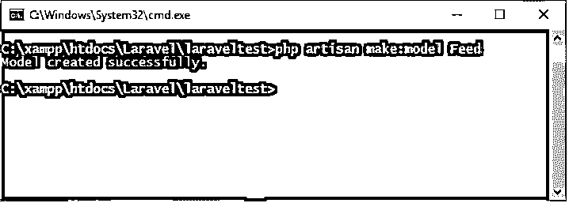
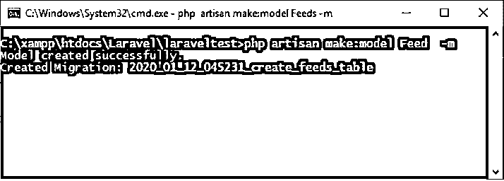
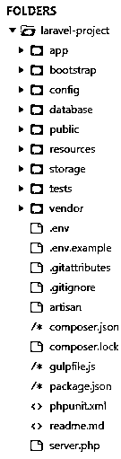
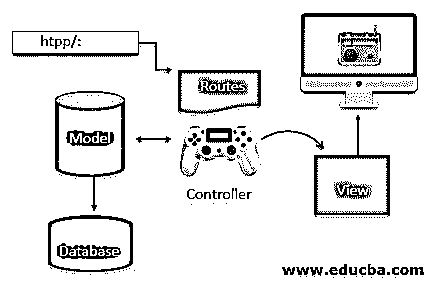
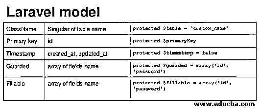

# 拉勒维尔雄辩的

> 原文：<https://www.educba.com/laravel-eloquent/>

## 拉勒维尔雄辩术简介

PHP Laravel 框架与雄辩的对象关系映射器(ORM)打包在一起。它提供了与数据库轻松通信的便利。大多数开发人员必须构建非常复杂和高度复合的应用程序或网站，并且不喜欢经历更长的过程。Laravel 雄辩协助提供一个无障碍和短路线，以开发他们的网站或应用程序的需求。Laravel 为遇到的许多技术问题提供了合适的解决方案，并加快了开发速度。Laravel 口才可以很容易地服务于多个数据库平台，并在数据库中执行许多常见的操作。

### 理解拉勒维尔雄辩的

这是一种高级复杂的 PHP 执行方法。借助简单的 ActiveRecord 实现，您可以非常轻松地使用数据库。有了它，任何开发人员都可以在多个数据库上工作，这将节省时间，并使过程运行得越来越快。它所具有的模式是一种架构模式，其中在模型-视图-控制器(MVC)结构中建立的模型直接与数据库中的表相对应或相关。开发人员不必编写冗长的 SQL 查询代码，模型将非常容易地执行常见的数据库操作。允许在表中查询数据，并且可以向表中插入新记录。简而言之，Laravel 雄辩术有助于简化运行在许多不同系统上的多个数据库的同步。您的主要职责只是定义数据库表以及它们之间存在的关系。雄辩是定制做所有其他工作，没有你的干扰。

<small>网页开发、编程语言、软件测试&其他</small>

Laravel 雄辩的 ORM 有一个内置的关系模型，帮助或允许操纵数据库中的表。操纵数据库中的所有相关数据也有好处。口才模型都住在 app 目录里，口才模型住在扩展 Illuminate/Database/口才/模型里。

#### 1.用于创建模型的命令

`Php artisan make: model Feed`

#### 2.数据库的迁移

当您在创建模型时需要迁移时，可以方便地使用该选项:

`Php artisan make: model Feed –Migration`

运筹学

`Php artisan make: model Feed --m`

#### 3.探索提要模型的结构

`<?php
namespace App;
use Illuminate\Database\Eloquent\Model;
class Feed extends Model
{
//
}`

上面给出了提要模型的编码结构。

### Laravel 是如何工作的？

Laravel 帮助您构建项目，并在技术操作中进行多任务处理，其中开发人员可以在短时间内轻松配置大量数据。有一个格式化的基本结构，里面有许多精心制作的文件夹，我们可以运行所有的命令，并给出方向，让 Laravel 根据我们的兴趣准备预期的数据库。

上面给出的是 Laravel 的根目录。这清楚地解释了格式以及响应命令并相应地存储信息的主文件夹和子文件夹。

Laravel 根据开发人员的命令，按照其目录中的通信过程对数据进行路由。有可用的自动化选项，并且可以在实例中毫无顾虑地生成，因为它们被配置为快速工作。上图描述了流程中单个项目的格式。

上图解释了 Laravel 作为一个编程应用程序的工作原理，其中您可以看到 Laravel 在短时间内生成一个应用程序的工作原理的方向性自我解释。这里使用路由将 URL 映射到指定的控制器动作。

在上图中，模式-视图-控制器的格式非常明显。

1.  **控制器—**它们用于处理来自用户的请求。他们还检索数据，这是通过利用模型来完成的。
2.  **模型—**它们与数据库交互，并检索对象的信息。
3.  **视图–**它们只是呈现现有的页面。

### 拉勒维尔模型解释了

让我们看一个定义 Laravel 模型的表，以理解类名和表名以及它们相应的编码数据。

#### 1.检查主键和时间戳

concertive 假设每个表都有自己的名为 *id 的主键列。*雄辩还假设数据库中的主键实际上是一个数字整数值。如果你想使用一个非数字主键，那么这个属性的值必须设置为 *false* 。

concertive 假定 created_at 和 updated_at 列存在于表数据库中。如果将该属性的值设置为 false，您将会阻止雄辩术自动管理所描述的列。时间戳格式的定制是可能的，也是容易的。日期属性也可以存储在数据库中。

#### 2.数据库连接

有一个预先配置完成，默认情况下，所有的雄辩模型使用数据库连接，这是默认设置和配置。$connection 属性用于为模型指定和定向不同的数据库连接。

`<?php
namespace App;
use Illuminate\Database\Eloquent\Model;
class Flight extends Model
{
/**
* The connection name for the model.
*
* @var string
*/
protected $connection = 'connection-name';
}`

#### 3.检索多个模型的可能性

每个有说服力的模型实际上都是一个非常强大的查询生成器。一旦您完成了模型和相关数据库表的构建，您就可以方便地从数据库中提取或检索您需要的数据。

**结论**

拉腊维尔雄辩的利与弊

| **优点** | **缺点** |
| 模型关系 | 增加 SQL 执行时间 |
| 使用方便 | 学习需要时间 |
| 代码可读性 | 处理复杂的 SQL 查询 |

我们知道使用 Laravel concrete 可以简化复杂的功能，从而节省开发人员的时间和精力。这是 Laravel 应用程序最好的可用功能之一。

**推荐文章**

这是一本能言善辩的指南。在这里，我们讨论了对 Laravel 口才的理解及其工作原理，以及对该模型的解释。您也可以看看以下文章，了解更多信息–

1.  [Laravel 控制器](https://www.educba.com/laravel-controllers/)
2.  [Laravel 型号](https://www.educba.com/laravel-models/)
3.  [什么是 Laravel？](https://www.educba.com/what-is-laravel/)
4.  [Laravel 命令](https://www.educba.com/laravel-commands/)

