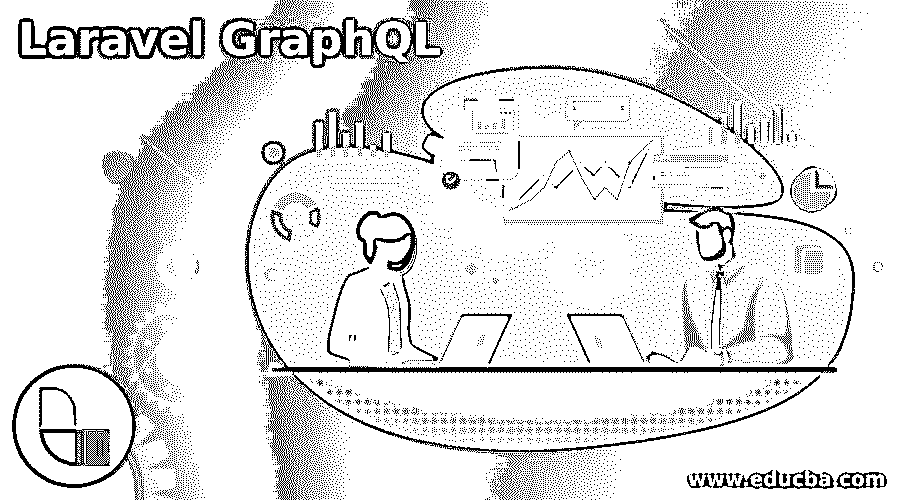
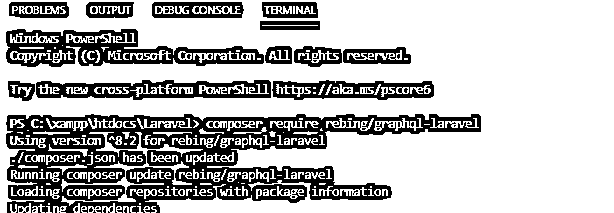
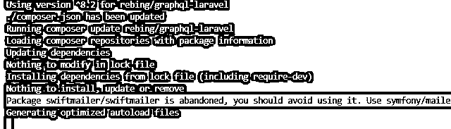
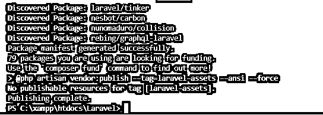
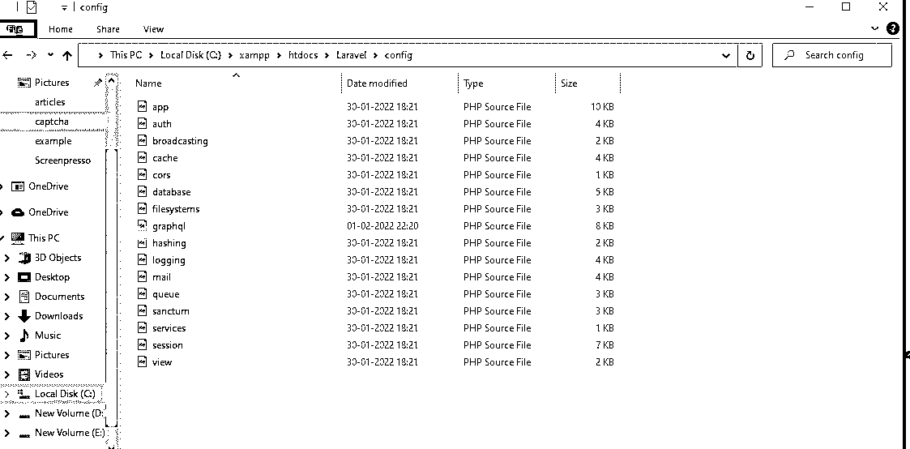
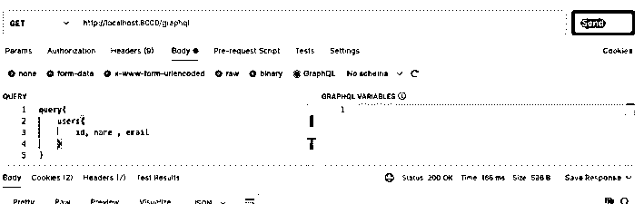

# Laravel 图表 QL

> [https://www . educba . com/laravel-graph QL/](https://www.educba.com/laravel-graphql/)

## Laravel GraphQL 简介

GraphQL 是一种 API 查询语言，它有助于让客户端准确地描述我们需要服务器提供的数据。Laravel 和 Ember 等其他框架区分了优先级，为客户提供了我们将要实现的确切数据。GraphQL API 用于在时间间隔内设置应用程序，以利用项目的强大基础设施。

### 什么是 laravel graphql？

Laravel 是最著名的基于 PHP 的 web 框架，具有很强的观点和用户友好的特性。它有 n 个内置工具，供开发人员快速实现应用程序，以定制方式构建 Laravel 接口。尽管围绕 GraphQL 和 Laravel 框架开发开源版本的主要社区在很大程度上结合了其他技术。这个 GraphQL 是由自由职业者开发的，他们解释了如何创建和包含带有一些用户修改的查询关系，以及如何验证数据。GraphQL 允许查询嵌套操作和与相关开发人员的数据相关的请求，以通过单个往返服务器获得准确的数据。

<small>网页开发、编程语言、软件测试&其他</small>

### 安装图

php 配置文件在 config 文件夹中进行配置，该文件夹来自映射到供应商的供应商文件夹。因为标准方法是从第三方包中获取一个或多个配置文件，并定制应用程序元素的需求。然后，只有我们将使用 graph QL API 端点，它提供了客户端的完整描述，查询将返回响应。数据库模式具有客户端请求的数据集合和返回将改变客户端请求的特定资源的数据类型，也称为突变。为了支持 GraphQL 库主要是为了允许设计模式和查询以简单的方式在 GraphQL 的应用程序中支持 GraphQL 借助于下面的命令，我们可以将 GraphQL 安装在 Laravel 项目上，

composer 需要重新绑定/graphql-laravel

安装完成后，我们需要从特定的项目文件夹中提取 GraphQL 库，

php artisan 供应商:publish–provider = " Rebing \ graph QL \ GraphQLServiceProvider。"

这个命令将有助于把 config.php 文件复制到 graphql.php，并在网上发布。

在安装和配置之后，我们可以在 Laravel\config 文件夹中看到 graphql.php 文件。

### 如何使用幼虫图形 SQL？

通常，GraphQL 通过一个为类似语言编写的查询来提供所需的数据，该查询可以通过数据库访问。GraphQL 是一个强大的、高度复杂的 API，它的用户界面可以帮助我们用自动完成特性编写查询。所以，当我们键入一个查询时，它显示了编写的最简单的查询；GraphQL 的概念看起来类似于 Rest API，但是它们运行在业务逻辑层之外。

工作流类似于 REST 和其他特性，如 RPC。尽管如此，所有这些都需要在业务逻辑层上进行授权，以验证必须检索的数据。所有数据都被添加到 GraphQL 服务器，并声明了进行查询的类型。作为输出结果，我们将创建任何可以使用 GraphQL 目录和 app 目录文件夹创建的数据。我们还可以使用突变来执行文件操作，如读写，这可以根据任务状态创建突变。突变还创建了一个单独的 app/GraphQL 目录，用于使用新的突变任务来定义接受突变的参数 args，从而在突变任务中创建。它将在其他场景中使用，如查询语言，它有自己的标准，工具包将在单一 HTTP 端点服务中工作。主要是它使客户端能够发送用户数据信息的请求，并且它需要越来越多的数据来验证服务器后端。它还允许开发 GraphQL API，通过利用健壮的基础设施在提到的时间内设置应用程序。

### laravel graphql 服务器

GraphQL API 是一种查询语言，它通过在查询项中提供特定方法的使用使服务器变得更容易。例如，它看起来像 REST API 平台，它将声明要从数据库中获取的数据，我得到一个更可预测的请求和响应。因此，我们可以使用特定的事物和方法在特定的领域与简单对象上的用户数据进行交互。每次使用带有指定对象、参数、上下文和信息的一些参数解析来自 GraphQL 服务器的请求数据时，这些都是调用带有指定项目的工作和任务的一些特定参数。

借助邮递员失眠工具，我们可以从前端 UI 发送请求和响应。

使用了 n 个 GraphQL 服务器，如 Apollo GraphQL 服务器、Hot Chocolate、Hasura GraphQL 引擎和解析服务器 GraphQL API 这些是默认的和最指定的服务器从编码器端。为了让每台服务器都有自己的配置和内置设置来托管用户数据，GraphQL 应用程序引擎将添加现有 Postgres 应用程序的层，即 GraphQL 引擎，它提供了内置功能，用于通过分页和其他合并远程模式过滤数据，以及许多有用的功能，这是由于高性能 CPU 利用率以及工具 API 平台(如 Rest)和 PHP 微框架等平台上的 graph QL API 的可能速率。

### 结论

Laravel GraphQL 是允许客户端请求模型和用户查询 API 的确切数据的 API。它将使用 Laravel API 和 PHP 框架来实现，该框架允许使用 Ember 开发来设置应用程序基础结构。

### 推荐文章

这是一本关于 Laravel GraphQL 的指南。在这里，我们讨论 Laravel GraphQL 是允许客户端请求模型和用户确切数据的 API。您也可以阅读以下文章，了解更多信息——

1.  [Laravel 网址](https://www.educba.com/laravel-url/)
2.  [LARAVEL 电子商务](https://www.educba.com/laravel-ecommerce/)
3.  [拉腊夫表单](https://www.educba.com/laravel-orm/)
4.  [不在拉腊维尔的地方](https://www.educba.com/where-not-in-laravel/)

