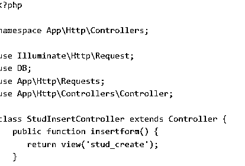
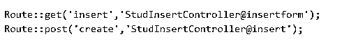

# Laravel 插件

> 原文：<https://www.educba.com/laravel-insert/>


## Laravel 插件简介

Larvel 是在 PHP 和一个免费的开源 web 框架上执行的。它主要用于使用 PHP 和 web 框架开发定制的 web 应用程序，以管理多种事情，如身份验证、路由和 HTML 中的模板。它完全在服务器端，在 PHP 上执行，管理复杂的数据操作和固定的模型-视图-控制器设计。它类似于 react 框架，后者主要关注用户交互。本文解释了数据库中的 laravel 插入函数，并给出了 Laravel 的概述。

### 什么是 laravel 插件？

Laravel 是用 PHP 和其他不同语言的框架执行的最好的 web 框架。在服务器端渲染框架上，Rail 得到了有效的使用，类似于 Laravel，基于 Ruby。Angular、Vue 和 React 在客户端工作，Javascript 的框架被配置为在服务器端呈现。如果用户应用程序使用不同的基于文本的文件夹向博客风格发展，那么它是基于 WordPress 并在 PHP 上执行的。但是在这里，Laravel 并不强迫用户使用不需要的特性；它提供了由用户自己开发一些可靠而有效的工具的工具。

<small>网页开发、编程语言、软件测试&其他</small>

### 如何使用 laravel 插件？

用户可以使用 insert 方法在数据库中插入记录，该方法遵循标准语法，

语法:

```
bool insert ( string $ query, array $ binding = array () )
```

参数是字符串格式的$ query，一个要在数据库中执行的查询。

$ binding，采用数组格式，用作与查询绑定的值。

它返回 bool 函数，可以填充描述以对数据库执行 insert 语句。

**Laravel 插入数据:**

要在 Laravel 中插入数据，需要执行以下步骤。

执行以下命令，构建一个名为“螺柱插入控制器”的控制器

一旦成功创建并且没有任何错误，就会获得下面的输出。


将以下代码复制到新文件中:

```
app / http/ controllers/ studinstert controller.php
app / http/ controllers/ studinstert controller.php
```




然后创建一个名为 resources/ views/ stud_new.php 的视图文件，并将代码复制到该文件中。

```
resources/ views/ stud_new.php
```

在 app/HTTP/routes.php 文件中插入以下命令

导航到 app/HTTP/routes.php URL，将记录添加到数据库中。




然后所需的输出显示在下图中。


### Laravel 插入数据框架

在 Laravel 中，通过以下方法向表中插入数据。它在 Laravel 7 中很简单，可以用完整的信息、源代码和示例来执行。

laravel 数据库查询也用于在 MySQL 中插入 laravel 查询。PHP 框架可以有效地将数据插入数据库。首先，用户必须创建一个数据库表来插入数据。然后，他应该使用 Insert Into 语句将原始数据添加到所需数据库的 Mysql 表中。

INSERT INTO 语句:

```
INSERT INTO name of the table (columnA, columnB, columnC,.....)
VALUES (value01, value02, value03,.....)
```

如果用户了解 SQL，使用 Laravel 将会很容易

创建表和表成员详细信息的 SQL 查询如下:

```
Create Table_member_details
CREATE TABLE­_member_details
(
id int NOT NULL AUTO_INCREMENT,
profile _nm varchar(30),
real _nm varchar(30),
full _address varchar(30),
email_address varchar(30),
primary key (id)
}
```

然后创建三个新文件，将数据插入 Laravel。

成员插入 controller.php-它位于/app /HTTP/Controllers/成员插入 controller.php 下

成员 _ 创建。php 它位于资源-视图-成员 _ 创建中。服务器端编程语言（Professional Hypertext Preprocessor 的缩写）

Website.php——它应该位于-> website.php 航线上

若要查看该文件，请执行以下查询

```
<!DOCTYPE html>
<html>
<head of the document>
<title>member addition | Add</title>
</head of the document>
<body>
@if (session('status of the query'))
<div class="alert alert-success" role="status of the alert">
<type of the button ="button" name of the class="close" data-dismiss="alert">×</button>
{{ session('status of the alert') }}
</div>
@elseif(session('failed'))
<div class="alert alert-danger" role="status of the alert">
<type of the button ="button" name of the class="close" data-dismiss="alert">×</button>
{{ session('failed') }}
</div>
@endif
<form action = "/create new" method = "post">
<type of the input = "hidden" name = "_token" value = "<?php echo csrf_token(); ?>">
<table>
<tr>
<td> First Name </td>
<td> <type of the input ='text' name='profile_nm' /></td>
<tr>
<td> Last Name </td>
<td> <input type="text" name='real_nm'/></td>
</tr>
<tr>
<td> Name of the city </td>
<td>
<select name="complete_address">
<option value="cca"> Calcutta </option>
<option value="ngp"> Nagpur </option>
</select> </td>
</tr>
<tr>
<td> Email address </td>
<td><type of the input ="text" name='email'/></td>
</tr>
<tr>
<td span = '2'>
<itype of the input = 'submit' value = "Insert member"/>
</td>
</tr>
</table>
</form>
</body>
</html>
```

为控制器文件添加脚本。

```
<?php
namespace  App \Http \Controllers;
use  App \Member Insert;
use Illuminate \Http \Request;
use \Illuminate \Http \Response;
use Illuminate \Support \Validator;
use Illuminate \validate \policy;
class Member Insert Controller extends Controller
{
public function insert()
{
$data of the url = getURLList();
return view('Member _create new');
}
public function create(Request $request)
{
$policy = [
'profile_nm' => 'required|string|min:4|max:245',
'complete_address' => 'required|string|min:4|max:245',
'email address' => 'required|string|email|max:245'
];
$validator = Validator::make ($request->all(),$rules);
if ($validate->fails())
{
return redirect('insert')
->withInput ()
->withErrors ($validate);
}
```

那么模型文件应该作为查询来执行

之后，路由文件应该作为查询执行

```
<?PHP
/*
|--------------------------------------------------------------------------
| Web Routes
|--------------------------------------------------------------------------
|
```

在这里，用户可以保存应用程序的 web 路由，它们被加载到组内的路由服务提供者中，该组包括 web 中间件组。

```
|
|
*/
//insert the data
Route:: get ('insert','Member InsertController@insertform');
Route:: post ('create','Member InsertController@insert');
```

### **结论**

如果用户想在 Laravel 中向一个数据库中插入海量数据，借助 Laravel 6 版本可以有效实现。因此，解释了在 Laravel 中插入数据的简要讨论，用户可以有效地处理它。

### 推荐文章

这是 Laravel 插页指南。这里我们讨论数据库中的 laravel 插入函数，并给出 Laravel 的概述。您也可以阅读以下文章，了解更多信息——

1.  [Laravel 网址](https://www.educba.com/laravel-url/)
2.  [拉勒维尔收银台](https://www.educba.com/laravel-cashier/)
3.  [Matlab 色条](https://www.educba.com/matlab-colorbar/)
4.  [Laravel 清除缓存](https://www.educba.com/laravel-clear-cache/)


