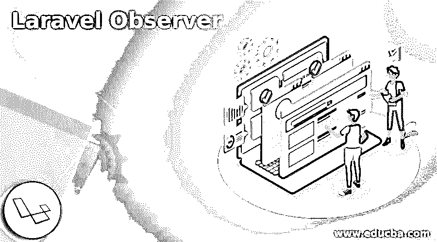
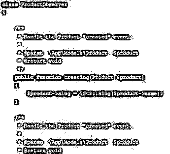
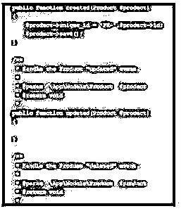
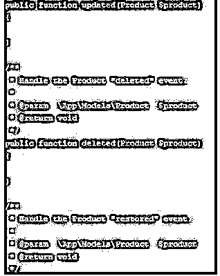
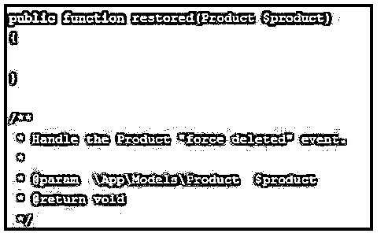
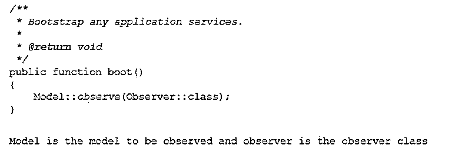
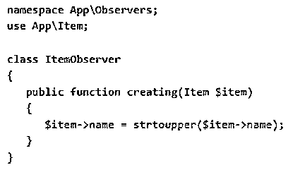

# 拉勒韦尔观察家报

> 原文：<https://www.educba.com/laravel-observer/>

## 《拉腊维尔观察家》简介

laravel 是一个免费的 PHP web 应用程序，可以减轻用户的复杂任务。Laravel 的框架有很多吸引人的特性，其中之一就是 Laravel observer。这是用来俱乐部的事件听众的一个实质性的模型雄辩。Laravel observer 让监听器甚至可以像删除、创建和更新那样对模型进行雄辩的操作。此外，如果用户在已定义的模型上监听多个事件，观察者可以使用 Laravel 中单个事件类的所有组。

Laravel 中的观察者帮助控制器清理在实现模型事件之前或之后执行的代码。它为模型事件的生命周期提供了插件，并且可以执行所有合适的逻辑。如果用户需要一个模型的许多事件，那么观察器将所有的监听器分组到一个唯一的类中。observer 类遵循方法名，这些方法名反映了用户喜欢暗示的正式事件。每个方法都有一个只有一个参数的模型。make:observer 是初始化一个新的 observer 类的简单方法。

<small>网页开发、编程语言、软件测试&其他</small>

### 如何使用 Laravel 观察者？

跨模型 laravel 观察和使用的模型事件具有以下检索选项:创建、更新、保存、删除、恢复、创建、更新、保存和删除。提到的事件可以用于 Laravel 框架中的每个模型，业务逻辑可以附加到它上面。

要创建一个 observer 类并执行它，请遵循以下步骤。

PHP 工匠制作:观察者<name of="" the="" observer="" class=""></name>

对于其他观察器类，用适当的模型名替换观察器名，这是用户正在观察但尚未实现的。该文件夹创建在名为 observers 的应用程序目录中，用户保存 observer 类。从那里，用户可以用不同的方法填充该类，以匹配上面列出的事件，并可以在创建新的观察器时附加观察器的模型，如下所示。

PHP artisan make:观察者<name of="" the="" observer="" class="">–m =< name of the model ></name>

它用于使用标准方法创建 observer 类，在该方法中触发模型动作并查看 observer 动作。

### 创建类 Laravel Observer

Laravel 中的观察者是使用下面的语法创建的，并且可以相应地被隐含。

Retrieved 是从数据库中提取模型记录时隐含的 observer 方法。

**语法:**

`Model: findorfail ($id); // it used to trigger the retrieve method in observer class`

Creating 是 observer 方法，具有在创建过程中执行的模型记录，并且仍未保存在数据库中。这是在生成模型的 id 和时间戳之前的过程。用户可以在这一步进行动态检查，并为缺失的列分配一个公共值。

Created 是模型记录开发成功后应用的 observer 方法。如果在流程创建期间有任何错误，它会解释丢失的列数据，并且不会被调用。

model::create()；在创建方法时以及在 observer 类中创建流程后第一次触发它。

更新是当模型记录正在更新流程时使用的观察器方法，此时更新还没有出现在数据库中。尽管 updated 是用于执行模型记录的 observer 方法，但它应该被成功更新。如果在更新流程时出现任何错误消息，则不会调用该方法。

model::update()；它启动更新方法，这意味着 observer 类中的更新方法。

saved 和 saving 方法在 model observer 类中应用，这是 swiss army blade 所熟悉的，它在任何需要租用数据库中的数据的事件之后和之前被调用。因此，如果用户创建了一个新模型，并且首先执行了保存方法，那么它将继续创建方法，并在保存的方法处停止。在模型更新、保存、更新和保存时，它遵循相同的程序。

当任何模型记录在删除过程中工作时，使用删除，这里记录还没有从数据库中删除，id 用于从数据库中获取它以返回相关数据。相反，deleted 方法是在模型记录被完全删除后执行的，现在，该记录从数据库中被删除。

模型::销毁($id)

当恢复被删除模型的记录时，使用 Restored 和 restoring。

### 拉勒韦尔观测器模型

laravel 观察者模型由这八个属性构成。

用模型文件、控制器和迁移文件为 laravel 配置模型。

开发一个视图并存储数据。

不同类型的模型观察器被提供给数据，这被称为模型事件。updated 和 updating 方法在更新从数据库中的列更改为模型时执行。如果更新请求没有强制进行任何更改，那么更新和正在更新的观察器不会被触发，然后执行保存和保存技术。

如果恢复一个被删除的模型，或者一系列的过程被一个接一个地执行，如检索、恢复、保存、更新、然后更新、再次保存、最后恢复。

为观察者配置服务提供者。

如果用户想要部署没有任何执行或观察者方法的模型事件，他们可以不使用观察者事件来保存它。可以在 app provider 服务类中完成。

### 结论

用户可以从观察器调度定制的事件，并从其他应用服务中暗示它们。用户可以应用 observer 类，即使他不知道它，因为它简单而有效。

### 推荐文章

这是一个指南拉勒韦尔观察员。在这里，我们讨论介绍，创建，模型，以及如何使用 laravel 观察员。您也可以看看以下文章，了解更多信息–

1.  [拉勒维尔收银台](https://www.educba.com/laravel-cashier/)
2.  [拉腊夫表单](https://www.educba.com/laravel-orm/)
3.  [拉勒韦尔加入](https://www.educba.com/laravel-join/)
4.  [Laravel Tinker](https://www.educba.com/laravel-tinker/)

