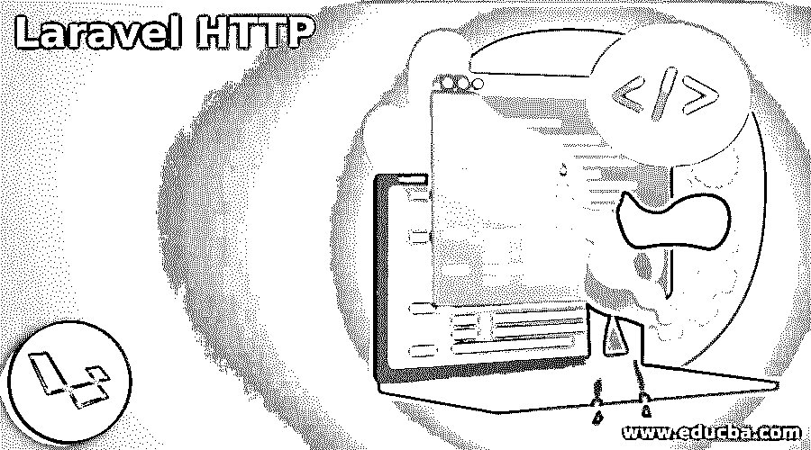
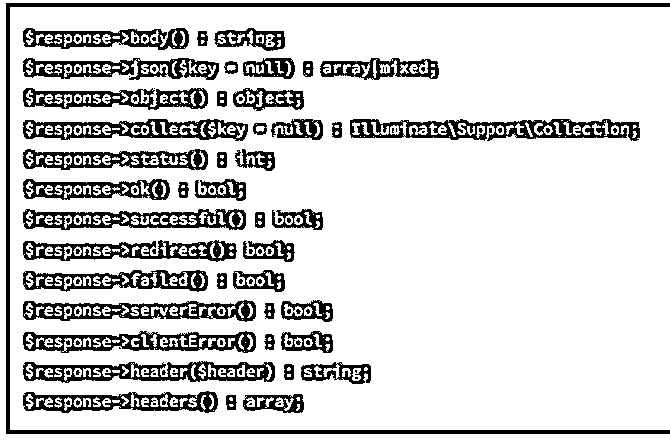
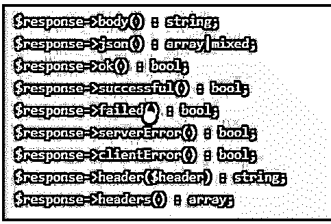
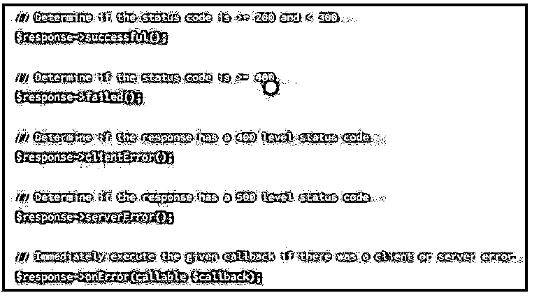

# Laravel HTTP

> 原文：<https://www.educba.com/laravel-http/>




## Laravel 简介 HTTP

Laravel 在 HTTP 客户机中提供了最小的 API，使用户能够发出 HTTP 请求，与其他网站应用程序进行交互。Laravel 中的包装器针对大多数用例，为开发人员提供了一个用户友好的环境。在启动 web 请求之前，用户应该安装 guzzle 包，这取决于应用程序。默认情况下，Laravel 依赖于通过 composer 删除包。Laravel 中的 HTTP 客户端使处理请求变得容易，并与 web 服务集成。它提供了一个独特的、强大的接口来发送 POST 请求，流式传输大量下载和多次上传，在 HTTP 中使用 cookies，在 JSON 中上传数据。

简单地说，Laravel 中的 HTTP 既适用于 HTTP 客户端，也适用于 HTTP 请求。两者都与 web 服务集成，提供了一个强大的接口来发送 POST 信号，处理多次上传和大量数据传输，在 HTTP 中启用 cookies，在 JSON 中上传数据。

<small>网页开发、编程语言、软件测试&其他</small>

为了发起请求，用户可以在 HTTP 控制台中处理 get、head、patch、put、delete 和 post。其他 URL 中的基本 GET 请求位于 illuminate \ support files \ faade \ HTTP:

$ response = HTTP::get(' HTTP://laravel . com ')；

GET 方法执行一个实例来定位 illuminate \ HTTP \ client \ response 文件夹，该文件夹提供了多种方法来处理响应中的任何错误。假设用户必须面对一个额外的正在进行的请求实例，用于发送和停止脚本的执行。用户可以添加由请求定义启动的 dd 技术。


返回 http::DD()-> get(' http:://www . laravel . com ')

### Laravel HTTP 请求

在请求数据中，标准函数是 PUT、PATCH 和 POST 请求，这些函数随请求一起传输附加数据。所以在这些技术中，用户接受数据范围或数据数组作为不同的参数。默认情况下，信息被传输到其他应用程序，JSON 的内容类型位于 illuminate \ support files \ faade \ HTTP:

**代码:**

```
$ response = Http :: post('http://example.com/users',
[
'name of the user' => “roy”,
'role of the user' => 'Network Administrator',
]); 
```

**输出:**


要使用 GET 请求获取查询参数，用户必须将查询中的字符串附加到 URL，该 URL 用于将键数组传递或定向到值对中，如 GET 技术中的以下参数。




**代码:**

```
$ response = Http :: get ('http:// laravel.com/ users',
[
'name of the user' => “Hari”,
'page to access' => 1,
] ); 
```

可以在应用程序或 x-form 中访问 URL 中的编码请求，x-FORM 封装了应该在发起请求之前从 FORM 方法中检索的内容类型。


**代码:**

```
$ response = Http :: asForm () -> post('http:/ /laravel.com/users',
[
'name of the user' => “Ria”,
'role of the user' => ‘admin Consultant',
] ); 
```

请求信息包括用于提供原始请求内容以发起请求的带体技术。内容的类型应该通过第二个参数方法提供。


**代码:**

```
$ response = Http ::with Body
(
base64_encode($photo), 'image/jpeg'
) -> post ('HTTP: / /laravel.com/ content of the image); 
```

### Laravel HTTP 客户端

请求也可以作为多方发出，在发起请求之前，应该从附加项目方法中调用它。该技术接受文件的内容和名称。如果需要，用户可以给出第三个参数作为文件名。




**代码:**

```
$ response = Http :: attach
(
'attachment', to get file contents ('photo.jpg'), image.jpg'
) -> post ('http://larvel.com/ file and image attachment); 
```


可以传递流资源，而不是从文件中获取原始信息。


**代码:**

```
$ image = f open (image.jpg', 'r');
$ response = Http :: attach (
'attachment', $ photo, ‘image.jpg'
) -> post (' http:/ /laravel.com/ attachments'); 
```




用户可以在 HTTP 中同时提交多个请求。换句话说，用户可以发起几个请求来同时发送，而不是顺序传输它们。该过程导致了许多实质性的策略，这些策略增强了与 HTTP 中的最小操作 API 进行交互的性能。例如，用户可以使用池技术，它接受闭包方法，该方法位于 illuminate \ support files \ faade \ http \ client \ instances 的池中，使用户能够将请求添加到请求集合中，并用于调度。

### Laravel HTTP 特性

用户必须检查客户端收到订单的请求，以确保应用程序传输正确的头或数据。应用程序中接收的客户端或请求用于检查正确的标题或数据，它可以位于 HTTP:: assert sent 方法中，该方法可以在调用 HTTP:: fake 后执行。

assert sends 技术用于接受请求实例中收到的闭包，它应该被调用，因为布尔值表示满足用户需求的请求匹配。只有一个推荐应该被传送到请求，并且客户端通过测试执行。

PHP 客户端中的 HTTP 和请求被集成到 web 服务中，简单的接口用于构建查询字符串、流式传输大规模上传、流式传输多个文件、在 HTTP 中包含 cookies、POST 请求以及在数据中传输 JSON。它在相同的接口上工作，使用异步和同步请求。

### 结论

PSR 接口处理响应、流和请求，并启用所有兼容的库。它抽象了 HTTP 传输，将其放在后面以编写传输代码，并且不依赖于非阻塞的套接字、PHP 流、cURL 和事件循环。中间件系统能够增加 HTTP 客户端和请求。

### 推荐文章

这是一个 Laravel HTTP 的指南。为了更好地理解，我们在这里讨论简介、laravel HTTP 请求、客户机和特性。您也可以看看以下文章，了解更多信息–

1.  [Laravel 视图](https://www.educba.com/laravel-view/)
2.  [Laravel 响应 JSON](https://www.educba.com/laravel-response-json/)
3.  [拉勒维尔发现](https://www.educba.com/laravel-find/)
4.  [Laravel 清除缓存](https://www.educba.com/laravel-clear-cache/)


