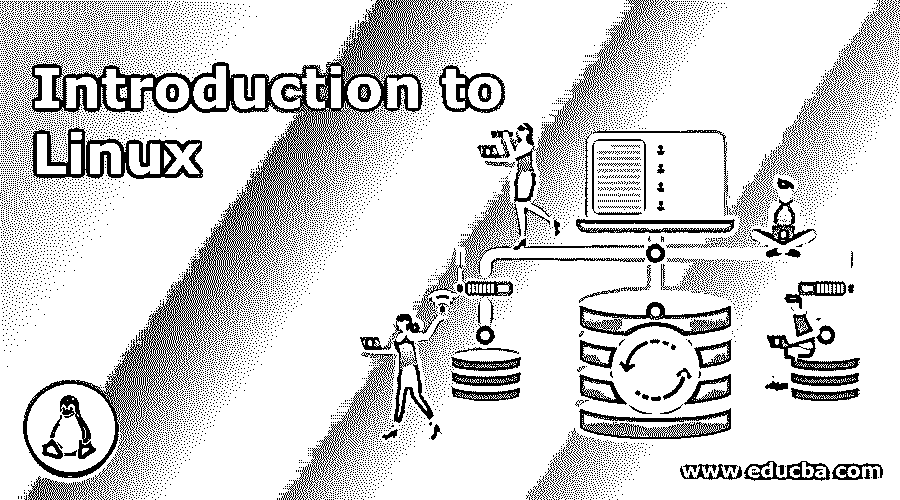

# Linux 简介

> 原文：<https://www.educba.com/introduction-to-linux/>

## Linux 简介

在这个主题中，我们将讨论 Linux 的一些基本介绍和以下概念。

### 什么是操作系统？

每当我们打开电脑/笔记本电脑，我们就会看到一个屏幕，在那里我们可以进行许多活动，如编辑文档、浏览互联网、播放视频、安装软件等。但是现在我们有一个好奇心，所有这些活动是如何被电子设备支持的？我们设备的处理器如何帮助我们完成要执行的活动？是操作系统帮助我们与硬件互动。

<small>网页开发、编程语言、软件测试&其他</small>

操作系统是我们在电子设备上工作所需要的。当你在你的电子设备上阅读这篇文章时，你正在利用操作系统的优势。我们很多人都用过很多流行的操作系统，比如 Windows，苹果操作系统，但是这里我们将讨论 LINUX。

### 什么是 Linux？

[Linux 是一个操作系统](https://www.educba.com/what-is-linux/)，它就像 Windows 和 Mac OS X 一样。操作系统是最大限度地利用笔记本电脑、台式机或平板电脑等设备硬件的软件。简单地说，我们可以说操作系统是软件和硬件之间的桥梁。没有操作系统，就不可能运行或执行软件或程序。

### Linux 的组件

在上面的部分中，我们已经学习了 Linux 的介绍，所以现在我们要学习 Linux 的组件。因为 Linux 架构主要有这些组件:硬件、内核、外壳和实用程序

*   **硬件:**RAM、HDD、CPU 等外围设备共同构成了 LINUX 操作系统的硬件层。
*   **内核:**Linux OS 的核心部分叫做内核；它负责 LINUX 操作系统的许多活动。它直接与硬件交互，硬件提供低级服务，如向系统提供硬件细节。我们有两种内核——[整体内核和微核](https://www.educba.com/monolithic-kernel-vs-microkernel/)。
*   **外壳:**外壳是用户与内核之间的接口；它向用户隐藏了内核功能的复杂性。它接受用户的命令并执行操作。
*   **实用程序:**操作系统功能由实用程序授予用户。可以从系统实用程序中利用单独的和专门的功能。

### Linux 的特点

在学习了 Linux 的介绍和 Linux 的主要组件之后，我们要学习 Linux 的特点。可以使用命令来利用 Linux，它具有以下功能:

*   Linux 命令用于执行一个或多个任务，例如复制、粘贴、查找等。
*   使用命令，可以高效且有效地执行任务以执行一些程序。

命令应该在 shell 中输入；这就像核心 Linux 和我们之间的沟通器，把人类的代码转换成硬件来执行。我们可以执行代码来查找文件中的内容，也可以编写代码来执行更复杂的代码，比如我们可以对一个命令的输出执行一个命令。为此，我们需要在两个或多个命令之间使用“|”(管道分隔符)。这就是管道操作符，作为两个命令的连接点。下面是使用管道连接单个命令和多个命令的例子。

例如

*   **grep–**在文件中搜索模式
*   **排序—**按顺序排序
*   仅显示相同事物的一个副本这是 single 的示例，该命令可以单独工作，或者我们可以使用它们来获取某样东西，将它们作为一个整体，例如 grep ARC * txt | sort | uniq>output . txt

上述命令将在所有扩展名为“txt”的文件中搜索单词“ARC”，并将记录的副本保存到新文件“output.txt”中。

这些是我们可以利用它们来实现我们的功能的命令的几个例子。

### Linux 系统的应用现状

Linux 的开发者在早期阶段完全专注于网络服务，但 Linux 的真正障碍是支持办公应用程序，如与 MS 兼容的办公应用程序，如文字处理器、电子表格、演示等。在得到所有的路障后，我们得到了一个非常稳定的免费操作系统。Linux 在服务器端的使用率很高，因为它被认为是最稳定和可靠的平台，为亚马逊、著名的在线书店、美国邮局、德国军队和许多其他公司提供数据库和交易服务。互联网服务提供商已经发现了防火墙、代理和 web 服务器，Linux 的服务非常有用，而且你可以发现 Linux box 触手可及，因为它有一个非常友好、舒适的管理系统。Linux 不仅用于个人电脑、笔记本电脑，还用于 PDA、手机、智能手表等小设备。

世界上成千上万的公司和政府都在使用 Linux 操作系统，因为它价格低廉，许可费用更低，而且节省时间和金钱。

Linux 被用于许多电子设备中；下面列出了一些例子:

*   戴尔 Inspiron Mini 9 和 12
*   Garmin Nuvi 860、880 和 5000
*   谷歌安卓开发手机 1
*   惠普迷你 1000
*   联想创意平板 S9
*   摩托罗拉摩托车 EM35 手机
*   每个孩子一台笔记本电脑 XO2
*   索尼 Bravia 电视
*   索尼阅读器

### Linux 的优点和缺点

在浏览了所有的组件、特性和对 Linux 的广泛介绍之后，我们将探讨 Linux 的优点和缺点:

#### 优点

以下是提到的优点:

1.  Linux 是免费的，可以从网上下载；没有注册，更新或任何隐藏的费用。
2.  Linux 是灵活的，即 [Linux 可以安装](https://www.educba.com/install-linux/)在任何硬件上；如果用户不确定他/她的机器上可以安装什么操作系统，他可以选择 Linux。
3.  Linux 的开发使得它可以一直运行而不需要重启，并且因为这个特性，许多应用程序可以被安排在平静的时间。
4.  为 Linux 实现的安全模型是基于 Unix 的；它对互联网和其他攻击非常安全。
5.  Linux 可以根据需要进行定制，由于它是开源的，所以错误修复非常快，我们可以在互联网上找到许多人来寻求解决方案。

#### 不足之处

下面是提到的缺点:

1.  Linux 是在 GNU 公共许可证(GPL)下授权的，这意味着任何人都可以修改和发布修改后的版本。所以要找到一个适合我们需要的版本有点令人困惑。
2.  Linux 对用户不太友好，对于初学者来说可能有点混乱。

### 推荐文章

这是一本介绍 Linux 的指南。在这里，我们讨论了操作系统，Linux 的工作，架构和命令执行，优点和缺点。您也可以阅读以下文章，了解更多信息——

1.  [介绍](https://www.educba.com/introduction-to-git/) [给饭桶](https://www.educba.com/introduction-to-git/)
2.  [JavaScript 简介](https://www.educba.com/introduction-to-javascript/)
3.  [机器学习简介](https://www.educba.com/introduction-to-machine-learning/)
4.  [数据挖掘简介](https://www.educba.com/introduction-to-data-mining/)

