# 如何安装 Linux？

> 原文：<https://www.educba.com/install-linux/>

## 如何安装 Linux？

[Linux 是一个](https://www.educba.com/what-is-linux/)开放源代码和免费安装的操作系统，它允许任何具有编程知识的人根据自己的要求修改和创建自己的操作系统。多年来，它变得更加用户友好，并支持许多功能，例如

1.  与服务器一起使用时可靠
2.  不需要杀毒
3.  一台 Linux 服务器可以不间断地运行很多年。

它有许多发行版，如 Ubuntu、 [Fedora](https://www.educba.com/install-fedora/) 、Redhat、Debian，但都运行在 Linux 服务器本身之上。每个发行版的安装都是相似的，因此我们在这里解释 Ubuntu。

<small>网页开发、编程语言、软件测试&其他</small>

所以，让我们通过以下任何一种方法开始使用这个美妙的操作系统吧。

### 形容词（adjective 的缩写）使用光盘或 u 盘安装 Linux

下载。iso 或计算机上的 ISO 文件，并在使用 Pen Drive Linux 和 UNetBootin 使其可引导后，将其存储在 CD-ROM 或 USB 棒中

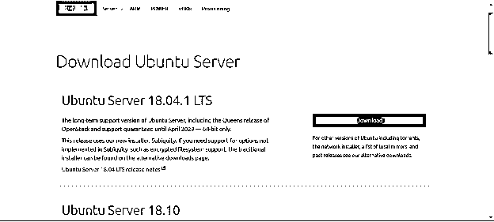

#### 1.从 u 盘启动

将 cd-r om 或 pen drive 连接到计算机后，您需要重新启动计算机。在启动时按回车键，在这里选择 CD-ROM 或 pen drive 选项开始进一步的启动过程。按住 F12 键启动引导过程，尝试手动引导设置。这将允许您在启动系统之前从各种引导选项中进行选择。所有选项，无论是 USB 还是 CD ROM，或者是操作系统的数量，你都会得到一个列表，你需要从中选择一个。

**Note:-**
You will see a new screen when your computer boots up called “GNU GRUB”, a boot loader that handles installations for Linux. This screen will only appear in case there is more than one operating system.

*   设置键盘布局。
*   现在你会被问到你想安装什么应用程序来启动 Linux？这两个选项是“正常安装”和“最小安装”。

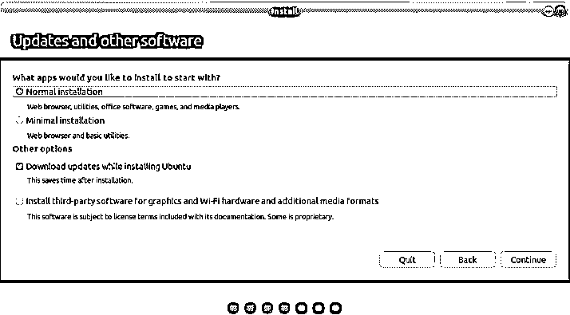

#### 2.派生选择

选择要完成操作系统安装的驱动器。如果你想替换现有的操作系统，选择“擦除磁盘并[安装 Ubuntu](https://www.educba.com/install-ubuntu/) ”否则选择“其他”选项并点击立即安装。

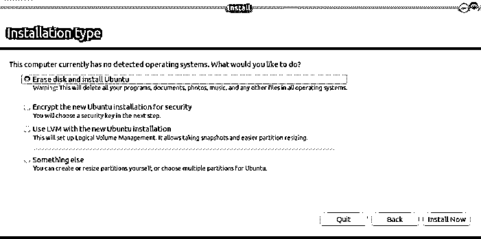

#### 3.开始安装

*   一个小组将要求确认。如果您不想更改提供的任何信息，请点按“继续”。在地图上选择您的位置并安装 Linux。
*   提供登录详细信息。

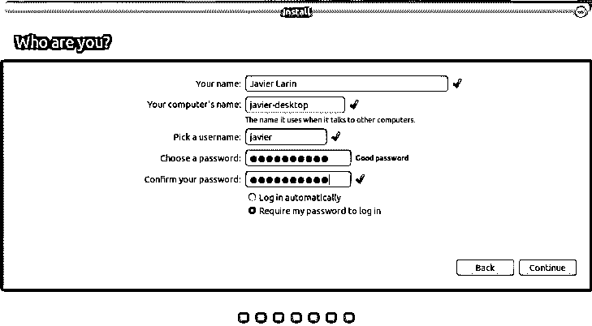

#### 4.完成安装过程

安装完成后，您将看到重启计算机的提示。

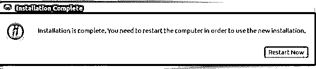

您也可以通过系统设置菜单下载您选择的驱动程序。只需遵循以下步骤:

其他驱动程序>从列表中选择图形驱动程序。

列表中会有很多有用的驱动，比如 Wi-Fi 驱动。

还有许多其他选项可以用来使用和安装 Linux

### B.使用虚拟机器 VMWARE 安装 Linux

这样，什么都不会影响你的 Windows 操作系统。

#### 什么是需求？

*   良好的互联网连接
*   至少 4GB 内存
*   至少 12GB 的可用空间

#### 步骤:

1.**从最初的 ORACLE VIRTUAL BOX 网站下载虚拟机器。可以参考下面的链接**

https://www.virtualbox.org/

**2。使用虚拟盒子**安装 Linux

使用。iso 文件或 ISO 文件，可以从网上下载并启动虚拟盒。

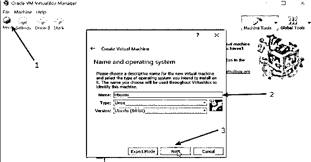

这里我们需要给虚拟操作系统分配内存。根据最低要求，它应该是 2 GB。

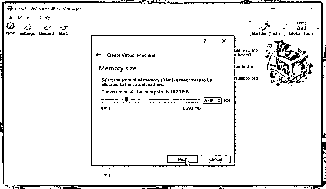

*   在创建虚拟磁盘下选择一个选项。

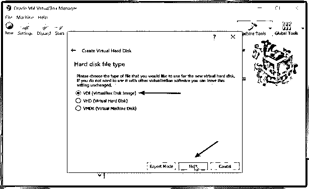

*   选择物理硬盘上的存储类型。并选择磁盘大小(根据要求最小 12 GB)

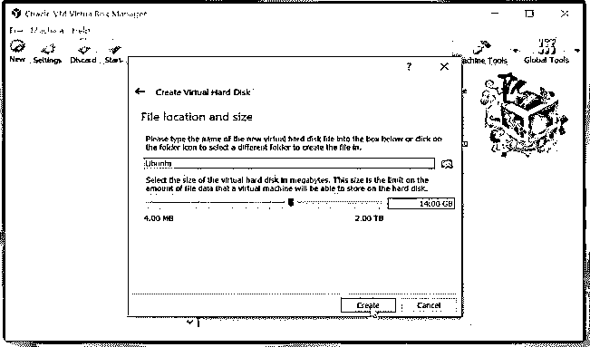

*   单击创建选项，然后单击启动按钮启动虚拟框并浏览到。操作系统的 iso 文件。

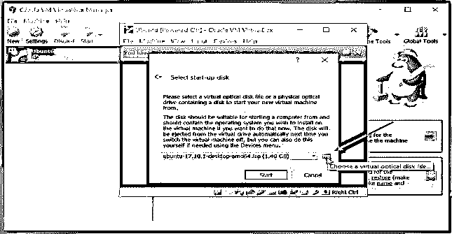

*   现在 Linux 操作系统将启动，点击安装选项。

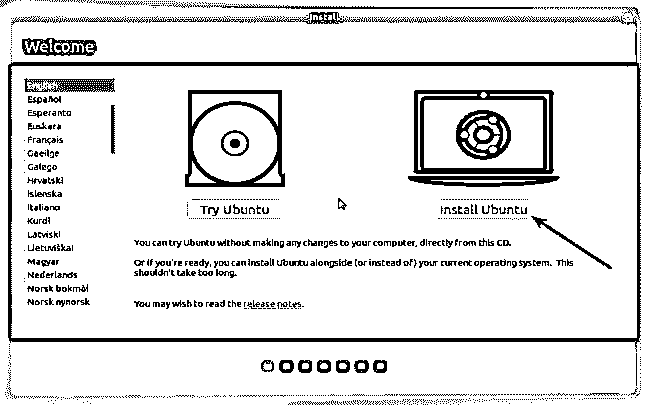

*   选择用于完成操作系统安装的驱动器。如果你想替换现有的操作系统，选择“擦除磁盘并安装 Ubuntu ”,否则选择“其他”选项并点击“立即安装”。

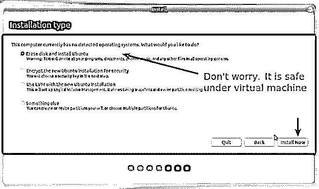

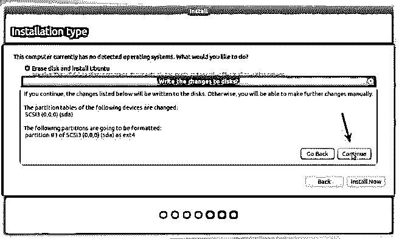

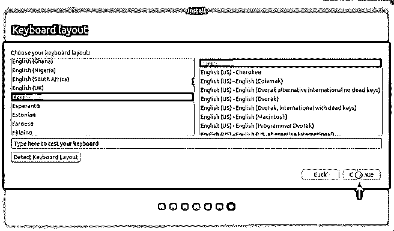

*   点击继续。
*   选择用户名和密码。

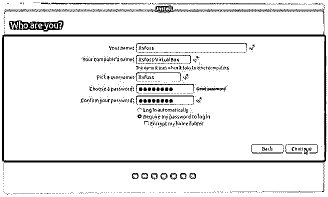

你差不多完成了。完成安装需要 10-15 分钟。安装完成后，重新启动系统。

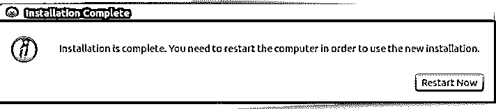

**注意**:如有任何问题，关闭并再次启动虚拟箱。

Linux 操作系统现在提供了数以百万计的程序/应用程序可供选择，其中大部分都是免费安装的！由于其稳定性和可靠性，Linux 也是服务器环境的首选操作系统(像亚马逊、脸书和谷歌这样的大公司使用 [Linux](https://www.educba.com/linux-alternatives/) 作为他们的服务器)。事实证明，这对每个人来说都是一个不错的选择。

### 推荐文章

这是如何安装 Linux 的指南？.这里我们已经讨论了安装 Linux 的基本说明和最简单的方法。您也可以阅读以下文章，了解更多信息——

1.  [如何使用 Kali Linux 命令](https://www.educba.com/kali-linux-commands/)
2.  [备忘单 Linux](https://www.educba.com/cheat-sheet-linux/)
3.  [适用于 Linux 的 Adobe Illustrator】](https://www.educba.com/adobe-illustrator-for-windows-8/)
4.  [Linux 与 Android 的区别](https://www.educba.com/linux-vs-android/)
5.  [Wi-Fi 与以太网的区别](https://www.educba.com/wifi-vs-ethernet/)
6.  [iPhone 与 Android |最大差异](https://www.educba.com/iphone-vs-android/)

