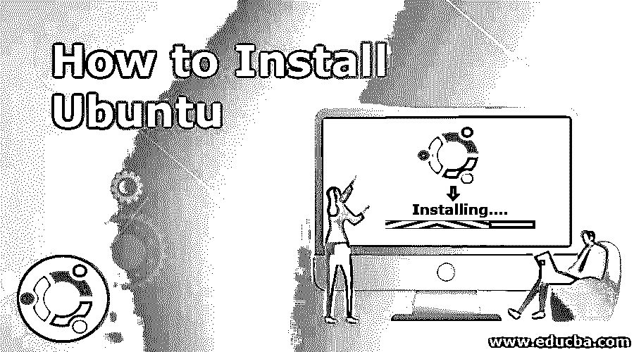
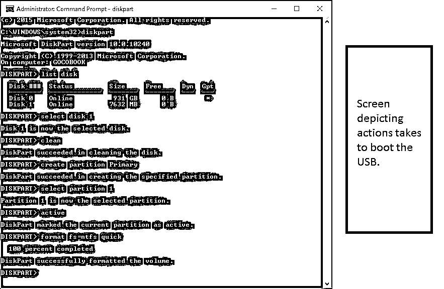
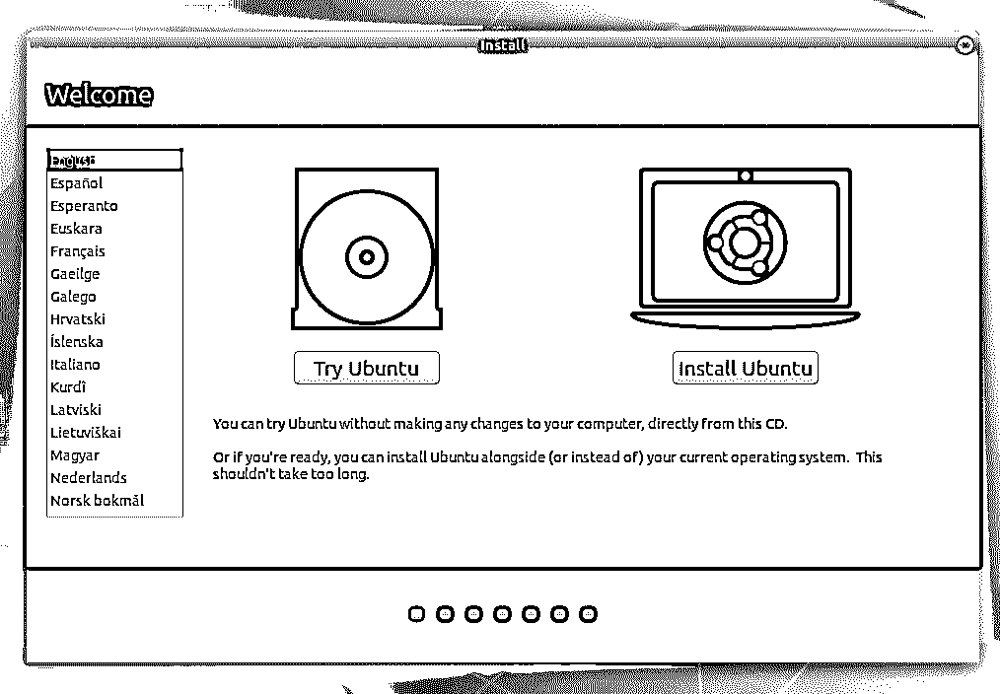
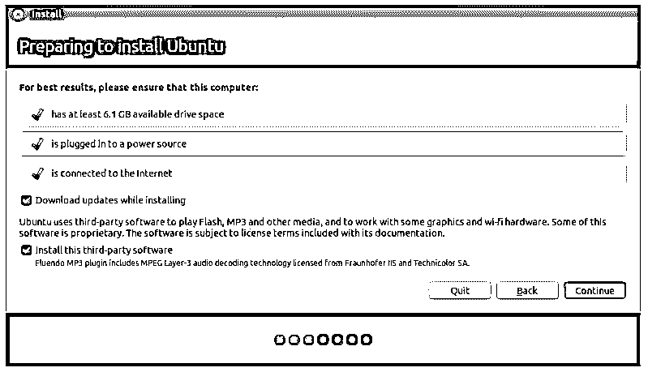
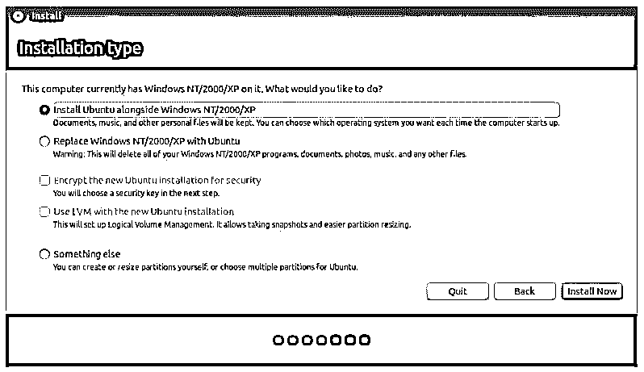
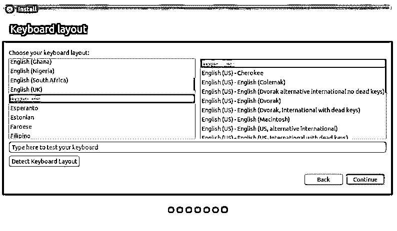
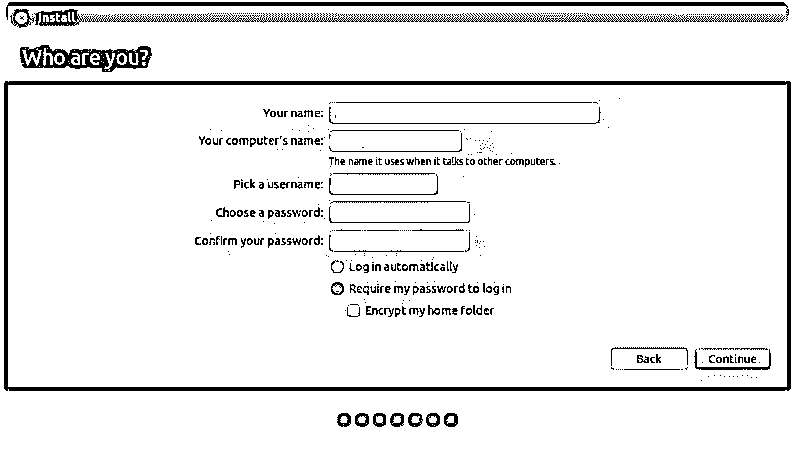
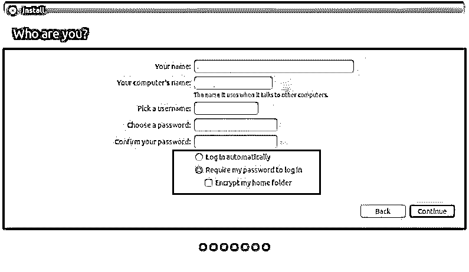
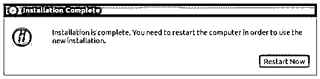

# 如何安装 Ubuntu

> 原文：<https://www.educba.com/install-ubuntu/>

## 如何安装 Ubuntu？

下面的文章提供了如何安装 Ubuntu 的概要。Ubuntu 是一个操作系统。Ubuntu 发布链接。这是一个主要基于 DEBIAN 的开源 LINUX 发行版。Ubuntu 每 6 个月发布一次，它的长期支持(LTS)每 2 年发布一次。Ubuntu 最新发布是 18.10；我们将在 18.04 LTS 展示安装过程。

它有 3 种版本类型–台式机、服务器和核心。

<small>网页开发、编程语言、软件测试&其他</small>

**平台:**

*   IA-32，AMD64
*   arm HF(arm 7+VFP v3-d16)
*   ARM64
*   仅适用于服务器:POWER8 (ppc64le)和 s390x

**入门:**

用户需要获得一份用于 USB 或 DVD 的 Ubuntu 安装映像。这些是安装 Ubuntu 的首选选项。

**系统要求:**

*   1 GHz x86 处理器(奔腾 4 或更好)
*   1 GB 系统内存(ram)
*   5 GB 的磁盘空间(建议至少 15 GB)
*   支持 1024×768 分辨率的视频
*   音频支持
*   互联网连接(强烈建议，但不是必需的)

**Note:** If you have a 64-bit version, prefer the 64-bit download and the same for the 32-bit users.

### 创建可引导的 USB 驱动器

*   将 USB 插入设备的 USB 插槽。
*   打开 cmd 应用程序，从上下文菜单中选择“以管理员身份运行”。用户将得到一个小窗口，显示一些要执行的操作。
*   键入 *'* diskpart *'* 并确认。这将启动存储设备管理器。
*   现在输入命令‘列出磁盘’；这将显示所有可用的存储设备。
*   从这里选择您的磁盘，因为用户必须选择磁盘才能继续。
*   现在输入命令“sel nickname”
*   现在输入命令“clean”删除 USB 中的所有文件。
*   现在输入主分区的命令“create partition primary ”(进入磁盘)。
*   现在输入命令“列表对”并选择“选择 par 1”
*   现在用命令' active '激活分区。 *'*
*   一些最后的调整，使用这个命令格式化 USB。

`“format fs=FAT32 label=“WINDOWS USB” quick override.”`

*   一旦该过程完成，用户必须输入命令“分配”以自动分配一个驱动器到您的 USB。
*   输入“exit”关闭 DiskPart，然后再次输入“exit”关闭命令提示符。

如果一切都做对了，这就是屏幕的样子。这种可引导的 USB 不仅可以作为安装介质，还允许用户测试 Ubuntu，而无需避免对计算机系统进行任何永久性的更改。用户可以从 USB 运行整个操作系统。现在你有了可启动的 USB 驱动器，让我们看看安装 Ubuntu 的过程。

### 安装 Ubuntu 的过程

将您的 USB 插入计算机插槽，然后重新启动计算机。一旦你的电脑找到这个插着的 u 盘，你会得到一个快速加载屏幕，有一个欢迎窗口。通过选择首选语言向前移动，从现在起您将看到的屏幕如下所示。

选择“安装 Ubuntu”按钮；这将启动安装过程。

在安装开始之前，上面的屏幕最后一次向用户显示了系统建议。用户必须选择“安装时下载更新”,然后单击“继续”继续。

**Note:** The action taken in the above screen completely depends upon the users (like internet connection selection and updates while installing). These will not affect the application performances in any way. So, a user can deselect them as well.

现在，用户必须分配空间；让我们看看怎么做。Ubuntu 安装程序会自动检测你机器上已安装的任何操作系统。

一些可用的选项如下:

*   与其他操作系统一起安装
*   升级 Ubuntu
*   擦除并安装 Ubuntu
*   别的东西

我们将选择“与其他操作系统一起安装”。

点击“立即安装”。

用户将被要求在“你在哪里”屏幕上设置他的位置信息。它包含一张世界地图；只需选择您所在的国家/地区，然后单击“继续”。

设置位置后，您将移至键盘布局屏幕。在这里，用户必须告诉 Ubuntu 用户正在使用的键盘类型。如果你不确定，点击“检测键盘布局”按钮，这将帮助 Ubuntu 建议一些选项来继续。另一方面，如果您对自己的选择满意，请单击“继续”。

你是谁？屏幕意味着从用户那里获取一些个人信息(包括凭证)。Ubuntu 需要知道账户详情。配置成功后，这些细节就会体现出来并用于工作。

在这里，用户必须提供详细信息:

*   名字
*   你想给你的电脑起什么名字
*   用户名详细信息
*   密码
*   你希望 Ubuntu 如何登录

### 选择

您已经完成了所有安装工作；需要最后一个配置。

这是登录选项。在屏幕底部，用户有两个关于如何登录 Ubuntu 的选项。

*   **自动登录:**在这里，Ubuntu 会在你启动设备时自动登录你的主账号。在这种情况下，您不必提供您的用户名和密码。
*   **登录时需要我的密码:**这是默认选择。这将为您的设备提供未经授权的访问。安装后，如果用户选择了，每次都会弹出这个登录界面。对于同一台计算机，任何用户都可以有不同的登录凭据。
*   **加密我的个人文件夹:**这样更安全，多了一层安全保障。选择此选项，Ubuntu 将自动对您的个人文件夹启用加密。

我们大多数人更喜欢使用 Windows，因为它非常用户友好，但与 Ubuntu 相比，Windows 有一些局限性。

下面是一些关于 Ubuntu 在 Windows 上得分的事实:

*   与 Windows 不同，Ubuntu 是免费的。
*   Ubuntu 是完全可定制的；当你安装 Ubuntu 的时候，你可以看到它的行为。您可以个性化 UI/UX 上的每个元素，如通知声音、弹出样式和布局、字体、工作区，甚至与系统相关的动画。
*   Ubuntu 更安全；您可以为任意数量的文件夹和文件设置密码。
*   有利于开发目的。
*   无需重启即可更新。
*   Ubuntu 是开源的，不像 Windows。

### 推荐文章

这是如何安装 Ubuntu 的指南。这里我们讨论了安装 Ubuntu 的不同步骤，以及不同的平台和最低系统要求。您也可以阅读以下文章，了解更多信息——

1.  [Ubuntu vs Windows 10](https://www.educba.com/ubuntu-vs-windows-10/)
2.  [Ubuntu 命令](https://www.educba.com/ubuntu-commands/)
3.  [Ubuntu 版本](https://www.educba.com/ubuntu-version/)
4.  [Ubuntu 的使用](https://www.educba.com/uses-of-ubuntu/)

