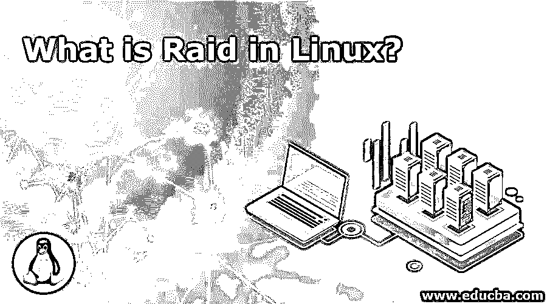
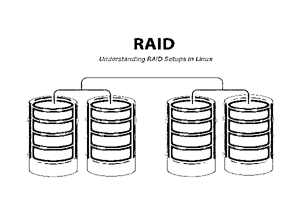
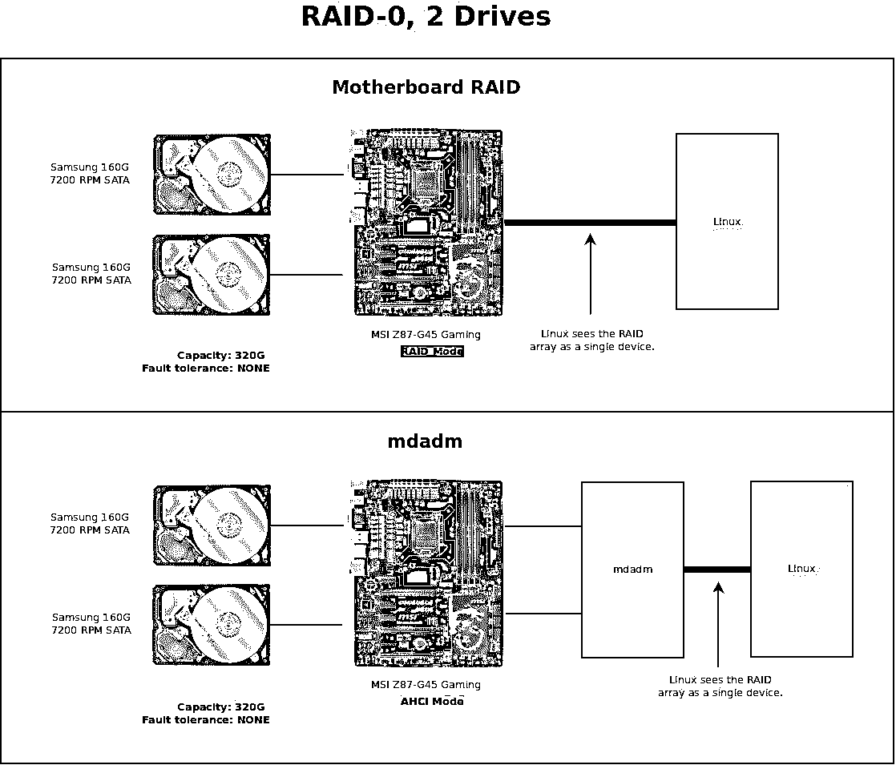

# Linux 中的 Raid 是什么？

> 原文：<https://www.educba.com/what-is-raid-in-linux/>

## Linux 简介

RAID 是“廉价磁盘冗余阵列”的首字母缩写，现在它也被称为“独立驱动器冗余阵列”。它基本上是一个池中的磁盘集合，构成一个逻辑卷。它基本上是一种在多个硬盘中保存或存储相同数据的方法，即使在磁盘出现故障的情况下，也能保护我们的数据。

RAID 是一种将不同磁盘中的多个分区组合成一个大型虚拟存储或设备的方法，也称为 RAID 阵列。

<small>网页开发、编程语言、软件测试&其他</small>

### 了解 Linux 中的 RAID

RAID 包含一组或一组阵列(一组磁盘)。驱动器的组合使一组磁盘形成一个 RAID 阵列或一组 RAID，可以是至少 2 个磁盘连接到一个 RAID 控制器并形成一个逻辑卷或更多，它可以是一个组中多个驱动器的组合。但是，一个磁盘组中只能应用一个 RAID 级别。当我们在数据存储和可访问性方面需要更好的系统性能时，通常会使用 RAID。RAID 级别的性能可能会有所不同，这取决于我们在数据容错和高可用性方面称之为 RAID 级别的配置或设置。

### Linux 中的 RAID 是如何让工作变得如此简单的？

为了让 RAID 在 Linux 中轻松工作，使用了名为 MDADM 的工具。MDADM 基本上是一个命令行系统，允许轻松快速地操作 RAID 设备。但是，默认情况下，该软件可能不会随大多数发行版一起提供。如果我们想使用它，有时可能需要手动安装。MDADM 用于管理和监控软件 RAID 设备，这些设备位于现代 GNU 或 Linux 发行版中，而不是用于**如**的旧 RAID 实用程序。 **raidtools** 或 **raidtools2** 。

### 在 Linux 中用 RAID 可以做什么？

在 Linux 中使用 RAID，我们可以以多种方式存储和管理我们的数据。它有助于我们保持数据的安全、可靠、快速访问，并且以一种复制的方式，即使一些或一个驱动器出现故障，系统也将继续运行，而不会对该过程产生任何影响。

### 在 Linux 中使用 RAID

Linux 中的 RAID 以多种方式(配置)工作，称为级别，如串联(线性)、磁盘条带化(RAID 级别 0)、磁盘镜像(RAID 级别 1)、磁盘奇偶校验(RAID 级别 4)、磁盘冗余(RAID 级别 5)等。RAID 的工作原理是将数据存储在多个磁盘上，并允许以平衡的方式进行输入/输出(即 I/O 操作)以提高性能。由于 RAID 使用多个磁盘，因此它增加了平均故障间隔时间(MTBF ),并且冗余地存储数据，同时也增加了容错能力。

在操作系统(OS)中，RAID 阵列显示为单个逻辑硬盘。RAID 通常使用磁盘镜像或磁盘条带化技术，其中镜像将相同的数据复制到不止一个驱动器和条带化分区上，每个驱动器的存储空间分成多个单位，范围从 512 字节的扇区到几兆字节，所有磁盘的条带通常以有序的方式交错和寻址。

例如，在单用户系统中，其中存储了大量记录，例如医疗或任何其他科学数据，如图像；条带通常设置得尽可能小(例如 512 字节)，以便单个记录可以跨越所有磁盘，并且可以通过同时读取所有磁盘来尽快访问。在多用户系统中，我们可以通过建立一个可以保存常规或最大大小数据的宽条带来提高性能，这允许跨驱动器的重叠磁盘 I/O。Linux 中 RAID 的好处是，我们可以在 RAID 01 和 RAID 10 中使用的阵列上将磁盘镜像和磁盘条带化结合在一起。

### **优势**

在不同层次的 Linux 中实现 RAID 有很多好处。但是，不同级别的 RAID 将由系统管理员根据 ITBM 应用程序的要求来决定和实施。基本优势是:

*   **冗余**–如果任何一个磁盘出现故障，那么其他磁盘将拥有相同的数据，以防止数据丢失。
*   **性能**–通过将数据写入多个磁盘，可以提高整体数据传输率。
*   **便利性**–设置 RAID 更加容易，即使不同物理磁盘位于同一设备中，也可以对其空间进行寻址。

### **所需技能**

我们获得的技能或知识是尽可能好的。然而，我们将讨论 RAID 实现所需的基本技能(尤其是在 Linux 中)。由于 RAID 是一个服务器级的概念实现，因此系统管理员或 RAID 实现者应该完全掌握服务器的基本知识和概念。主要是:

*   管理不同 RAID 级别的硬盘分区或逻辑卷管理(LVM)。
*   网络配置概念:ifconfig，IP，route 等。
*   网络调试:netstat，traceroute 等。
*   过程管理:ps，top，lsof 等。
*   服务:Apache/MySQL/DNS/DHCP/LDAP/IMAP/SMTP/FTP 等。
*   基本日志:syslogd、logrotate 等。
*   可视化技术:OpenVZ，KVM 等。
*   硬件知识等。

### 为什么要在 Linux 中使用 RAID？

使用 RAID 可能有几个很好的理由，但是，其中一些理由是:

*   数据冗余。
*   性能提升。
*   能够将几个物理磁盘合并成一个更大的虚拟设备。
*   旨在在出现常见硬件问题(磁盘故障)时保持系统正常运行。

### 范围

众所周知，性能、成本和弹性是 RAID 的主要优势之一；通过将多个驱动器添加在一起，RAID 可以改善单个驱动器的工作，提高计算机速度和故障后的可靠性，这取决于配置。

尽管嵌套 RAID 级别的成本较高，但实施起来比传统级别更昂贵(因为磁盘数量更多，每 GB 的成本更高),嵌套 RAID 越来越受欢迎，因为它有助于克服与标准 RAID 级别相关的一些可靠性问题。

### 为什么我们在 Linux 中需要 RAID？

RAID 是一种基本上用于提高性能的技术，也用于通过额外的存储来提高数据的可靠性。因此，我们可以说，当我们需要服务器系统的某些优异性能时，就使用 RAID。

### 这项技术将如何帮助你的职业发展？

RAID 技术用于服务器级，并且其使用日益增多。未来将会有更大的磁盘、更大的系统，同样，更加强调故障恢复。RAID 可以用更先进的技术来解决所有这些问题。同样，RAID 的未来在于更多的开发或编码，可以针对特定的故障恢复和并行性，可以平衡重建丢失数据的负载。

### 结论

本文主要讨论了 RAID 技术及其在 Linux 平台上的实现。为什么使用 RAID 的想法及其可行性。RAID 仍然是数据存储技术和主要技术供应商如 IBM、Intel、Dell 等的根深蒂固的部分。还是发布 RAID 产品。例如，IBM 分布式 RAID 和 spectrum 虚拟化 V7.6、NetApp ONTAP。

### 推荐文章

这是 Linux 中什么是 Raid 的指南。在这里，我们讨论了 Linux 中 Raid 的范围、技能、职业发展和优势。您也可以浏览我们推荐的其他文章以了解更多信息——

1.  什么是 HDFS？
2.  [什么是大数据](https://www.educba.com/what-is-big-data/)
3.  [什么是计算机科学？](https://www.educba.com/what-is-computer-science/)
4.  [什么是数据建模？](https://www.educba.com/what-is-data-modeling/)

