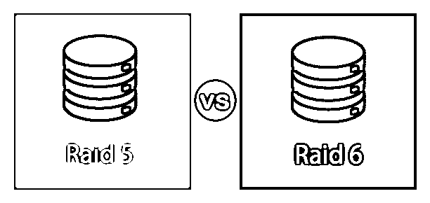
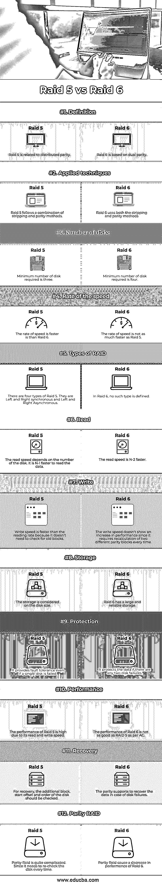

# Raid 5 与 Raid 6

> 原文：<https://www.educba.com/raid-5-vs-raid-6/>

## RAID 5 与 RAID 6 的区别

RAID 扩展为独立磁盘的冗余阵列。它是一种存储虚拟化方法，将多个物理组件合并为一个逻辑单元，以提高性能和实现数据冗余。有不同类型的 RAID，其中 RAID 0 与条带化相关，RAID 1 与镜像相关，RAID 5 与分布式奇偶校验相关，RAID 6 基于双奇偶校验。RAID 5 和 RAID 6 是奇偶校验和分条技术的组合。RAID 5 和 RAID 6 的工作原理相似，但性能指标不同。目前，RAID 在全球范围内被广泛使用。[根据 RAID 5](https://www.educba.com/what-is-raid-5/) 和 Raid 6 的配置，它通过提供一个组合所有驱动器数据的单元驱动器来提高系统速度。在本主题中，我们将了解 Raid 5 和 Raid 6。

### Raid 5 与 Raid 6 的面对面比较(信息图表)

以下是 Raid 5 与 Raid 6 之间的 12 大区别:

<small>网页开发、编程语言、软件测试&其他</small>

### RAID 5 与 RAID 6 的主要区别

让我们讨论一下 RAID 5 与 RAID 6 之间的一些主要区别

RAID 5 基于奇偶校验方法和条带化方法的混合。数据流被分成多个特定大小的块。然后，它们被打印到成员磁盘上。在每一行中，磁盘都包含一个被称为奇偶校验函数的校验和。奇偶函数是基于来自一行中其他同事的数据来评估的。如果有任何一个单元磁盘出现故障，那么丢失的信息可以用奇偶性来计算。这就是 RAID 5 的容错方式。构建 RAID 5 最少需要三个磁盘，最大值可以是任何值，具体取决于硬件的大小。

对于 N 个磁盘的阵列，最低成员磁盘的大小是阵列体积的 N-1 倍。因此，使用单位磁盘的容量或容量来保存奇偶校验数据，以提供容错功能。RAID 6 基于奇偶校验方法和条带化方法工作，与 RAID 5 相反，RAID 5 使用双独立的奇偶校验函数，这些函数被打印到不同的成员磁盘。其中一个奇偶校验函数类似于 RAID 5 的 XOR 函数，而第二个函数比较复杂。如果两个相关成员磁盘出现任何故障，奇偶校验数据有助于恢复数据。RAID 6 配置有最少四个磁盘，其中一个阵列的容量是 N 个磁盘阵列中最低成员磁盘容量的 N-2 倍。

RAID 5 的读取速度快了 N-1 倍，但没有读取奇偶校验数据的值快 N 倍。为了写入数据，需要采取必要的步骤来减小所需块的大小。从旧块和奇偶校验块中读取数据。然后比较新旧版本中的数据。对于每个转换的位，转换奇偶校验中的相关位。写入新块和奇偶校验块中的数据。奇偶校验更新会降低系统性能。

RAID 6 的读取速度比单个磁盘快 N-2 倍。如果一行中有两个磁盘具有不需要读取的奇偶校验功能。此类操作类似于 RAID 5。写入值需要对每两个不同的奇偶校验块进行新的评估和更新，因为它需要新的写入。RAID 6 的写入速度并没有给性能指标带来任何改善。

RAID 5 的恢复基于由数据块大小、起始偏移量和相关成员磁盘的顺序确定的参数。RAID 6 的存储价格适中，因为它提供大量可靠的存储服务。但是，即使在两个磁盘出现故障的情况下，数据的保护也很高。当阵列处于重建期间，由于用户错误而交换了错误的磁盘时，就会发生这种情况。

RAID 6 可能是目前使用的最公开、最高效的 RAID 级别。不过，RAID 6 是在 RAID 5 的基础上构建的，并增加了一个奇偶校验级别。这一特殊功能使它比 RAID 5 具有更强的保护性，RAID 5 很重要，但也会执行受影响的写入惩罚

### RAID 5 与 RAID 6 对比表

为了便于理解，让我们通过一个比较表来看看 Raid 5 与 Raid 6 之间的更多差异:

| **属性** | **RAID 5** | **RAID 6** |
| 定义 | RAID 5 与分布式奇偶校验相关。 | RAID 6 基于双奇偶校验 |
| 应用技术 | RAID 遵循条带化和奇偶校验方法的组合 | RAID 6 同时使用分条和奇偶校验方法 |
| 磁盘数量 | 所需的最小磁盘数量是三个 | 所需的最小磁盘数量是四个 |
| 速度的比率 | 速度比 RAID 6 还快 | 速度没有 RAID 5 快得多 |
| RAID 的类型 | RAID 5 有四种类型。它们是左右同步和左右异步的 | 在 RAID 6 中，没有定义这样的类型 |
| 阅读 | 读取速度取决于磁盘的数量。读取数据要快 N-1 倍 | 读取速度快了 N-2 倍 |
| 写 | 写入速度比读取速度快，因为它不需要检查旧数据块 | 写入速度没有显示出性能的提高，因为每次都需要重新计算两个不同的奇偶校验块 |
| 储存；储备 | 存储是根据磁盘大小来考虑的 | RAID 6 有一个大而可靠的存储 |
| 保护 | 即使单个磁盘出现故障，它也能提供容错能力 | 如果有任何两个磁盘出现故障，它会保护数据。 |
| 表演 | RAID 5 的性能很高，因为它的读写速度很快。 | 根据 AC，RAID 6 的性能不如 RAID 5 |
| 恢复 | 对于恢复，应检查磁盘的附加块、起始偏移量和顺序 | 奇偶校验支持在磁盘出现故障时恢复数据 |
| Parity RAID | 奇偶校验 RAID 相当复杂。因为它每次都需要重新检查磁盘 | 奇偶校验 RAID 导致 RAID 6 性能下降 |

### 推荐文章

这是 Raid 5 与 Raid 6 的对比指南。在这里，我们通过信息图和比较表来讨论 Raid 5 和 Raid 6 的主要区别。您也可以看看以下文章，了解更多信息–

1.  [Debian vs Arch](https://www.educba.com/debian-vs-arch/)
2.  [角度 5°对反作用力](https://www.educba.com/angular-5-vs-react/)
3.  [角度 5 对角度 4](https://www.educba.com/angular-5-vs-angular-4/)
4.  [反应状态 vs 道具](https://www.educba.com/react-state-vs-props/)

