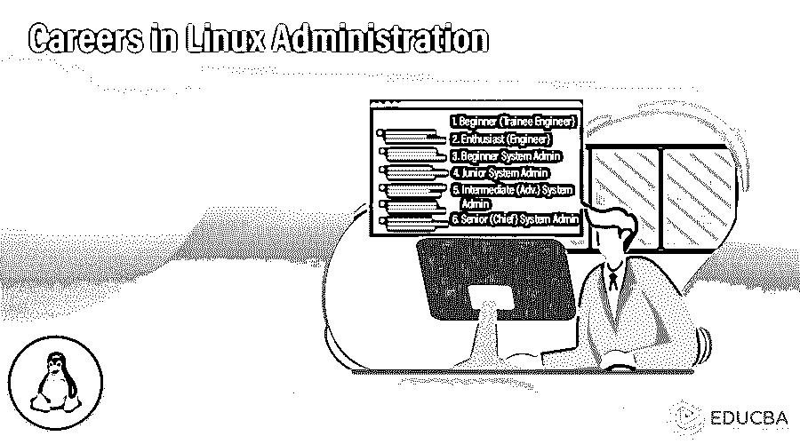
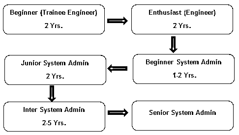
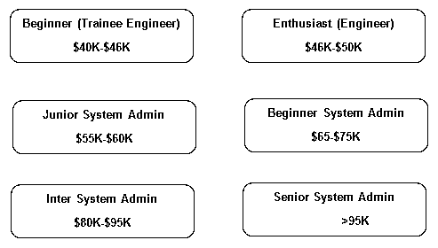

# Linux 管理职业

> 原文：<https://www.educba.com/careers-in-linux-administration/>

## Linux 管理职业介绍

[操作系统](https://www.educba.com/android-operating-system/)的 Linux 家族于 1991 年由 Linus Torvalds 首次发布。从那时起，它已经成为 it 和[计算机科学](https://www.educba.com/career-in-computer-science/)社区不可或缺的一部分。Linux 最初是作为一个与硬件对话并将其转换为软件的内核发布的，它已经在基于家庭的桌面系统中找到了自己的位置，从大型数据中心到大型机，从 Android 手机到智能手表，Linux 无处不在！

Linux 操作系统家族附带了许多开源发行版，即 CentOS、Arch Linux、Ubuntu、Debian、Fedora 等。有一些 Linux 服务器的商业发行版在业界很突出——Red Hat Enterprise Linux(RHEL)、SUSE Enterprise Linux、Ubuntu Enterprise 等。在这篇文章中，我们将讨论从事 Linux 管理职业的可能性和前景。

<small>网页开发、编程语言、软件测试&其他</small>

### 教育

在当前的 IT 市场中，Linux 技能是最受欢迎的工作前景之一。尤其是 Linux 管理方面的职业需求非常大。业界寻求合格的专业人员来处理他们的服务器管理任务。随着大数据和云计算技术的出现，Linux 系统管理员的需求每年都在成倍增长。尽管在开源和商业平台上都有许多培训课程、教程和视频，但拥有专业认证总是能让你在求职竞争中保持领先。专业认证由 RHEL、惠普、甲骨文和 LPI 提供，而在线课程可从电子学习平台获取，帮助您通过认证考试。

学习平台:有足够多的在线培训机构和门户网站提供初级到专业水平的课程。以下是许多研究所中的几个。请随意访问他们各自的网站，查看批次、费用等。

专业认证: Linux 系统管理认证由多个机构提供，其中许多被视为基准，有时被不同的组织强制执行。RHEL、HP-AIX、Oracle Solaris 和 BSD 确实提供了自己的认证，得到了全球大多数公司和组织的认可。有志之士可以瞄准以下认证

o 红帽认证系统管理员(RHCSA)
o LPIC-1 Linux 管理员(LPI)
o Novell 认证 Linux 管理员
o 甲骨文 Solaris 系统管理员
o IBM 认证系统管理员–AIX
o CSA–惠普-UX

### Linux 管理的职业道路

像每一种技术一样，Linux 管理职业有一条明确的职业道路。从初级水平开始，一直到高级/首席系统管理员水平。我们将讨论每个角色的职责。

#### 1.初学者(见习工程师)

形容词（adjective 的缩写）工程师知道如何安装 Linux
b。他也可以在 OS
c 上安装应用程序。主要的交互是基于 GUI 的

#### 2.发烧友(工程师)

形容词（adjective 的缩写）可以设置家庭服务器
b .在命令行或终端上工作
c .知道灯堆栈
d .知道基本网络
e .知道虚拟化

#### 3.初级系统管理员

形容词（adjective 的缩写）知道文件系统的导航
b .可以精确编辑文件系统
c .知道基本的实用程序和命令
d .可以安装系统范围的软件
e .可以创建用户并设置权限

**推荐课程**

*   XML 和 Java 课程
*   专业节点。JS 课程
*   Silverlight 在线课程
*   灰烬上的训练。射流研究…

#### 4.初级系统管理员

形容词（adjective 的缩写）熟悉配置管理
b .擅长资源共享
c .了解基本的网络
d .此外，了解基本的 Linux 系统管理工具
e .可以挂载远程文件系统

#### 5.中级(高级)系统管理员

形容词（adjective 的缩写）管理进程和服务
b .负责应用程序的安装和配置
c .了解基本的安全性
d .能够编写 python 和 Perl/shell 脚本
e .负责基于角色的系统访问

#### 6.高级(首席)系统管理员

形容词（adjective 的缩写）充当问题解决者并负责任务分配
b .解决困难场景的问题
c .负责流程自动化
d .知道交换进程间通信
e .了解设备驱动程序及其功能
f .进行交换和分页
g .性能调优和分布式计算

### 工作职位或应用领域

几乎所有使用自有 Linux 服务器、租赁服务器、基于云的服务器或共享服务器的小型到大型行业都需要一名系统管理员。Linux 系统管理员可能还需要履行不同的职责，但不限于

1.节点和网格
2。应用企业范围的补丁程序
3。安全和防病毒更新
4。用户访问和权限
5。系统存储和设备访问定义
6。系统政策的实施
7。审计和配置管理
8。系统可用性和可靠性
9。备份等。

### 薪资(美国数据，而非印度具体数据)

Linux 管理员的职业生涯在学习和金钱收益两方面都有好处。以下是不同职位员工工资的一般分布。这因公司而异，我们试图展示不同级别的平均工资。

(来源——[www.payscale.com/](https://www.payscale.com/research/US/Job=Linux_System_Administrator/Salary))

### 结论或职业前景

当前的大数据和面向服务的时代给服务提供商带来了很大的压力。Linux 作为一个操作系统，由于它所展示的特性和承诺，一直是人们最感兴趣的。Linux 系统管理员的角色至关重要，各组织都在排队寻找最好的、经过认证的 Linux 管理员。未来 10 年，对这些资源的需求将成倍增长。这些职位都有丰厚的津贴和发展机会。这个领域的有志之士将会有大量的机会，如果你渴望抓住一个机会，现在开始还为时不晚。

### 推荐文章

这是 Linux 管理职业的指南。在这里，我们讨论了 Linux 管理所需的教育技能以及工作职位、工资和职业前景。您也可以阅读以下文章，了解更多信息——

1.  [网页设计职业](https://www.educba.com/career-in-web-designing/)
2.  [商业智能职业](https://www.educba.com/career-in-business-intelligence/)
3.  [项目管理职业](https://www.educba.com/career-in-project-management/)
4.  [在 Splunk 的职业生涯](https://www.educba.com/career-in-splunk/)

