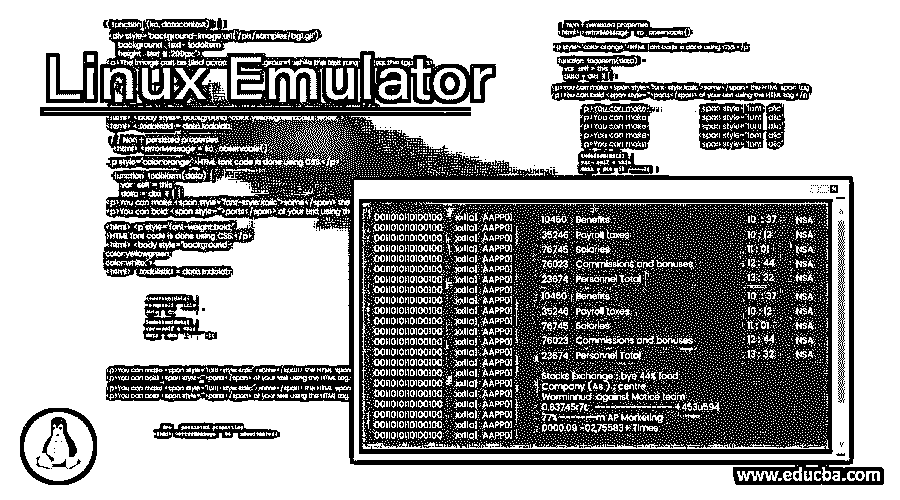

# Linux 仿真器

> 原文：<https://www.educba.com/linux-emulator/>

## Linux 仿真器简介

在 Linux 操作系统中，我们有不同类型的仿真器，如终端仿真器、游戏仿真器、android 仿真器等。在 Linux 中，终端模拟器向最终用户提供图形框架。在同一画面中，用户将输入 shell 作业、Linux 命令、应用程序级作业等。模拟器的访问或工作管理与 Linux 风格不同。借助各种参数，如主题、文本颜色、文本大小调整、透明度、鼠标移动交互、支持多个标签、支持自动文本换行等。我们可以选择仿真器并使用它。

**语法:**

<small>网页开发、编程语言、软件测试&其他</small>

因此，Linux 模拟器没有特定的语法。大多数情况下，我们只使用图形格式的 Linux 模拟器。使用和处理 Linux 模拟器的方式是不同的。根据需要，我们可以选择不同的 Linux 模拟器。

### 不同类型的 Linux 仿真器

让我们讨论不同类型的 Linux 仿真器。

*   #### 侏儒终端

GNOME 终端附带了 Linux 生态系统的默认安装。同一个 GNOME 终端是一个漂亮的软件。这个模拟器属于终端模拟器的范畴。它将支持多种功能，如主题的多样性，文本颜色，文本大小调整，透明度，鼠标移动交互，支持多个标签，支持自动文本重新包装。这个模拟器的主要优点是配置安全。它将正常安全地使用设置，不会影响当前配置。在 GNOME 终端中，我们能够创建链接。GNOME 终端模拟器的默认版本是 3。

*   #### Guake

在“下拉”风格的界面类别中，guake 是第一个出现在“下拉”风格界面下的模拟器。这个模拟器属于终端模拟器的范畴。当按下热键时，它将从屏幕顶部发展。瓜克模拟器有多种优势，如不同类型的主题，能够添加个人喜好，能够添加自己喜欢的功能。如果我们需要安装 guake 终端模拟器，我们可以从 Github repo 中获得。该 guake 在 GPL 2 版本下可用。

*   #### Consol

Konsole 模拟器已在 KDE 发货。KDE 的用户已经熟悉了 Konsole 模拟器。这个模拟器属于终端模拟器的范畴。由于控制台模拟器已归入 KDE 组件，它也将为许多其他 KDE 应用程序提供根终端，如 Kate、KDevelop，包括 Konqueror 等。控制台模拟器具有与默认 GNOME 终端相似的特性。但是在控制台模拟器中，我们可以启用书签功能；从事 SSH 部分等工作。它还提供分离终端功能。如果我们需要安装 Konsole 终端模拟器，我们可以从互联网回购获得。konsole 在 GPL 2 版本下可用。

*   #### Terminator

开发终端仿真器的基本思想是在一个窗口中安排多个终端。在模拟器中，我们获得了多种功能，如节省布局时间、键绑定数量、同时创建多个终端的能力等。这个模拟器属于终端模拟器的范畴。在 GNOME 项目下，我们有一个包包。终结者模拟器有类似的功能，如默认的 GNOME 终端。在之前的终结者模拟器中，是用 python 写的。但是它依赖于平台。现在新的终端模拟器是用 java 编写的。因此，新的终端仿真器不是独立于平台的。

终结者模拟器属于开源类别。GPL 2 版本下提供了终结器。

*   #### Tilda

Tilda 模拟器是一个地震下拉式模拟器。这个模拟器属于终端模拟器的范畴。基本上，它是为 GTK 设计的。Tilda 模拟器的名称来自于 tilde 键。这个模拟器的默认键是调用 quake 终端。这个模拟器的默认界面是一个非常简单或者非常小的窗口标题。但是如果我们需要根据我们的要求改变它，我们也可以改变它。要改变它，我们需要在首选项中进行更改。我们可以在同一个 Tilda 模拟器中做多种改变，如按键绑定设置，默认颜色，默认大小，滚动选项中的首选项，以及许多不同的支持选项。

Tilda emulator 属于开源类别。GPL 2 版本下提供了终结器。

*   #### Pairing simulator

mate 模拟器是 Linux 环境中非常常用的模拟器。它为最终用户提供图形用户界面，以触发他们的查询、应用程序级作业等。根据不同的 Linux 风格，mate 模拟器上的操作可能会有所不同(就版本而言)。使用模拟器时，光标向用户显示文本需要键入的位置。要删除整行，我们可以使用 Ctrl + U 选项，或者使用键盘上的 delete 键来删除字符。我们也可以使用向上箭头键来获取或打印以前执行的命令信息。同样，我们也可以使用左右箭头键来移动。mate 模拟器属于终端模拟器的范畴。

*   #### Xterm

1984 年，xterm 仿真器被开发出来。基本上，xterm 模拟器是为 X windows 环境设计的。我们还可以在最小 Linux 包安装中安装 xterm 模拟器(带有图形包)。但是如果我们使用最小的图形化安装，那么就会安装一堆完全兼容的包。xterm 模拟器只不过是一个终端。Xterm 模拟器属于开放源码类别。在 MIT 许可下可用的 xterm。

### 结论

我们已经看到了“Linux 模拟器”的完整概念和适当的类别，模拟器的解释。它为最终用户提供了一个图形用户界面来触发他们的工作和命令。根据不同的特性和用例，我们需要选择仿真器。

### 推荐文章

这是一个 Linux 模拟器的指南。在这里，我们讨论介绍，语法和不同类型的 Linux 模拟器。您也可以看看以下文章，了解更多信息–

1.  [Linux Untar](https://www.educba.com/linux-untar/)
2.  [Linux nslookup](https://www.educba.com/linux-nslookup/)
3.  [Linux LVM](https://www.educba.com/linux-lvm/)
4.  [Linux 大小](https://www.educba.com/linux-size/)

